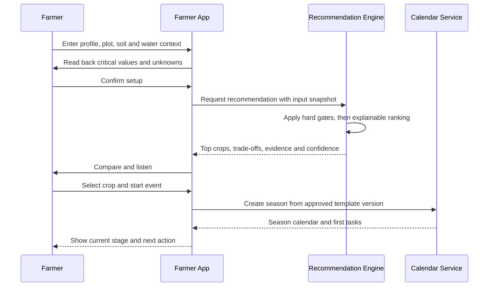
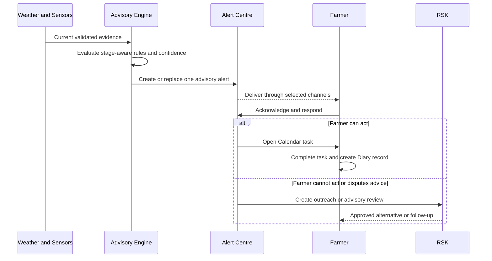
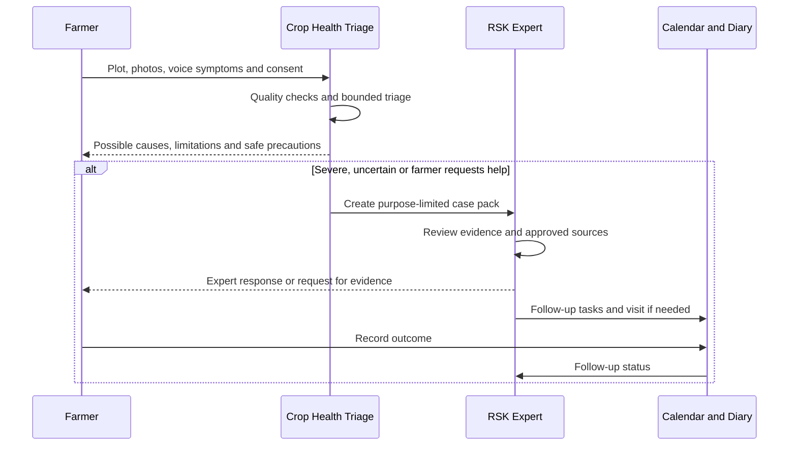

# Smart Fasal Kisan Alert

## End-to-End Flow Specification

| Field | Value |
| --- | --- |
| Status | Approved |
| Version | 0.2.3 |
| Last updated | 12 July 2026 |
| Parent documents | `docs/01_PRD.md`, `docs/02_INFORMATION_ARCHITECTURE.md` |
| Covered roles | Farmer, Rythu Seva Kendram Office, MP Office |

## 1. Purpose

This document defines how Smart Fasal features operate together across screens, services, offline states and stakeholder boundaries. It converts the PRD journeys into implementation contracts for commands, state changes, failure handling, notifications, audits and acceptance tests.

Feature-specific calculations and schemas belong in later specifications. When this document names an event or command, the name is a logical contract. The API and data specifications will finalize its transport and payload.

## 2. Shared flow invariants

These rules apply to every flow.

1. **Authorization is server-enforced.** Every protected read and mutation rechecks role, capability, jurisdiction, ownership and current consent.
2. **Commands are idempotent.** Every state-changing request has an idempotency key and, where applicable, the expected entity version.
3. **Events are attributable.** Every accepted event retains actor, role, device, `dataMode`, `provenanceTypes`, occurrence time, server-received time, correlation ID and relevant rule or model version.
4. **Client optimism is not cross-role truth.** RSK and MP receive only server-accepted events, never unacknowledged local state.
5. **Plan and actual remain separate.** Calendar stores intended work. Diary stores actual farmer activity and observations.
6. **Delivery, engagement and outcome remain separate.** Canonical alert state, per-channel provider delivery, per-recipient engagement and linked Task or Case outcome are distinct entities.
7. **Data mode is singular and visible.** Every fact uses exactly one `dataMode`: `Live`, `Recorded` or `Simulated`.
8. **Evidence provenance is multi-valued.** `provenanceTypes` may include Sensor, Farmer Manual, RSK Manual, Laboratory, Soil Health Card, Weather, Satellite, Public Market or Derived. Multiple sources may contribute, but none are silently relabelled as a data mode.
9. **Missing, stale, suppressed and zero differ.** None may be substituted for another.
10. **Corrections supersede.** A correction creates a new version or reversal event and never erases prior history.
11. **Voice proposes before mutating.** State-changing voice actions require contextual read-back and explicit confirmation.
12. **Generative AI does not own safety.** Gemini may extract, summarize, translate and explain approved structured results. It cannot invent measurements, severity, crop eligibility, chemical choice, dose, official warning or market price.
13. **Deep links never execute actions.** They open an authorized review destination and require confirmation.
14. **Sensitive content is minimized.** Default logs and audit rows reference sensitive evidence rather than copying it.
15. **Demo data is honest.** Recorded and Simulated scenarios remain visibly labelled throughout the flow.

## 3. Shared lifecycle vocabulary

### 3.1 Client persistence

Client persistence uses three independent axes:

```text
Local commit: Draft -> Locally Committed
Transport:    Not Queued -> Queued -> Syncing
                        -> Accepted | Already Accepted | Rejected | Conflict
Projection:   Current Local -> Server Confirmed | Needs Reconciliation | Invalid
```

The interface may display `Saved on this phone` only after the local event, local projection and outbox entry commit atomically. A server `Rejected` or `Conflict` result keeps the local event in a locked, visible `Needs Review` record with its reason; it neither remains authoritative nor disappears.

### 3.2 Task lifecycle

```text
Execution: Suggested -> Planned -> Ready -> Due -> In Progress -> Completed
                                                    -> Cancelled | Replaced
```

`Overdue` is a time flag, not a farmer-failure status. `Waiting for Weather`, `Waiting for RSK`, `Waiting for Input`, `Waiting for Water` and similar values are blocking reasons. `Done`, `Partly Done`, `Cannot Do`, `Skipped with Reason`, `Remind` and `Disputes Advice` are farmer responses. Execution state, time flags, blocking reasons and farmer responses must be stored separately.

### 3.3 RSK work lifecycle

```text
New -> Assigned -> In Progress
In Progress -> Awaiting Farmer | Scheduled
Awaiting Farmer | Scheduled -> In Progress
In Progress -> Resolved | Cancelled | Duplicate
Resolved -> Reopened -> In Progress
```

RSK Work owns assignment, queue priority, SLA and service progress. Priority and the linked domain entity's state remain independent. Reopening an actionable domain entity reopens its Work or creates a new linked Work interval without rewriting the earlier service interval.

### 3.4 Case lifecycle

```text
New -> Evidence Review -> Awaiting Farmer -> Care Plan Issued
    -> Follow-up Due -> Resolved -> Closed
    -> Reopened
```

The Case owns evidence, care plan, follow-up and resolution; its linked RSK Work item owns assignment and SLA. Severity remains Low, Moderate, High or Critical independently of workflow status.

### 3.5 Alert lifecycle

```text
Canonical version: Active -> Replaced | Corrected | Cancelled | Expired
Channel attempt:   Queued -> Provider Accepted -> Delivered | Failed | Unknown | Expired
Recipient journey: Eligible -> Reached -> Opened or Heard -> Acknowledged -> Response Recorded
```

An RSK `AlertDraft` owns any governed composition and approval lifecycle; successful publication creates the distinct Active canonical version above. Task completion and RSK service resolution remain on their linked domain entities. The eligible recipient cohort is frozen for each canonical alert version; later preference, consent or profile changes affect future delivery only and do not rewrite historical denominators.

## 4. Flow catalogue

| ID | Flow | Primary roles |
| --- | --- | --- |
| E2E-01 | Farmer setup to crop plan | Farmer, Recommendation Engine |
| E2E-02 | Live evidence to advisory and completed action | Farmer, Advisory Engine, RSK |
| E2E-03 | Crop-health report to expert resolution | Farmer, AI Triage, RSK |
| E2E-04 | Role-aware voice request and safe mutation | Farmer, RSK, MP |
| E2E-05 | Calendar task to actual Diary record | Farmer, RSK |
| E2E-06 | Offline capture, synchronization and conflict | Farmer, RSK-assisted user |
| E2E-07 | Sensor installation, trust failure and recalculation | Farmer, Sensor System, RSK |
| E2E-08 | Canonical alert to multichannel acknowledgement | Farmer, Alert Centre, RSK |
| E2E-09 | Harvest readiness to Market Watch and Diary | Farmer, RSK, MP aggregates |
| E2E-10 | RSK advisory and template governance | RSK |
| E2E-11 | RSK assisted farmer session | Farmer, RSK |
| E2E-12 | Accepted domain events to MP briefing | MP Office, Aggregate Services |
| E2E-13 | RSK alert outreach and constraint resolution | Farmer, RSK |
| E2E-14 | RSK field visit with time-bound access | Farmer, RSK |
| E2E-15 | RSK market-record mapping and reprocessing | RSK, Market Data Service |

## 5. E2E-01: Farmer setup to crop plan

### Outcome

An authenticated farmer creates a trustworthy farm and plot profile, receives up to three explainable eligible crop options, confirms one crop and starts a versioned season calendar.

### Preconditions

- Farmer identity and role have been verified online.
- Launch language and device mode are selected.
- The Raigad pilot and current season are supported.
- At least one current, approved crop-template set exists.

### Main sequence



1. Farmer selects language, accessibility preferences and Personal, Family-shared or RSK-assisted device mode.
2. The application explains and records consent for location, audio, case sharing and alert channels separately.
3. Farmer enters identity, farm, plot, area, village or map context, soil source, water source, crop history and current farm state.
4. The application accepts explicit Unknown values and identifies missing high-impact information without inventing it.
5. Critical values such as plot, area, soil units, water availability and dates are read back before setup is accepted.
6. The server stores a versioned profile snapshot and data-quality state.
7. The Recommendation Engine creates a Raigad, season and sowing-window candidate set.
8. Hard gates exclude crops that fail geography, season, sowing window, water or other approved safety requirements.
9. Explainable scoring ranks the remaining candidates using approved soil, rainfall, weather, crop history, water, Earth Engine and bounded market context.
10. The result stores its complete input snapshot, source times, rule version, component scores and confidence.
11. Gemini may render only the approved structured comparison in the selected language. Reviewed deterministic Marathi, Hindi and English templates render the complete result when the provider is unavailable or its output fails validation.
12. Farmer reviews or listens to up to three crops, trade-offs and limitations.
13. Farmer accepts one crop or requests RSK help. Acceptance requires crop, plot and either a proposed start date or a confirmed actual sowing or transplanting event.
14. Calendar Service snapshots the approved crop template and creates the plot-season timeline. A proposed date creates `PLANNED_AWAITING_START`; an actual event creates `ACTIVE`.
15. Stage-relative tasks stay inactive while `PLANNED_AWAITING_START`. The farmer confirms the actual sowing or transplanting event before the season becomes `ACTIVE` and those tasks receive real dates.
16. Farmer lands on `/farmer/seasons/:seasonId/calendar`; Today shows the first relevant active action or a clear prompt to confirm the actual start.

### Season activation

```text
DRAFT -> PLANNED_AWAITING_START -> ACTIVE -> COMPLETED | ABANDONED
```

Registration time, recommendation time and a proposed date never substitute for the actual sowing or transplanting anchor.

### Alternate and failure paths

| Condition | Required behaviour |
| --- | --- |
| Required profile field is missing | Ask only for the missing high-impact field or lower confidence; never guess |
| Soil or water units are ambiguous | Preserve the original value and request confirmation before normalization |
| External source is stale | Display source date and reduced confidence; block the result when an approved hard gate requires current data |
| No crop passes hard gates | Return no safe shortlist and offer RSK review; never rank an ineligible crop |
| Farmer is offline | Save setup draft locally; do not claim a new recommendation was generated |
| Farmer rejects every option | Preserve the result and offer RSK help. Manual setup is permitted only to record an already-planted crop or to accept a plan approved by an authorized RSK expert; warning-only confirmation can never bypass hard gates for a proposed crop |
| Template expires before season creation | Block creation and open RSK template reapproval work |
| Recommendation request is retried | Return the same logical result for the same idempotency key |
| Gemini or translation provider fails | Render the approved structured result through reviewed deterministic Marathi, Hindi or English content; crop planning remains usable |

### Required logical events

`farmer.setup_saved`, `farm.created`, `plot.created`, `profile.snapshot_created`, `recommendation.requested`, `recommendation.generated`, `recommendation.no_safe_result`, `recommendation.accepted`, `season.created`, `season.start_confirmed`, `season.activated`, `calendar.instantiated`.

### Acceptance checks

- No hard-gated crop appears in the shortlist.
- Every result shows reasons, source, freshness, trade-offs and confidence.
- Accepting a crop creates exactly one season and one Calendar snapshot.
- A planned season activates stage-relative work only from the farmer-confirmed actual start event.
- Farmer can complete setup without owning hardware.
- RSK and MP cannot see the unsafely broad farmer profile through this flow.

## 6. E2E-02: Live evidence to advisory and completed action

### Outcome

Trusted weather and farm evidence produce one explainable advisory, one canonical alert and one Calendar action. The Farmer response becomes a Diary record or an RSK service request.

### Main sequence



### Preconditions

- Active crop season and current or estimated stage exist.
- Required source freshness rules are available.
- The applicable advisory and crop-calendar templates are approved and unexpired.

### Main steps

1. Weather, rainfall, farmer observations and sensor ingestion retain source and observed time.
2. Quality checks mark evidence Trusted, Use with Caution, Trend Only or Do Not Use.
3. Advisory Engine resolves the active crop stage and evaluates the approved crop-stage rules.
4. High-impact action requires the evidence agreement defined by policy, such as current weather plus calibrated moisture, or an official warning.
5. The engine emits No Action when no material decision change exists.
6. For a new or changed decision, it stores facts, rule version, confidence, action window, expiry and dependencies.
7. A high-risk, contradictory, disputed or policy-gated result enters `/rsk/agronomy/advisory-reviews/:reviewId` before farmer issuance.
8. Approved output creates or replaces an advisory and updates the dependent Calendar task atomically.
9. Alert Centre deduplicates related weather, sensor and satellite signals into one canonical alert.
10. Farmer sees what to do, by when, why, source, freshness and Listen.
11. Farmer selects Understood, Done, Remind, Cannot Do, Alert Seems Wrong or Ask RSK.
12. Done opens task completion and creates a Diary event. Remind schedules an appropriate reminder.
13. An actionable Cannot Do response creates an alternative, RSK outreach or support case. Non-actionable reasons update the task without unnecessary escalation.
14. Alert Seems Wrong pauses only repetitions of that Smart Fasal advisory version or deduplication key and creates advisory review. It does not suppress an official warning, a materially changed risk, a new action or a higher-severity version.
15. A later material change replaces or cancels the advice, explains old versus new and updates pending tasks without rewriting completed Diary work.

### Failure paths

- A single abnormal sensor reading creates Check Field or Check Sensor, not a severe agronomic action.
- Stale evidence is excluded from current action and lowers confidence.
- If no trustworthy fallback remains, output `Insufficient evidence`.
- If review expires before its action window, do not issue late advice.
- If publication partially fails, retain `Approved, publication pending` and retry from the same idempotency key.
- If the farmer has no water, do not repeat an impossible irrigation instruction.
- If delivery fails, retain the alert and create outreach according to severity and consent.

### Required logical events

`evidence.validated`, `advisory.evaluated`, `advisory.review_requested`, `advisory.issued`, `advisory.replaced`, `advisory.cancelled`, `calendar.task_created`, `calendar.task_changed`, `alert.version_created`, `farmer.response_recorded`, `constraint.recorded`, `rsk.work_created`, `diary.activity_recorded`.

### Acceptance checks

- One material risk produces one canonical alert, not one per signal.
- Existing plan and previous advisory versions remain visible.
- Provider delivery never counts as acknowledgement or task completion.
- Cannot Do is treated as a service constraint, not farmer noncompliance.
- A completed Diary event is never silently reverted by rescheduling.

## 7. E2E-03: Crop-health report to RSK resolution

### Outcome

A farmer records a crop-health problem using guided photos and voice. The system performs bounded triage, escalates according to severity and uncertainty, and closes the loop through RSK-approved care and follow-up.

### Main sequence



### Main steps

1. Farmer selects a plot and opens Report Crop Problem.
2. Guided capture requests whole-plant, affected-part and environmental context images where applicable.
3. Farmer records voice symptoms and answers only necessary structured questions.
4. The application confirms crop, plot, symptom duration and sharing scope.
5. Image quality checks detect blur, darkness, missing subject and insufficient context.
6. Speech extraction produces structured symptoms and retains the original audio according to consent.
7. Triage returns possible causes, evidence quality, severity, confidence, limitations and immediate safe precautions.
8. The result never claims confirmed diagnosis and never invents chemical choice, dose, re-entry interval or pre-harvest interval.
9. Severe, spreading, uncertain, safety-sensitive or farmer-requested findings require escalation. With current case-sharing consent, they create one purpose-limited RSK case pack, normally containing 14 to 30 relevant days.
10. RSK Work Queue assigns explainable priority and SLA. Authorized staff claim the linked work item optimistically. Farmer contact details remain masked until a successful claim, declared contact purpose and current-consent check all pass.
11. Expert verifies crop, stage, evidence, freshness and contradictions.
12. Insufficient evidence produces a structured request for a clearer photo, missing observation or visit.
13. Agronomy Expert issues a care plan using current approved content and creates follow-up Calendar tasks.
14. Severe or unresolved cases create a field visit through E2E-14 with minimum authorized evidence and time-limited location access.
15. Farmer receives the response as an Alert and case update with expert identity and source.
16. Farmer records follow-up outcome: improved, unchanged, worsened, could not follow, alternative cause or unable to assess.
17. Case resolves only with outcome, closure reason and mandatory follow-up complete. High or Critical resolution requires Agronomy Expert authority. It moves to `Closed` only after the defined confirmation or review window.
18. New worsening evidence reopens the same case and preserves its earlier resolution and closure history.

### Offline, consent and failure paths

- Offline evidence is saved locally and labelled Waiting for Internet.
- A queued report cannot show AI analysis as completed.
- Case creation is not claimed until server acceptance.
- Evidence is not shared without a confirmed scope.
- If case-sharing consent is declined, record `Escalation Recommended - Sharing Declined`, provide direct RSK or emergency contact guidance appropriate to the scenario and withhold unsafe self-treatment guidance; do not create or share the evidence pack.
- Withdrawn consent blocks new RSK evidence access and contact according to policy.
- An expired treatment source blocks care-plan issuance.
- Failed expert-response delivery keeps the case open and creates outreach.
- Duplicate reports may link to one case but preserve each original farmer event.

### Required logical events

`health_report.saved`, `health_media.queued`, `health_report.synced`, `triage.completed`, `triage.escalated`, `triage.escalation_sharing_declined`, `case.created`, `rsk.work_claimed`, `case.contact_access_authorized`, `case.evidence_accessed`, `case.evidence_requested`, `case.care_plan_issued`, `case.visit_scheduled`, `case.follow_up_recorded`, `case.resolved`, `case.closed`, `case.reopened`.

### Acceptance checks

- Poor evidence cannot produce overconfident guidance.
- With current case-sharing consent, a severe or mandatory-escalation scenario cannot bypass RSK; without it, the app clearly records and communicates the unshared escalation recommendation.
- RSK receives only consented, relevant evidence.
- Expert guidance and generated explanation remain distinguishable.
- MP receives only threshold-safe pressure and service aggregates.

## 8. E2E-04: Role-aware voice request and safe mutation

### Outcome

Farmer, RSK or MP can ask a natural-language question or initiate an authorized action without bypassing the same product, permission and confirmation rules as visual interaction.

### Main steps

1. User opens the labelled voice action from a current screen.
2. Voice layer receives role, language, current destination and allowed contextual identifiers.
3. Speech-to-text returns transcript plus confidence and detected language.
4. Domain extraction maps the utterance into an allowlisted intent and structured slots.
5. Missing or ambiguous critical slots trigger a short clarification.
6. The authorization layer validates the intended data read or tool action.
7. A read-only request calls the same domain query used by the equivalent screen.
8. The answer states scope, source, time and confidence and links to the visual destination.
9. A state-changing request produces a draft proposal.
10. The application reads back actor context, target, action, date, quantity, sharing or consequence.
11. User confirms, corrects or cancels.
12. Confirmed action uses the same command, validation, idempotency and audit path as visual interaction.
13. The result is announced and displayed. The originating screen remains selected.

### Role-specific boundaries

- Farmer can read and change only authorized farmer, farm, plot, task, alert, diary, case and market-watch information.
- RSK voice may draft responses, tasks and visits, but cannot voice-only publish templates, bulk alerts, chemical guidance or severe-case closure.
- MP voice accesses only approved aggregate queries and cannot find a farmer, case, farm, device or raw record.
- Voice cannot bypass aggregation suppression through repeated questions.
- Sensitive identities are not spoken aloud until an RSK user confirms a private environment.

### Offline and failure paths

- With explicit audio-storage consent, offline audio is queued and labelled Voice Saved, Transcription Pending. Without that consent, a failed live attempt is discarded and the app offers tap or text input instead.
- Later transcription becomes Needs Confirmation and cannot execute automatically.
- Low ASR confidence shows the transcript and asks for correction.
- Provider failure offers tap-based alternatives and retry.
- Unsupported or unsafe intent receives a clear limitation and safe next option.
- Raw transcript and audio are not retained merely for analytics.

### Acceptance checks

- Voice and visual query return the same authorized result.
- Every mutation has read-back and explicit confirmation.
- Cancelling produces no domain mutation.
- MP and RSK voice cannot expand the user's permission scope.

## 9. E2E-05: Calendar task to actual Diary record

### Outcome

A planned activity becomes an accurate actual record without destroying the plan or forcing duplicate entry.

### Main steps

1. A versioned crop template, advisory or expert action creates a Calendar task.
2. Task stores plot, season, stage, action window, dependencies, conditions, evidence and source version.
3. Today surfaces the task only when it is relevant and high enough priority.
4. Farmer opens task and sees what, why, by when, inputs and safety context.
5. Farmer selects Done, Partly Done, Remind, Cannot Do, Alert Seems Wrong or Ask RSK.
6. Done pre-fills plot, task, occurrence date and expected fields, then asks only activity-specific confirmation.
7. Partly Done captures one-quarter, half, three-quarters or selected area and creates a remaining task.
8. Ambiguous units remain in the farmer's original terms until confirmed. `One bag` never silently becomes a fixed weight.
9. Confirmation creates an immutable Diary activity linked to the original task.
10. Calendar marks the task outcome but preserves the original planned window and every change.
11. Cannot Do captures a structured reason and offers an approved alternative or RSK escalation when actionable.
12. A correction appends a revision or void event; it does not rewrite history.
13. Completing or cancelling the owning task stops redundant reminders.

### Weather rescheduling

1. Re-evaluate only weather-sensitive pending tasks.
2. Show original window, proposed window, reason, forecast time and downstream impact.
3. Farmer selects Accept, Keep Original, Remind, Cannot Do or Ask RSK. `Keep Original` records the farmer declining the proposed reschedule; it never restores superseded unsafe advice as the current recommendation. The current safe plan and the farmer's intended action stay separate and visible.
4. High-risk changes follow advisory-review policy.
5. Completed actual work remains completed even if the plan changes later.

### Acceptance checks

- One task completion creates one logical Diary record.
- Partial completion leaves a correctly scoped remainder.
- Plan and actual are visible side by side.
- Overdue language never shames the farmer.
- A later RSK change cannot erase the farmer's reported activity.

## 10. E2E-06: Offline capture, synchronization and conflict

### Outcome

Farmer actions remain durable without internet, synchronize exactly once after reconnection and resolve genuine conflicts without silent last-write-wins.

### Local save sequence

1. Validate enough information to create a safe local event.
2. Generate stable event ID, device ID, local sequence, actor, occurrence time, client time, timezone, base version and schema version.
3. In one IndexedDB transaction:
   - append immutable event;
   - update local projection;
   - enqueue outbox operation.
4. Only after commit, display `Saved on this phone`.
5. Store media separately with checksum and pending status.

### Reconnection and synchronization

1. Verify real backend connectivity, not only browser online state.
2. Refresh authentication. If unavailable, display Sign In to Continue Syncing without deleting local work.
3. Send bounded, causally ready event batches with last server cursor.
4. Server validates authorization, consent, schema, event ID and base version.
5. Server returns Accepted, Already Accepted, Rejected or Conflict plus remote events and next cursor.
6. Accepted retries return the original acknowledgement and never duplicate an activity.
7. Client applies remote events and rebuilds projections.
8. Structured activity syncs before ordinary media. Urgent crop-health media has higher priority.
9. Media uploads resume, verify checksum and append Media Attached event.
10. Display Synced only after server acknowledgement. Rejected or conflicting events move the local projection to `Needs Reconciliation`, remain readable to the originating user and cannot drive cross-role or safety decisions until resolved.

### Conflict rules

| Conflict | Resolution |
| --- | --- |
| Independent observations | Keep both |
| Same task completed twice | Preserve both evidence records, designate one logical completion and request review when needed |
| Different fields changed | Automatically merge only explicitly allowlisted mutable profile fields |
| Same field differs | Ask farmer or authorized RSK user in plain language |
| Farmer completed while RSK rescheduled | Preserve actual completion and plan change separately |
| Farmer and RSK report different stages | Preserve both; approved planning stage drives rules with visible provenance |
| Deleted record arrives from old device | Tombstone prevents resurrection |
| Synced activity correction | Append correction or void event |

Immutable Diary events, consent, crop stage, quantities, units, task outcomes and safety-sensitive advice never use generic field-level merge.

### Shared-phone and failure behaviour

- Private, family-shared and RSK/public-device modes have separate caching policies.
- Profile switching requires protected identity context and preserves event actor.
- Logout warns about unsynced work and cannot clear it silently.
- A public or assisted session cannot switch profiles or exit while sensitive work is unsynchronized unless the data first moves into an encrypted locked-recovery state that is inaccessible to subsequent users and recoverable only by an authorized continuation flow.
- Public or assisted sessions purge farmer data after confirmed sync, or after authorized recovery completes.
- Storage pressure preserves text events before media and offers Save Without Media.
- Wrong phone time preserves occurrence, client and server times separately and displays a correction prompt.
- A delayed event updates history but cannot trigger an expired real-time alert.

### Acceptance checks

- Any event labelled Saved on This Phone survives reload, process termination and network flapping.
- Repeating the same event ID produces one server event.
- The app never claims RSK received unsynced work.
- Genuine conflicts preserve both versions until resolution.
- Unsynced work is never automatically evicted.

## 11. E2E-07: Sensor installation, trust failure and recalculation

### Outcome

Optional hardware contributes trustworthy context when valid and fails safely when stale, miscalibrated or disconnected.

### Installation and activation

1. Explain the installation purpose, readings collected, retention, advisory use, exact-location access and removal path; record the farmer's separate device and location consent.
2. RSK Sensor Technician scans device ID and selects the approved installation purpose.
3. Assign device to farmer, farm, plot, representative field zone and depth.
4. Record model, firmware, location, installation image and expected reporting interval.
5. Authenticate gateway and test each sensor.
6. Complete soil-specific moisture calibration and applicable periodic pH or EC calibration.
7. Observe required baseline period.
8. Authorized Sensor Technician activates the device for telemetry collection. Agronomic use begins only after its trust policy passes.
9. Farmer Monitor shows source, measured time, received time, freshness and trust state.

### Telemetry and advice use

1. Gateway buffers timestamped readings locally and sends them through authenticated ingestion.
2. Server validates schema, clock, range, rate of change, flatline, packets, calibration, battery and signal.
3. Raw observation remains immutable; validated interpretation receives quality flags.
4. Fresh calibrated moisture may influence irrigation when combined with crop stage, weather and rainfall.
5. pH and EC act as periodic gates. Low-cost NPK remains Experimental or Trend Only until locally validated.

### Failure and recalculation

1. Quality engine detects stale stream, outlier, flatline, expired calibration, low battery or farmer dispute.
2. Create `/rsk/sensors/issues/:issueId` and mark the interval Suspect.
3. Identify advisories, alerts and tasks that used the interval.
4. Quarantine material suspect data from new advice and show farmer a trust warning.
5. A Sensor Technician may diagnose hardware, calibration and connectivity and may mark an interval Suspect. Only an authorized Agronomy Expert may decide its agronomic impact, invalidate its use in advice or approve a safety-relevant recalculation.
6. Recalculate affected advice using remaining trusted evidence.
7. Preserve original and recalculated results.
8. If the action materially changes, replace or cancel the advisory, update pending tasks and create one correction alert.
9. Assign a maintenance work order. Exact location appears only to the assigned technician during its authorization window, after a current consent check, and every access is audited.
10. Require validation period before Return to Service.

### Failure paths

- No trustworthy fallback yields Insufficient Evidence, not a guessed action.
- Recalculation failure suspends affected advice visibly.
- Backfilled readings update history but cannot trigger expired alerts.
- Technician offline completion remains Awaiting Sync until server validation.
- A false-positive issue is resolved through a new validation decision; original flags remain auditable.
- A farm without hardware continues through weather, Earth Engine, Soil Health Card and farmer observation with appropriate confidence.

### Required logical and audit events

`sensor.consent_recorded`, `sensor.installed`, `sensor.activated`, `sensor.observation_received`, `sensor.interval_flagged`, `sensor.issue_created`, `sensor.location_accessed`, `sensor.interval_invalidated`, `sensor.advice_impact_reviewed`, `advisory.recalculated`, `sensor.maintenance_completed`, `sensor.returned_to_service`. Protected evidence and exact-location reads also emit actor, purpose, jurisdiction and authorization-decision audit records.

### Acceptance checks

- Simulated telemetry never appears as Live.
- An offline sensor never appears as stable field conditions.
- One abnormal reading cannot generate a severe action.
- Invalidating data propagates to every affected current decision.
- Hardware maintenance and agronomic invalidation require their respective authorized roles.
- Raw telemetry is never rewritten.

## 12. E2E-08: Canonical alert to multichannel acknowledgement

### Outcome

One agricultural or official event produces one canonical alert delivered through appropriate channels without duplicate pressure, privacy leakage or conflating delivery with action.

### Main steps

1. An advisory, official warning, RSK response, task change, sensor state or market watch requests an alert.
2. Alert Policy Service validates source, severity, action, geography, effective time and expiry.
3. Related signals share a deduplication key and update one canonical alert. Activation freezes the eligible recipient cohort and policy version for that alert version.
4. Official warning content, severity and provenance remain unaltered. Farm implication is separate.
5. Reviewed templates render concise Marathi, Hindi or English content and audio.
6. Policy selects Inbox, Push, SMS or consented IVR based on priority, channel preference, quiet hours and connectivity.
7. Sensitive detail stays out of lock-screen and provider payloads.
8. Each channel attempt records provider ID and its own `Queued`, `Provider Accepted`, `Delivered`, `Failed`, `Unknown` or `Expired` state against the same alert-recipient pair.
9. Farmer response through any channel cancels unnecessary pending fallback attempts.
10. The first channel-policy-qualified Delivered attempt emits one idempotent Reached milestone per recipient and canonical version. Opened or Heard, Acknowledged and Response Recorded remain independent. An unacknowledged urgent alert may receive one careful voice retry and then enter RSK outreach through E2E-13.
11. Expiry stops retries. Correction, cancellation or replacement updates the existing thread.
12. Market and routine information remain in digest or opted-in opportunity alerts, never Act Now.

### IVR interaction

- Press 1: Heard.
- Press 2: Repeat.
- Press 3: Cannot Do.
- Press 4: Hear Why.
- Press 9: Request RSK Help.

The call identifies itself as automated. A connected call is not Heard without explicit interaction.

### Failure paths

- Provider Accepted remains distinct from Delivered.
- Delivery Unknown remains unknown and is not counted as farmer failure.
- Wrong Recipient suppresses personal content and creates contact-correction work.
- Consent withdrawal stops optional channels immediately.
- An offline in-app response remains Saved on This Phone until synchronized.
- An acknowledgement to an old version does not acknowledge a material replacement.
- A later preference or consent change stops any newly disallowed optional attempt but never rewrites the frozen historical eligible cohort or its denominator.
- Retrying a terminal Failed or Unknown attempt creates a new linked attempt ID after rechecking consent, expiry and channel policy; it never moves the terminal attempt back to Queued.

### Required logical events

`alert.version_created`, `alert.cohort_frozen`, `alert.attempt_queued`, `alert.provider_accepted`, `alert.delivered`, `alert.delivery_failed`, `alert.delivery_unknown`, `alert.recipient_reached`, `alert.opened_or_heard`, `alert.acknowledged`, `alert.response_recorded`, `alert.expired`, `alert.replaced`, `alert.corrected`, `alert.cancelled`.

### Acceptance checks

- Multiple successful channels count one farmer once in the overall reach funnel.
- Acknowledgement and action completion are never derived from provider callbacks.
- Expired advice cannot arrive later as current.
- Repeated unchanged risk is suppressed according to policy.
- MP receives only released aggregate funnel stages.

## 13. E2E-09: Harvest readiness to Market Watch and Diary

### Outcome

The Calendar activates harvest preparation, Market Watch presents comparable dated public reports, the farmer optionally sets a target alert and actual harvest is recorded privately.

### Main steps

1. Farmer or RSK confirms the crop stage used for harvest planning.
2. Calendar creates a versioned expected harvest window.
3. Twenty-one days before the expected window, ask the farmer to confirm crop and harvest timing.
4. Fourteen days before, optionally capture expected saleable quantity and select markets to watch.
5. Seven days before, create tasks for maturity, weather, labour, drying, grading, packing and transport.
6. Market ingestion archives immutable public records with source, market, commodity, variety, grade, original unit, prices and report date.
7. Normalization includes only Exact or explicitly Comparable with Caveat records. Unknown mappings enter RSK Market Mapping through E2E-15.
8. Farmer sees latest report, reporting coverage, trend based on actual reporting days and No Recent Data states.
9. Optional Indicative Net uses farmer-confirmed quantity and costs; unknown costs remain Unknown.
10. Farmer may set a target watch after the app reads back crop, market, grade, unit and threshold.
11. A target alert fires only when crop relevance, harvest window, comparable fresh data and threshold conditions all pass.
12. Price information cannot instruct premature harvest, Sell Now or Hold.
13. Actual harvest creates a private Diary entry. Market and sale details remain private unless purpose-specifically shared.
14. RSK may explain grade, mapping or logistics but cannot edit official price or endorse a buyer.
15. MP receives privacy-released farmer-derived harvest windows and constraints. Public market price, freshness and source-coverage facts use a separate public-fact path and do not require a farmer cohort threshold unless joined to farmer-derived data.

### Failure paths

- Incompatible grade, variety, form or unit is excluded rather than guessed.
- Missing price is not zero.
- Stale price remains dated and cannot trigger a fresh-price alert.
- Source outage shows last valid snapshot as stale.
- Demo uses dated Recorded Government Data when live Raigad records are unavailable.
- No farmer quantity means no aggregate production-volume estimate.

### Acceptance checks

- Every price includes market, crop, matching context, source and report date.
- Modal price is a reference, not a guaranteed offer.
- Market alerts use the global Alert Centre and remain non-urgent.
- MP payload excludes individual quantity, target, costs and sale value.
- Market Watch remains decision support and contains no transaction path.

## 14. E2E-10: RSK advisory and template governance

### 14.1 High-risk advisory review

```text
Pending -> Claimed -> Reviewing
        -> Approved | Approved with Revision
        -> More Data Required | Rejected | Expired
```

1. Create the review with protected evidence references; do not materialize individualized evidence in the reviewer client yet.
2. Server verifies Agronomy Expert authority, jurisdiction and individualized-service purpose.
3. Recheck current consent before every protected read: valid consent permits only the purpose-limited snapshot; missing consent requests it without revealing data; expired consent blocks review until renewed; withdrawn consent blocks new access, clears client material and records the denial.
4. With valid scope, freeze plot, crop, stage, farmer water availability, weather, rainfall, trusted sensor, source freshness, existing task and rule snapshot.
5. Expert reviews disagreements and missing evidence.
6. Expert approves, revises allowed fields, requests data, rejects or escalates.
7. Safety-sensitive fertilizer or chemical fields require current approved source and structured values.
8. Show exact farmer explanation, action window, uncertainty and prior recommendation before approval.
9. Approved advisory and dependent task publish atomically.
10. Material change creates one correction alert.
11. Evidence or consent change during review requires refresh; withdrawal before publication blocks issuance.
12. Action-window expiry prevents late issuance.

### 14.2 Crop-template version approval

```text
Draft -> Review -> Changes Requested -> Review -> Approved -> Effective
      -> Expired | Retired | Rolled Back
```

1. Create an immutable new version from an approved source version or validated blank schema.
2. Record crop, variety, geography, season, method, irrigation class, sources, author, dates and translations.
3. Validate schema, units, stage transitions, dependencies, source validity, language completeness and agronomy scenarios.
4. Content Editor submits structured diff and safety classification.
5. Separate Approver reviews source, diff, translations and tests. An editor cannot approve the same safety-sensitive version.
6. Publishing affects eligible new seasons only. Existing seasons retain their template snapshot.
7. An active-season safety correction uses an explicit advisory or Calendar correction flow.
8. Expiry blocks new seasons and creates reapproval work.
9. Rollback selects a prior approved version for future use and never erases the defective version.

### 14.3 Required logical and audit events

`advisory.review_claimed`, `advisory.consent_checked`, `advisory.evidence_accessed`, `advisory.review_decided`, `advisory.publication_started`, `advisory.published`, `advisory.publication_failed`, `template.version_created`, `template.submitted`, `template.reviewed`, `template.published`, `template.expired`, `template.rolled_back`. Every protected read, consent denial, publication, failed publication and rollback records actor, role, purpose, jurisdiction, before and after versions and correlation ID.

### Acceptance checks

- Expired or unapproved content cannot drive new decisions.
- High-risk approval and template publishing are server-authorized.
- No same-person two-party approval is possible.
- Existing farmer plans do not mutate silently.
- Published output is traceable to source, reviewer and version.

## 15. E2E-11: RSK assisted farmer session

### Outcome

An RSK officer assists a verified farmer for a declared purpose without impersonation, cross-farmer leakage or lingering local data.

### Main steps

1. Officer selects service purpose before search.
2. Find Farmer for Service performs jurisdiction-filtered, rate-limited search and returns masked results.
3. Farmer identity is verified through an approved factor.
4. Officer explains fields viewed, actions permitted, media collected, duration and receipt method.
5. Farmer grants the required purpose-specific consent.
6. Server creates short-lived scoped session and application switches to `Assisting this farmer` shell.
7. Templates, bulk alerts, audit search, unrelated cases and other farmer search remain blocked.
8. Every mutation reads back farmer, plot, action, value and consequence.
9. Farmer explicitly confirms; event records farmer, officer, purpose and session ID.
10. Pending sync remains visible. Another farmer cannot open while sensitive work is unsynchronized.
11. Generate accessible receipt containing data viewed, changes, consent, follow-ups and officer identity.
12. After confirmed sync, revoke session, purge farmer cache and queued media and return to RSK shell.

### Required logical and audit events

`assisted.search_attempted`, `assisted.farmer_verified`, `assisted.consent_checked`, `assisted.session_started`, `assisted.protected_data_accessed`, `assisted.mutation_confirmed`, `assisted.receipt_issued`, `assisted.session_revoked`, `assisted.client_data_purged`, `assisted.recovery_locked`. Search, access, consent denial or withdrawal, session expiry and purge outcomes are auditable.

### Failure paths

- Failed verification reveals no additional data and rate-limits retry.
- Consent refusal ends without mutation.
- Timeout locks the session and requires re-verification.
- Offline actions are limited to the already authorized and cached scope.
- Server rejection creates an unresolved correction on the receipt.
- Lost device triggers session revocation and encrypted-pack invalidation.

### Acceptance checks

- Assisted events attribute both farmer and officer.
- No second farmer opens before safe cleanup.
- Ending session leaves no browsable farmer cache.
- The officer never acts as an unrecorded farmer identity.

## 16. E2E-12: Accepted domain events to MP briefing

### Outcome

Server-accepted operational events become privacy-safe, freshness-labelled aggregate metrics and an evidence-linked MP briefing without exposing an individual farmer.

### Aggregate pipeline

Before an analytics event is emitted, the operational service maps an authorized exact location to an approved village or cluster identifier and removes the coordinate. A separate privacy-tokenization service creates a non-reversible `analyticsSubjectId`, stable only within the approved purpose, jurisdiction and identifier-version scope. It enables corrections and distinct-farm counts without exposing an operational farmer or farm ID, cannot be joined across unrelated purposes, and is never returned to an MP client. The MP analytics pipeline never receives exact coordinates.

1. Consume allowlisted, geography-minimized domain events only.
2. Validate schema, singular `dataMode`, multi-valued `provenanceTypes`, timestamps, jurisdiction and version.
3. Quarantine malformed, unsupported or untrusted events.
4. Reject any analytics event that contains exact coordinates or a direct farmer, farm, case or device identifier; validate the scoped `analyticsSubjectId` and identifier version.
5. Convert constraints to allowlisted categories; free text never enters MP analytics.
6. Deduplicate by immutable event ID.
7. Apply corrections and supersessions to current derived state without deleting audit history.
8. Build fixed-grain facts and count distinct contributing farms according to metric definition.
9. Generate only allowlisted metric, geography, crop, stage, `dataMode`, provenance and time combinations.
10. Attach sample size, coverage, as-of time, confidence and metric-definition version.
11. Apply the minimum cohort of five farms or stricter policy, complementary suppression and sticky suppression to farmer-derived facts.
12. Compare periods only when both cells independently pass privacy and quality rules.
13. Rank at most three priorities deterministically from severity, released cohort, change, confidence and unresolved service need.
14. Gemini verbalizes only the released structured briefing payload.
15. Validate every generated statement against the payload; fall back to deterministic summary on failure.
16. Save immutable briefing snapshot with sources, limitations and privacy-release version.

Public market prices, report freshness and public-source coverage travel through a separate public-fact pipeline and require no farmer cohort threshold. If a public fact is joined to farmer-derived harvest, readiness or constraint data, the joined result follows the stricter farmer-derived suppression policy.

### MP drill-down and voice

1. MP selects a released card, map area or approved voice query.
2. Client sends only allowlisted geography, time, crop, stage, risk, service, channel, constraint, `dataMode` and provenance filters.
3. Server returns Released, Suppressed, Stale, Unavailable or Safe Roll-up.
4. Drill-down stops at village or approved cluster.
5. Map and table display the same released data.
6. Voice states geography, period, as-of time, coverage, suppression, confidence and source and links to the visual view.
7. Briefing drafts and exports reapply suppression on the server and regenerate or redact every narrative statement derived from evidence that no longer passes; otherwise the export is refused.

### Failure and privacy paths

- Privacy-release failure fails closed.
- Ingestion delay may retain a prior snapshot only within that metric's configured maximum-staleness window, after current privacy rules pass again, and with a visible stale warning. Beyond the window, or when current privacy release fails, return `Unavailable` or `Suppressed` without the old value.
- Missing data shows No Recent Data, never zero risk.
- Simulated records are excluded from default operational metrics.
- Recorded demo mode remains separate and visible.
- Suppressed values never reach the client.
- Individual-name, farm, case, device or exact-location requests are refused before raw data access.
- Saved briefings are immutable even when later corrections update current aggregates.

### RSK service metric clocks

- `receivedAt` is the server-acceptance time of the work-creating event; the original farmer occurrence time remains separate.
- `firstResponseAt` is the first substantive human response issued to the farmer. Assignment, opening, drafting and automated acknowledgement do not count.
- `resolvedAt` requires the domain's mandatory follow-up and valid resolution reason; reopening is recorded separately and does not erase the earlier interval.
- Every service report declares whether it uses a received cohort or a resolved cohort and never mixes the two silently.
- Alert-reach metrics use the frozen eligible cohort for the canonical alert version.

### Acceptance checks

- Every briefing statement resolves to a released metric or public source fact.
- No MP response contains an individual identifier, exact location or raw record link.
- `analyticsSubjectId` remains inside the privacy and aggregation boundary and cannot be queried or exported by MP users.
- Voice and dashboard return the same result for the same query.
- Repeated filters and questions cannot reveal a suppressed cohort.
- RSK drafts do not improve response metrics until a substantive response is issued.
- A public market fact is never suppressed merely because fewer than five farmers use the app.
- A snapshot older than its metric-specific maximum staleness is `Unavailable`, not stale indefinitely.

## 17. E2E-13: RSK alert outreach and constraint resolution

### Outcome

An urgent, unacknowledged or help-requested alert becomes a purpose-limited RSK outreach item. An authorized officer verifies that the correct farmer received and understood the exact alert version, records constraints without blame and routes a feasible next action.

### Outreach lifecycle

```text
New -> Assigned -> Attempting Contact
    -> Reached | Not Reached | Correction Required
    -> Follow-up Scheduled -> Resolved
```

The canonical alert remains unchanged and separately versioned. The outreach item owns contact attempts and service outcome; any advisory review, Task, Case or Visit owns its own domain outcome.

### Main steps

1. Outreach Policy creates one work item from a frozen canonical alert version, recipient, reason, severity, expiry and delivery history. `receivedAt` is the server-acceptance time.
2. Work Queue assigns priority and SLA without exposing contact details in the queue.
3. An authorized Service Agent claims the item and declares the contact purpose.
4. Server rechecks role, jurisdiction, claim ownership, current contact consent and alert state. Only then may it reveal the minimum contact channel; the decision and reveal are audited.
5. Officer uses a consented channel, verifies the intended farmer before revealing personal alert detail and reads the exact current alert version in the farmer's language.
6. Officer records one or more structured responses: Heard, Understood, Already Done, Cannot Do, Disputes Advice, Needs Explanation, Wrong Recipient or No Answer.
7. `Cannot Do` captures an allowlisted constraint such as water, labour, input, equipment, cost, transport, accessibility, misunderstanding or Other without copying unnecessary free text into analytics.
8. The service path offers an approved alternative, creates a support Case, schedules a Visit or records No Feasible Alternative. It never repeatedly instructs an impossible action.
9. `Disputes Advice` pauses only repetitions of the disputed advisory version or deduplication key and opens an advisory review. A new material risk, new action, higher severity or official warning remains eligible.
10. `Wrong Recipient` immediately suppresses personal content, stops further attempts to that contact and creates a contact-correction item.
11. No Answer follows the bounded retry policy. Expiry ends retries; it never records Heard or farmer failure.
12. Resolution requires an outreach outcome, next-action owner and any mandatory follow-up. Automated acknowledgement does not count as first response.

### Consent, offline and failure paths

- Missing, expired or withdrawn contact consent blocks the attempt and records the exact denial reason; it does not reveal contact details.
- Consent withdrawal during an attempt ends optional outreach immediately and clears displayed details.
- Officer notes saved offline remain `Awaiting Sync`; they do not change alert engagement or MP service metrics until server acceptance.
- A farmer dispute is preserved even when the officer disagrees.
- A provider callback can update only its channel attempt, never the officer's contact outcome.

### Required logical and audit events

`outreach.created`, `outreach.assigned`, `outreach.claimed`, `outreach.contact_access_checked`, `outreach.contact_revealed`, `outreach.attempted`, `outreach.response_recorded`, `constraint.recorded`, `outreach.follow_up_scheduled`, `outreach.resolved`, `contact.correction_requested`, `advisory.disputed`. Contact access, denial, consent change and every outcome correction are auditable.

### Acceptance checks

- No contact detail is revealed before claim, purpose and current-consent checks pass.
- One outreach item never changes the source alert's content or version history.
- Cannot Do produces a service response, not a noncompliance label.
- First-response and resolution clocks follow the definitions in E2E-12.

## 18. E2E-14: RSK field visit with time-bound access

### Outcome

An authorized field visit gives the assigned officer only the minimum farmer and farm context needed for a declared purpose, works safely offline and returns a structured, farmer-visible outcome before local sensitive data is purged.

### Visit lifecycle

```text
Requested -> Approved -> Scheduled -> Assigned -> Accepted
          -> In Progress -> Awaiting Sync -> Completed
          -> Outcome Reviewed -> Closed
          -> Cancelled | Reschedule Required
```

### Main steps

1. A Case, outreach item, sensor work order or farmer request proposes a visit with purpose, urgency, evidence need and expected duration.
2. Server verifies scheduling authority, jurisdiction and current purpose-specific visit consent. The farmer receives date, purpose, officer role and change or cancellation controls.
3. An RSK Manager or authorized workflow assigns a Field Officer or Sensor Technician appropriate to the purpose.
4. Shortly before the visit, the farmer reconfirms or updates consent. Exact contact and location become available only to the assigned officer for the configured travel and visit window.
5. Server builds an encrypted minimum visit pack: visit ID, purpose, farmer display identity, contact method, authorized location, crop and stage, bounded relevant evidence, requested observations, safety notes and consent expiry.
6. The officer downloads the pack on an authenticated managed device. Download, exact-location reveal and evidence reads are audited.
7. At arrival, the officer verifies the farmer and visit purpose before opening protected evidence.
8. The officer records only structured findings required by the purpose, with source, occurrence time, photos or readings where consented and clear Unknown values.
9. A proposed care, maintenance or follow-up action uses the same authority and approval rules as its domain flow; a field visit does not grant implicit agronomy approval.
10. The app reads back the visit summary to the farmer, records confirmation or disagreement and issues an accessible receipt.
11. Offline completion becomes `Awaiting Sync`. After server validation, the linked Case, sensor work or outreach item receives the accepted outcome and the visit becomes `Completed`.
12. An authorized reviewer completes any mandatory outcome review. The client proves purge of the exact-location token, farmer cache and media after successful sync or authorized locked recovery.

### Failure and safety paths

- Consent refusal or withdrawal cancels protected access and offers a non-visit service route where possible.
- Reassignment revokes the old officer's pack and exact-location token before issuing a new one.
- A late or expired visit requires consent reconfirmation; an old token cannot be reused.
- A lost device revokes the session and encrypted pack remotely.
- Unsynced data on a shared device moves to locked recovery and is never browsable by another farmer or officer.
- Safety-sensitive disagreement or unexpected severe evidence escalates; it is never silently closed as a routine visit.

### Required logical and audit events

`visit.requested`, `visit.consent_checked`, `visit.approved`, `visit.scheduled`, `visit.assigned`, `visit.pack_issued`, `visit.location_accessed`, `visit.started`, `visit.observation_recorded`, `visit.farmer_response_recorded`, `visit.saved_offline`, `visit.synced`, `visit.completed`, `visit.outcome_reviewed`, `visit.closed`, `visit.access_revoked`, `visit.client_data_purged`.

### Acceptance checks

- Only the currently assigned officer can access the visit pack or exact location, and only during the authorization window.
- The pack excludes unrelated Diary, media, sale, target-price and cost data.
- Offline completion cannot improve RSK service metrics before server acceptance.
- A completed visit has a farmer-visible receipt, accepted outcome, review state and purge evidence.

## 19. E2E-15: RSK market-record mapping and reprocessing

### Outcome

An unfamiliar public mandi commodity, variety, grade, form or unit is reviewed against official evidence, mapped without altering the raw record and safely reprocessed into comparable Market Watch results.

### Mapping lifecycle

```text
Unmapped -> In Review -> More Evidence Needed
         -> Approved Exact | Approved with Caveat | Rejected Incompatible
         -> Superseded
```

### Main steps

1. Market ingestion stores the raw public record immutably with source, source URL or identifier, market, commodity text, variety, grade, form, unit, prices, report date, ingestion time, checksum and `dataMode`.
2. An unknown or changed field creates a mapping item and excludes the record from comparable price calculations until decided.
3. An authorized Market Data Reviewer claims the item. The reviewer sees official directories, source definitions, prior mappings and unit-conversion rules, not farmer-private data.
4. Reviewer selects canonical commodity, variety, grade, form and unit relation and records official evidence, reasoning, effective dates and confidence.
5. `Approved Exact` requires semantic and unit equivalence. `Approved with Caveat` requires a visible comparison caveat. `Rejected Incompatible` remains excluded.
6. Unit conversion uses a versioned deterministic rule and retains original value and unit alongside the normalized value.
7. A separate authorized approval is required for a mapping classified as high-impact by policy; the creator cannot approve the same high-impact version.
8. Publication creates an immutable mapping version and enqueues reprocessing for all affected source records and Market Watch calculations.
9. Reprocessing creates new derived records, replaces affected target-alert evaluations where material and preserves every earlier result and mapping version.
10. Farmer-facing views show source, report date, match quality and caveat. No RSK user may edit the official price, endorse a buyer or promise a sale price.
11. Farmer-private quantity, cost, target price and sale fields are available only for a declared service purpose with separate field-level consent; they are unnecessary for source mapping.

### Failure paths

- Conflicting official sources remain `More Evidence Needed`; the system does not guess.
- A mapping version past its effective date is not applied to later records.
- A rollback selects a prior approved mapping for future processing and triggers another explicit reprocessing run.
- Reprocessing failure leaves the prior released result visibly dated and marks the affected comparison unavailable when safety or comparability requires it.
- Source correction creates a superseding raw-source event; it never overwrites the archived record.

### Required logical and audit events

`market.raw_record_archived`, `market.mapping_requested`, `market.mapping_claimed`, `market.mapping_decided`, `market.mapping_approved`, `market.mapping_rejected`, `market.mapping_superseded`, `market.reprocessing_started`, `market.reprocessing_completed`, `market.reprocessing_failed`, `market.comparison_replaced`. Protected-field access, approval and rollback are audited.

### Acceptance checks

- An Unmapped or Rejected Incompatible record never enters a comparable price trend or target alert.
- Raw price, unit and source text remain immutable and visible to authorized reviewers.
- Every normalized result resolves to a mapping and unit-rule version.
- Public-source mapping requires no farmer-private data.

## 20. Cross-feature propagation matrix

| Originating event | Farmer result | RSK result | MP result |
| --- | --- | --- | --- |
| Trusted risk creates advisory | Explainable alert and task | Review when policy requires it | Released risk and coverage aggregate |
| Farmer completes task | One Diary entry | Visible only in authorized case scope | Released aggregate completion metric |
| Farmer selects Cannot Do | Alternative or Waiting for Internet | Actionable work item when rules qualify | Allowlisted aggregate constraint |
| Crop-health escalation | Case status and consent controls | Prioritized case and care workflow | Aggregate pressure and service demand |
| RSK expert responds | Alert, case update and follow-up task | Attributed timeline and audit event | Aggregate response and backlog metric |
| Sensor interval invalidated | Trust warning and changed-advice explanation | Maintenance issue and affected-decision list | Aggregate sensor coverage gap |
| Alert replaced | Old alert marked Replaced | Canonical version history | Correction and replacement trend |
| Urgent alert needs outreach | Contact preferences and service outcome | Purpose-limited outreach item | Released reach and service funnel |
| Field visit completed | Receipt and linked follow-up | Accepted visit outcome and purge proof | Released service aggregate after sync |
| Harvest stage confirmed | Preparation tasks and Market Watch | Support request only when needed | Privacy-safe harvest outlook |
| Market target crossed | Personal informational alert | No work unless farmer requests help | No target-price data |
| Market mapping published | Updated dated comparison when applicable | Immutable decision and reprocessing run | Public market coverage fact only |
| Template version published | New eligible seasons use new version | Approval and rollback history | No individual-season exposure |

## 21. Cross-flow acceptance requirements

- Every derived alert, task, Diary entry, RSK work item and aggregate fact retains a correlation chain.
- Retrying a command with the same idempotency key creates one logical result.
- Corrections update current derived views without erasing prior versions.
- Cancelling or replacing advice explicitly cancels or replaces dependent pending tasks.
- Completed Diary records are never silently reverted by Calendar changes.
- RSK access uses the current consent scope for the case or service purpose.
- MP data is produced only through the aggregate privacy-release boundary.
- `Live`, `Recorded` and `Simulated` `dataMode` distinctions survive every role transition, separately from multi-valued evidence provenance.
- No screen interprets Suppressed, Missing or Stale evidence as zero.
- Every cross-role deep link rechecks role, jurisdiction, consent and current entity state.
- No voice utterance, deep link or provider callback directly completes a protected action.
- Every error path leaves a recoverable state and a clear owner for the next action.
- Every critical flow has deterministic integration coverage and a release-environment smoke path as required by the PRD.
