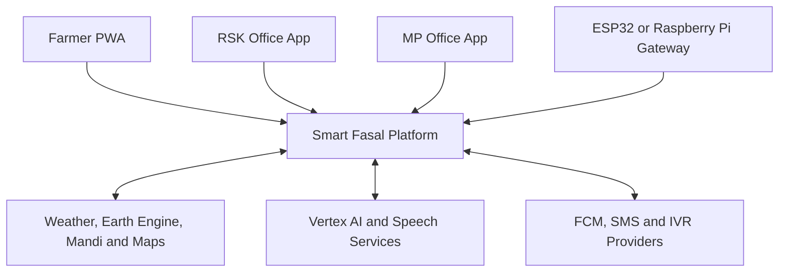
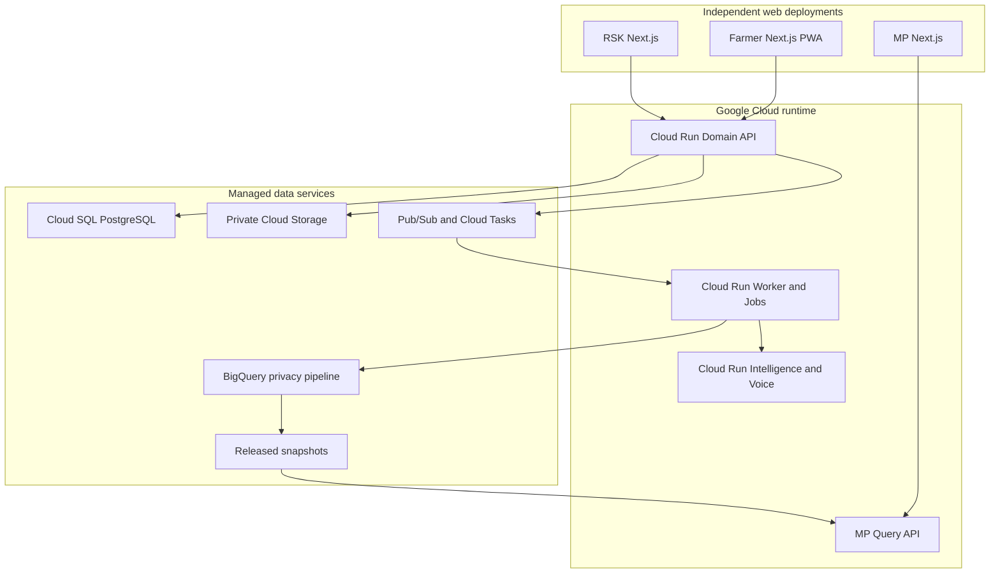
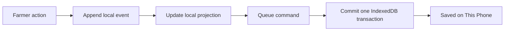
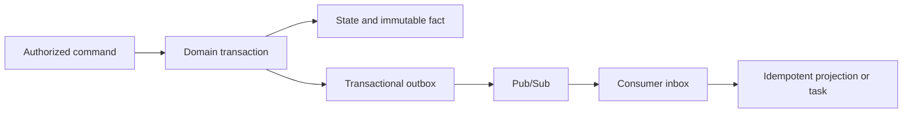
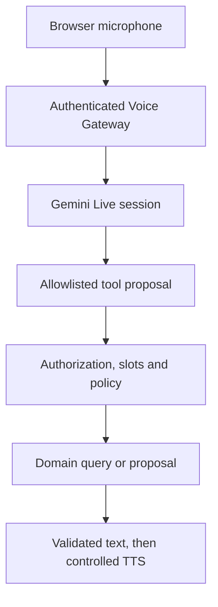
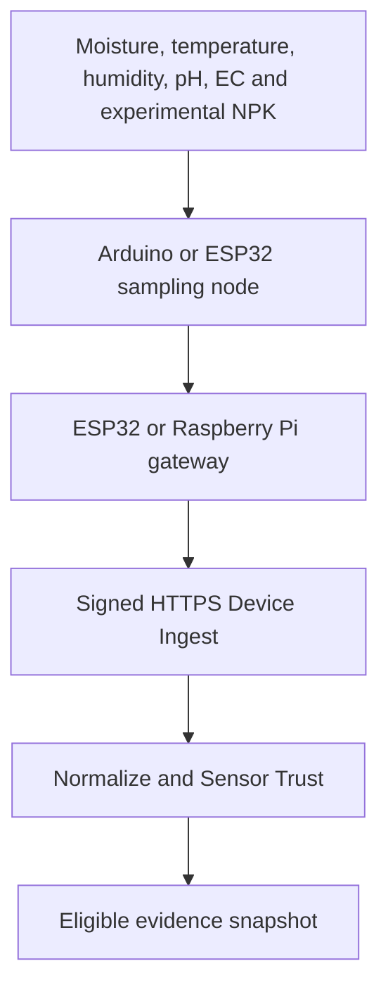

# Smart Fasal Kisan Alert

## Technical Architecture

| Field | Value |
| --- | --- |
| Status | Approved |
| Version | 0.1.0 |
| Last updated | 12 July 2026 |
| Parent documents | `docs/01_PRD.md`, `docs/02_INFORMATION_ARCHITECTURE.md`, `docs/03_END_TO_END_FLOWS.md`, `docs/04_FEATURE_SPECIFICATIONS.md` |
| Pilot | Raigad district, Maharashtra |
| Product surfaces | Farmer installable PWA, RSK desktop web application, MP Office desktop web application |
| Architecture style | TypeScript-first modular monolith with isolated intelligence workloads and event-driven integrations |
| Primary cloud | Google Cloud |
| Repository reviewed | `rajpatilrobotics/smart-fasal-kisan-alert`, `main` at `890228f` |

## 1. Purpose

This document selects the implementation architecture for the approved Smart Fasal Kisan Alert product. It defines system boundaries, runtimes, cloud services, application structure, authorization, data ownership, offline synchronization, AI safety, voice, Earth Engine, public-data and hardware integration, event delivery, privacy release, observability and deployment for the Farmer, Rythu Seva Kendram (RSK) Office and MP Office.

It does not duplicate every database column, endpoint or test case. Those become separate data-model, event-catalogue, API, security and test specifications after this architecture is approved.

The words **must**, **must not**, **required** and **never** are architecture constraints. A newer document may add detail but cannot weaken an approved product, safety, privacy or integrity contract without reconciling the parent documents.

## 2. Architecture outcome

The build is a modern, Google Cloud-first platform with three independently deployable web applications, one modular operational backend and selectively isolated security/runtime boundaries:

1. A Farmer Next.js PWA optimized for low-end Android, Marathi-first use and durable offline work.
2. An RSK Next.js desktop application for consented farmer support and operational workflows.
3. An MP Office Next.js desktop application that can consume only privacy-released aggregates.
4. A Cloud Run domain API and worker built as a modular monolith.
5. A separately isolated Python geo/ML service for Earth Engine, scientific feature work and future trained-model inference; launch agronomy rules remain in one deterministic TypeScript kernel.
6. Cloud SQL for PostgreSQL with PostGIS as the operational source of truth.
7. Pub/Sub, Cloud Tasks, Cloud Scheduler and Cloud Run Jobs for reliable asynchronous processing.
8. Vertex AI, Gemini Live, Speech-to-Text, Text-to-Speech and Translation behind typed, policy-controlled adapters.
9. Google Earth Engine through precomputed snapshots and licence-aware weather adapters; Google Weather supplies short-lived Google-native current context where its terms permit.
10. A signed HTTPS hardware-ingestion path for ESP32 or Raspberry Pi gateways.

The first release is deliberately not a collection of one-service-per-feature microservices. Domain modules remain independently testable and replaceable, but share one transactional operational database and one deployable API until an evidenced scaling, runtime or security boundary requires extraction.

## 3. Non-negotiable architecture principles

### 3.1 One authority for each decision

- PostgreSQL is the server-side operational source of truth.
- The Farmer device has an explicit offline source of truth only for locally committed, not-yet-acknowledged work and cached local projections.
- Deterministic versioned engines own eligibility, scores, action classes, escalation, alert policy, conflict policy and privacy release.
- Generative AI may extract, translate, summarize, explain or propose a tool call; it never becomes the hidden owner of a product decision.
- The server, never the route, button, prompt or browser, authorizes every protected read and mutation.

### 3.2 Honest evidence

`Live`, `Recorded` and `Simulated` remain different data modes from ingestion to display and analytics. Source, observation time, fetch time, freshness, quality, unit, processing version and limitations travel with every derived result. A provider failure never silently substitutes a fixture.

Mode derivation is deterministic and versioned. Any decision-driving synthetic input makes the derived result `Simulated`. A deliberate frozen replay produces `Recorded`. Genuine historical evidence may support a current `Live` evaluation only when it remains explicitly dated and its policy allows historical context; it is never relabelled as a current measurement. Server environment, credential, assignment and source registry outrank client claims, and an untrusted client can never promote `Recorded` or `Simulated` evidence to `Live`.

### 3.3 Offline truth without false synchronization

The Farmer PWA can truthfully say `Saved on This Phone` only after an atomic IndexedDB commit. It says `Synced` only after server acknowledgement. Browser online state, service-worker queueing or an HTTP request being sent are not acknowledgements.

### 3.4 Privacy by physical boundary

The MP application has no individual-farmer routes, generated client or direct operational-data connection. Exact location and direct identifiers are removed before the analytics boundary. Suppression and disclosure control happen on the server before a released snapshot becomes queryable.

### 3.5 Degrade safely

The app remains navigable without AI, Earth Engine, weather, market, messaging or sensor providers. It shows the last dated result only within its freshness policy, otherwise `Unavailable`, `Waiting for Internet`, `Needs Review` or another truthful terminal state.

## 4. Locked technology baseline

Use current stable releases available at implementation time and pin every exact version in lockfiles and container digests. Canary, preview and unpinned `latest` dependencies are forbidden in a critical path.

| Layer | Selection | Reason |
| --- | --- | --- |
| Monorepo | `pnpm` workspaces and Turborepo | One dependency graph, cached builds and enforceable package boundaries |
| Web applications | Next.js App Router, React, strict TypeScript | Mature routing, code splitting, PWA support and separate server/client boundaries |
| Styling and primitives | Tailwind CSS, CSS-variable tokens and React Aria Components | Accessible, owned UI primitives without a runtime-heavy theme system |
| Forms and schemas | React Hook Form and Zod | Accessible forms with shared runtime validation |
| Connected state | TanStack Query | Controlled request caching, invalidation and async state |
| Farmer local database | Dexie over IndexedDB | Transactions, schema migrations, indexed durable event/outbox storage |
| Service worker | Custom Workbox `injectManifest` build | Explicit cache and push policy; no opaque all-route caching |
| Localization | `next-intl` with ICU messages | Marathi, Hindi and English pluralization and externalized copy |
| Tables | TanStack Table | Headless, accessible RSK and MP data views |
| Maps | Google Maps JavaScript API, lazy loaded | Plot capture and approved map views using Google tooling |
| Domain API | Node.js active LTS, Fastify, strict TypeScript | Low-overhead typed HTTP service and clear plugin/module boundaries |
| Operational database | Cloud SQL for PostgreSQL 17 with PostGIS | Transactions, relational workflows, spatial data and mature integrity controls |
| SQL access | Drizzle ORM plus reviewed SQL migrations | Type-safe queries without hiding SQL or database constraints |
| Geo/ML service | Python stable runtime, FastAPI and Pydantic | Earth Engine, scientific feature extraction and later custom-model inference with typed contracts |
| Object storage | Private Google Cloud Storage buckets | Media, raw imports, exports and model/evaluation artifacts |
| Events | Pub/Sub plus transactional outbox/inbox | Fan-out with explicit idempotency under at-least-once delivery |
| Scheduled/retry work | Cloud Tasks, Cloud Scheduler and Cloud Run Jobs | Per-attempt retries, due-time execution and bounded batch jobs |
| Identity | Firebase Authentication upgraded to Identity Platform in staging and production | Farmer phone OTP, invite-only staff identity and mandatory staff MFA |
| Notifications | Firebase Cloud Messaging plus provider adapters for SMS/IVR | Web push with replaceable external channels |
| Generative AI | Vertex AI Gemini through an application model registry | Google-hosted multimodal and live voice capabilities with controlled versions |
| Speech | Gemini Live primary; Cloud Speech-to-Text V2 and Text-to-Speech fallback | Low-latency conversation with a separately testable Marathi fallback |
| Translation | Reviewed locale catalog plus Cloud Translation Advanced glossary for dynamic text | Human-reviewed critical copy and consistent agricultural terms |
| Analytics | BigQuery staging plus server-created privacy-release snapshots | Aggregate analysis without direct MP access to operational records |
| Infrastructure | Terraform | Reviewable, reproducible and environment-specific cloud configuration |
| Observability | OpenTelemetry, Cloud Logging, Cloud Trace, Cloud Monitoring and Error Reporting | Correlated signals without provider-specific instrumentation in domain code |
| Test stack | Vitest, Testing Library, MSW, Playwright, axe-core and Lighthouse CI; Pytest for Python | Unit, contract, integration, accessibility and end-to-end coverage |

Redis, Firestore as a domain database, GraphQL, Kubernetes and a public MQTT broker are not required for the pilot. They must not be introduced without an architecture decision record demonstrating a need that the selected stack cannot meet.

## 5. Existing repository assessment and rebuild disposition

The current GitHub repository is a static submission prototype. Its significant files are `public/index.html`, `public/app.js`, `public/styles.css`, `package.json`, `vercel.json`, `firebase.json`, `README.md`, `TECH_USED.md` and `plan.md`.

The prototype proves that a submission URL exists, but it does not provide authentication, durable data, route isolation, typed contracts, offline synchronization, APIs, tests, provider integration or three real stakeholder products. It also contains hard-coded Guntur/Telugu assumptions that conflict with the approved Raigad/Marathi pilot. User-controlled values are rendered through `innerHTML`; that unsafe pattern must not be copied into the rebuild.

Migration rules:

1. Preserve the current commit with a Git tag such as `legacy-static-submission` before replacement.
2. Do not incrementally grow `public/app.js` into the product.
3. Reuse only reviewed wording, useful visual ideas and deterministic demo content.
4. Replace the existing Vercel project with the Farmer build only after staging smoke tests pass, preserving `https://smart-fasal-kisan-alert.vercel.app` as the submitted public entry.
5. Deploy RSK and MP as separate projects or backends with separate origins. The approved `/rsk/*` and `/mp/*` route paths remain valid within their respective applications.
6. Keep a rollback deployment for the static submission until the modern build is verified.
7. Never ship the legacy prototype under an unlabelled route that a judge could mistake for live product behaviour.

No repository write, tag or deployment is performed by this document.

## 6. Quality attributes and measurable budgets

| Attribute | Architecture response |
| --- | --- |
| Availability | Cloud Run stateless services, Cloud SQL high availability in production, bounded retries and provider circuit breakers |
| Offline reliability | IndexedDB event/projection/outbox transaction, foreground sync and checksum-based media resume |
| Idempotency | Stable command/event IDs, unique constraints, transactional outbox and consumer inbox |
| Authorization | Server-verified identity, capability, jurisdiction, ownership, purpose and consent on every protected operation |
| Privacy | Purpose-specific views, restricted schemas, pseudonymous analytics IDs and server-side privacy release |
| Explainability | Immutable evidence and decision snapshots with rule, model, source and template versions |
| Performance | Farmer entry route at or below 250 KB compressed executed JavaScript; maps, charts, voice and media lazy loaded |
| API latency | Normal first-party reads and writes target p95 below 750 ms; heavy provider work is asynchronous |
| Voice latency | Healthy-provider p95 target at or below 5 seconds from end of speech to first audible response |
| Accessibility | WCAG 2.2 AA, keyboard-complete office apps, large farmer targets and accessible alternatives to maps/charts |
| Maintainability | Strict boundaries, zero lint/type errors, domain rules outside UI and AI, Sonar quality gate on new code |
| Auditability | Append-only audit facts and immutable decision snapshots; no blockchain or mutable log-as-audit shortcuts |

## 7. System context



The three users do not call cloud providers directly for protected product operations. Public Google Maps assets may load in the browser with origin-restricted keys; all protected provider credentials, AI calls, Earth Engine work and domain mutations remain server-side.

## 8. Deployment topology



The MP application and its query service cannot access operational data or raw BigQuery datasets. `mp-query-api` reads only approved released snapshots. No browser receives BigQuery credentials.

### 8.1 Deployable units

| Unit | Runtime | Public exposure | Responsibility |
| --- | --- | --- | --- |
| `web-farmer` | Next.js web deployment | Public shell; authenticated Farmer routes | PWA, offline store, sync, camera and Farmer voice |
| `web-rsk` | Next.js web deployment | Staff-authenticated | RSK queues, cases, templates, alerts, sensors, visits and support |
| `web-mp` | Next.js web deployment | Staff-authenticated | Released aggregates, maps, briefings and MP voice |
| `domain-api` | Cloud Run, TypeScript | HTTPS through controlled ingress | Authorized Farmer/RSK queries, commands, sync and upload intents |
| `domain-worker` | Cloud Run, TypeScript | Internal only | Outbox publication, event consumers, alert attempts, imports and projections |
| `device-ingest` | Cloud Run, TypeScript | Signed device batches only | Hardware authentication, replay defence and raw-observation acceptance |
| `provider-callback-ingest` | Cloud Run, TypeScript | Signed provider callbacks only | Signature/replay verification and immutable callback-inbox acceptance |
| `intelligence-service` | Cloud Run, Python | Internal only | Earth Engine, scientific feature computation and later shadow/custom-model inference |
| `voice-gateway` | Cloud Run | Authenticated WebSocket/HTTPS | Ephemeral live sessions, tool proposals, fallback speech path |
| `privacy-pipeline` | Cloud Run/Jobs | Internal only | Analytics minimization, tokenization, validation and privacy release |
| `mp-query-api` | Cloud Run, TypeScript | MP-authenticated only | Allowlisted queries over immutable released snapshots |
| `media-scanner` | Event-driven Cloud Run | Internal storage event only | Quarantine validation, malware/content checks and safe derivatives |
| `scheduled-jobs` | Cloud Run Jobs | Internal only | Weather, market, Earth feature, retention, export and privacy-release jobs |

These selectively isolated units may share source packages and container images, but run under different service identities and scaling policies. They exist because ingestion, intelligence, media and MP privacy require materially different permissions. `domain-api` is the only public component allowed to commit authoritative user commands. Workers commit only commands explicitly delegated by a domain policy and still use the same application services and invariants.

### 8.2 Region policy

- Place the core runtime, Cloud SQL, buckets, Pub/Sub, Tasks and analytics data in `asia-south1` when the selected service supports it.
- Use a different Google region only when a required managed model or speech feature lacks the approved core region; record the data-flow and residency decision before enabling it.
- Provider region and endpoint are configuration-registry values, not scattered constants.
- Production and demo are separate Google Cloud projects. Recorded or Simulated data cannot share production delivery credentials.

## 9. Monorepo and package boundaries

```text
apps/
  farmer-web/
  rsk-web/
  mp-web/
  domain-api/
  domain-worker/
  device-ingest/
  provider-callback-ingest/
  mp-query-api/
  privacy-pipeline/
  media-scanner/
  intelligence-service/
  voice-gateway/

packages/
  api-contracts/
    farmer/
    rsk/
    mp/
    internal/
  application/
  authz/
  domain/
  persistence/
  events/
  offline/
  ui/
  i18n/
  voice/
  maps/
  observability/
  test-kit/
  config/

infra/
  terraform/
  environments/

tests/
  contract/
  integration/
  e2e-farmer/
  e2e-rsk/
  e2e-mp/
  authorization/
  offline/
  privacy/
  load/

tooling/
  workbox/
  scripts/
  quality/
```

Boundary rules:

- An application never imports another application.
- `domain` contains pure rules and value objects, with no React, HTTP, SQL or Gemini SDK imports.
- `application` coordinates commands, queries, transactions and domain services.
- `persistence` implements repositories; domain packages do not know Drizzle.
- `ui` contains presentation primitives and tokens, never network calls, authorization or agronomy decisions.
- Role-specific API contract packages expose only that surface's allowed operations.
- Generated clients, schemas and events come from one versioned contract source; handwritten duplicate interfaces are forbidden.
- TypeScript packages use explicit exports and dependency-boundary lint rules.
- Python and TypeScript communicate through versioned JSON/HTTP or event contracts, not a shared database schema assumption.
- No client package contains service-account credentials, privileged SDKs, prompt secrets or provider keys.

## 10. Frontend architecture

### 10.1 Three applications, shared system

Three builds are required even though they share a monorepo and design tokens. This keeps the Farmer service worker away from staff routes, prevents office-only charts and maps from entering the Farmer bundle, makes forbidden MP route families physically absent and permits independent CSP, rollback and performance budgets.

| Application | Rendering and state | Offline policy |
| --- | --- | --- |
| Farmer | Generic route shell plus client-rendered authorized local projections; TanStack Query only for connected operations | Installable PWA with durable domain data in IndexedDB |
| RSK | Generic server-rendered shell plus client-side authorized API reads and focused interactive islands | Online-first except the dedicated encrypted Field Visit and Sensor Maintenance pack/store |
| MP | Generic server-rendered shell plus client-side released-snapshot reads; maps/charts as lazy islands | No durable analytical-data PWA cache beyond safe public assets |

The initial Vercel architecture does not server-render personal or protected aggregate data. It serves application code and generic shells; authenticated browsers call the Google Cloud APIs directly. If protected HTML or React Server Component payloads are introduced later, they require a privacy/cache review, use `private, no-store` and never enter a shared service-worker cache. No secret provider key is present in the Vercel bundle or logs.

### 10.2 Client state ownership

- URL parameters own allowlisted RSK and MP filters so refresh and Back remain deterministic.
- TanStack Query owns connected server request state, not durable offline truth.
- Dexie owns Farmer cached projections, immutable local events, outbox work, media state, cursors and conflicts.
- React context owns the current authenticated identity, language, accessibility preferences and selected opaque context.
- Local reducers own temporary overlays, wizards and voice interaction state.
- Redux and Zustand are not introduced until a demonstrated cross-tree state problem survives these boundaries.

### 10.3 Rendering safety

- React text nodes render all farmer, expert and AI content by default.
- Raw `innerHTML` and unsanitized generated Markdown or HTML are forbidden.
- Any approved rich text passes an allowlist sanitizer in a dedicated component and stores the sanitized representation separately from the original.
- Each application uses a tested nonce/hash-based Content Security Policy compatible with its Next.js build; arbitrary inline scripts and `unsafe-eval` are forbidden. The identity-neutral offline shell uses a static hash-compatible policy, and Google Maps permissions are enabled only on routes that load Maps. Trusted Types where supported and strict dependency review complete the XSS boundary.
- External links use an allowlist and safe target attributes.
- URLs contain opaque IDs and approved filter slugs, never phone, name, symptom, transcript or exact coordinates.

### 10.4 Performance and accessibility

- Farmer primary touch targets are at least 48 by 48 CSS pixels.
- Only the active locale is loaded. Devanagari fonts are self-hosted and subset when licensing permits.
- Camera, live voice, Google Maps, evidence viewers and office charts load on demand.
- Every chart or map that carries a decision has an equivalent accessible table or ordered summary.
- RSK and MP remain desktop-first, but the MP saved-briefing and voice routes retain a safe responsive read-only layout for authorized mobile use.
- Voice overlays restore focus to the opening control.
- Bundle analysis, Lighthouse CI, axe-core and keyboard/screen-reader smoke tests are merge gates.
- RSK and MP tables virtualize only when the measured row count needs it; virtualization must preserve keyboard and screen-reader behaviour.

## 11. Farmer PWA and offline architecture

### 11.1 Local stores

The Farmer Dexie database contains logical stores for:

| Store | Purpose |
| --- | --- |
| `localEvents` | Immutable farmer actions and observations before and after acknowledgement |
| `projections` | Screen-ready farm, season, task, alert, diary and case views |
| `outbox` | Commands awaiting a server decision |
| `mediaBlobs` | Consented local media pending upload or retained for recovery |
| `mediaUploads` | Checksum, part state and server upload reference |
| `syncCursors` | Last accepted server stream position per identity partition |
| `conflicts` | Server rejections and conflicts requiring reconciliation |
| `cacheMetadata` | Schema, locale, freshness and storage-pressure metadata |
| `sessionPartitions` | Isolation and lock state for Personal, Family and RSK-Assisted modes |

This is a logical design, not the final table specification.

### 11.2 Atomic local commit



If any operation fails, none commits and the UI cannot show `Saved on This Phone`. Media is a separate checksummed object; structured work may commit with `Media Pending` or after the Farmer selects `Save Without Media`.

### 11.3 Sync protocol

1. Trigger on authenticated unlock, launch, focus, confirmed reachability, network recovery, manual retry and bounded foreground timer.
2. Treat `navigator.onLine` only as a hint; call a lightweight API reachability endpoint.
3. Refresh authentication without deleting local work.
4. Send causally ready, size-bounded command batches with schema version, last server cursor and stable command IDs.
5. The server validates identity, role, ownership, consent, schema, base version, command policy and idempotency.
6. Return `Accepted`, `Already Accepted`, `Rejected` or `Conflict` per command plus the next event cursor.
7. In one IndexedDB transaction, append returned server events, rebuild affected projections, update each command disposition, remove or mark acknowledged outbox rows and advance the opaque cursor. If any part fails, retain the prior cursor and replay safely.
8. Synchronize structured events before ordinary media; urgent crop-health media outranks ordinary Diary media.
9. Show `Synced` only after the original server acknowledgement is durably applied locally.

The service worker may help wake the foreground engine, but Workbox Background Sync is never the authoritative outbox because browser scheduling is not dependable across farmer devices.

### 11.4 Cache policy

| Resource | Policy |
| --- | --- |
| Hashed JavaScript, CSS, icons and fonts | Cache first with immutable versioned names |
| Identity-neutral Farmer offline shell, navigation and recovery | Precached by exact build version |
| Generic dynamic Farmer route shell | Network first with bounded timeout, then identity-neutral offline shell |
| Auth, OTP, protected HTML/document and `?_rsc` requests | Network only; never placed in Cache Storage |
| Critical locale resources | Precache current language plus fallback language |
| Protected API response | `private, no-store`; project into identity-partitioned IndexedDB explicitly |
| Exact-location maps or private media | No shared Cache Storage; short-lived authorized access only |
| Public static methodology or safe aggregate asset | Stale while revalidate when licensing and policy permit |
| RSK and MP protected pages | Online first; no Farmer service-worker scope |

The Farmer app registers one service worker for its scope. That worker integrates Workbox caching, update handling and Firebase Cloud Messaging; competing cache and messaging service workers are forbidden. Push payloads contain only non-sensitive routing metadata and the authenticated app fetches the current Alert.

An offline deep link loads the identity-neutral shell, unlocks the current subject partition and resolves the opaque route against IndexedDB. Missing cached data returns a truthful offline recovery screen. Automated tests enumerate every Cache Storage entry after critical journeys and fail if any personal response, protected document/RSC payload, signed URL or another identity's content is present. Approved public current/fallback locale bundles are explicitly allowed.

Calendar `Remind` uses a safe local notification only where the installed browser supports it and permission exists. The durable Task/Alert remains in IndexedDB, and Today/Alerts provide the mandatory in-app fallback when local scheduling is unavailable or evicted.

### 11.5 Browser storage and shared phones

- Request persistent storage where supported but never assume it is granted.
- Never evict unsynchronized structured work automatically.
- Warn before large media capture when quota is low; preserve text before media.
- Use a separate physical Dexie/IndexedDB database name per environment and authenticated subject, not only a row-level partition. Active identity is shown and must be unlocked before data access; inactivity auto-locks shared modes.
- Encrypt approved sensitive local records with Web Crypto AES-GCM. In shared modes, protect the data key with the documented local lock/recovery policy.
- Local encryption reduces casual at-rest exposure but does not make XSS harmless; CSP and structured rendering remain mandatory.
- Assisted-session data is purged only after confirmed sync or authorized encrypted recovery. The purge is audited.
- Logout with unsynchronized work warns the current user and locks the partition; it never silently deletes or exposes the work.
- A later user can never browse another Farmer's cache or recover it through browser history.
- Maintain a minimum 90-day pilot compatibility horizon for emitted offline command schemas and a complete forward-migration chain for every version still inside that horizon. Local migrations are expand-only while an older deployment may still run. Service-worker activation is staged until the database migration is verified; rollback must either open the expanded schema safely or keep the prior build active. An unsupported old queue is locked for forward migration/recovery and is never deleted.
- The Sync API retains validated upcasters/handlers for every command schema inside that horizon. Removing a handler requires telemetry proving the horizon has elapsed and no retained queue or recovery artifact can still emit it.

## 12. Identity, session and authorization architecture

### 12.1 Authentication

- Farmers use Identity Platform phone OTP for the pilot, with Marathi/Hindi/English recovery guidance and configured reCAPTCHA/SMS-abuse defence, quotas and anomaly monitoring.
- RSK and MP staff are invite-only, use approved Google identity or email authentication and complete TOTP or another approved MFA factor before staging or production access.
- The API verifies the Firebase ID token signature, audience, issuer, expiry and revocation-sensitive state.
- A valid Firebase App Check token is required on supported browser and device routes as an abuse-reduction signal; it never grants data access or replaces user authorization.
- The frontend does not trust a role selector. A visibly labelled Demo selector uses isolated demo identities and data only.
- Offline Farmer work remains locally available after token expiry under the device-mode lock, but server sync requires reauthentication.
- Personal mode may use the approved persistent Firebase authentication setting. Family-shared and RSK-Assisted modes use in-memory or session persistence with explicit reauthentication. Application code never stores bearer or refresh tokens in `localStorage` or its own IndexedDB records.

### 12.2 Authorization

Custom claims may carry only coarse routing hints such as stakeholder type. The authoritative decision is computed server-side from current records:

```text
identity
+ active role
+ capability
+ jurisdiction or ownership
+ object state/version
+ declared purpose
+ current consent
+ data-mode policy
= authorized operation
```

Every protected repository query receives an authorization scope. Fetching broadly and filtering in React is forbidden. RSK access is purpose-limited and time-bounded where required. MP access can target only released aggregate snapshot IDs.

### 12.3 Session transport

The default browser-to-API transport uses a short-lived Firebase bearer token in the `Authorization` header over TLS, with exact-origin CORS. Tokens are never put in URLs. If a later custom-domain deployment adopts HTTP-only session cookies, it requires CSRF protection and a separate architecture decision; the API authorization model does not change.

### 12.4 Database defence in depth

- The application connects with a non-owner database role without `BYPASSRLS`.
- PostgreSQL row-level policies protect tenant/jurisdiction or subject-scoped tables where practical.
- RLS context uses `SET LOCAL` only inside the same transaction as the query and binds actor, jurisdiction and purpose; missing context denies all. Connection-level `SET` is forbidden because pooled connections are reused, and a pool-reuse negative test proves context cannot leak.
- Separate database roles isolate migrations, API reads/writes, workers, analytics export and support operations.
- Row-level security is defence in depth, not a substitute for application capability and consent checks.
- Negative authorization tests cover object existence leakage, enumeration, stale claims and cross-role deep links.

### 12.5 Cross-origin role resolution

Each Farmer, RSK and MP origin is explicitly registered in Identity Platform and the server App Origin Registry. Authentication preserves only an opaque, expiring return-state ID that maps server-side to an exact allowed origin and safe internal route; it never accepts an arbitrary `returnUrl` host. After sign-in, the API returns the actor's currently allowed roles and destinations. Selecting or switching a role creates a new role context, rechecks staff MFA/capabilities, invalidates the prior context where required and writes an audit fact. Identity or bearer tokens never travel between origins in a query string.

## 13. Domain backend architecture

### 13.1 Modular monolith

`domain-api` and `domain-worker` use the same application and domain packages but different entry points and service identities. Each domain module owns its commands, queries, rules, repository interfaces, emitted events and read models.

| Module | Primary ownership |
| --- | --- |
| Identity and Access | User linkage, role grants, capabilities, jurisdictions and access sessions |
| Consent and Purpose | Location, audio, case-sharing and channel consent; purpose grants and withdrawals |
| Farmer Registry | Farmer-visible profile, preferences and device modes |
| Farm and Plot | Farms, plots, geometry versions, water context and soil evidence references |
| Season and Crop Plan | Crop selection, season lifecycle and governed crop-profile snapshot |
| Evidence | Source registration, immutable snapshots, quality, freshness and provenance |
| Recommendation | Candidate gates, component scores, confidence and acceptance |
| Advisory | Dry-spell evaluation, input timing, review and material recalculation |
| Calendar | Template versions, season task instances, rescheduling and task state |
| Diary and Sync | Immutable activity events, corrections, tombstones, cursors and conflicts |
| Crop Health | Reports, triage results, evidence packs and expert Cases |
| RSK Work | Work queue, ownership, visits, outreach, reviews and service clocks |
| Sensor | Device registry, assignments, observations, calibration, trust and issues |
| Alerting | Canonical alerts, recipients, interactions, channel policy and delivery attempts |
| Market | Raw public records, ontology mapping, comparisons and watches |
| Voice | Sessions, allowlisted intents, proposals, confirmation and metadata audit |
| Export and Deletion | Farmer export jobs, artifact access, deletion workflows and tombstones |
| Privacy Release | Analytics subject mapping, contribution bounding, suppression and released snapshots |
| Audit | Append-only security and domain-action facts with retention controls |

Cross-module calls use application service interfaces. A module cannot update another module's table from a UI handler or an event consumer. Multi-module invariants such as `Advisory + Task + Alert` are coordinated by one application transaction or an explicit saga whose intermediate states appear in the product contract.

### 13.2 Commands and queries

- Commands are imperative, validated and idempotent: for example `AcceptRecommendation`, `RecordDiaryActivity` or `AcknowledgeAlert`.
- Queries return purpose-built role read models, not database entities.
- A command handler rechecks authorization and the expected entity version inside its transaction.
- Every successful command writes the authoritative change, immutable decision/audit facts and outbox entries in one database transaction.
- A retry with the same actor and command ID returns the original outcome. Reusing the ID with a different payload is a conflict and a security signal.
- High-impact commands store the rule, template, consent and evidence versions used at decision time.

### 13.3 No hidden business rules in infrastructure

Cloud Tasks schedules work but does not decide whether it remains safe. Pub/Sub transports an accepted event but does not define its meaning. Database triggers may enforce narrow integrity constraints but cannot contain the only implementation of agronomy, alerting, consent or privacy logic. Those rules live in versioned domain packages with tests.

### 13.4 Feature-to-architecture trace

| Approved feature | Owning modules and principal infrastructure |
| --- | --- |
| FS-01 Farmer and Farm Setup | Farmer Registry, Farm and Plot, Consent; PostGIS, Google Maps and Farmer offline store |
| FS-02 Farmer Home and Daily Action Centre | Season, Calendar, Advisory, Alerting and local Farmer projections |
| FS-03 Smart Crop Recommendation | Evidence and Recommendation modules, deterministic agronomy kernel and precomputed Earth snapshots |
| FS-04 Real-time Advisory and Dry-spell Guidance | Evidence, Advisory, Calendar and Alerting; weather cells, sensor trust and asynchronous reevaluation |
| FS-05 Multimodal Crop Health | Crop Health and RSK Work; quarantine media, bounded Vertex AI extraction and deterministic escalation |
| FS-06 Multilingual Voice Agents | Voice Gateway, role tool registries, Gemini Live and STT/TTS fallback |
| FS-07 RSK Expert Operations | RSK web, operational API, Work/Case/Visit/Review modules and purpose grants |
| FS-08 MP Decision Intelligence | Privacy Pipeline, released snapshots, isolated MP Query API and MP web |
| FS-09 Smart Crop Calendar | Season and Calendar modules, governed templates, tasks and Diary linkage |
| FS-10 Live Farm Monitor | Device Ingest, Sensor module, trust engine, hardware gateway and Farmer/RSK projections |
| FS-11 Offline Farm Diary | Dexie local events/projections/outbox, Sync API, Diary module and tombstones |
| FS-12 Alert Inbox and Delivery | Canonical Alert service, Pub/Sub, Cloud Tasks, FCM and SMS/IVR adapters |
| FS-13 Mandi Price and Market Watch | Market adapters, raw archive, governed ontology/mapping and watch evaluation |

## 14. API and transport architecture

### 14.1 Public API style

- Versioned REST JSON under `/v1` is the primary contract.
- Zod schemas in `packages/api-contracts` are the canonical source for public APIs, internal JSON messages and events.
- OpenAPI 3.1 and JSON Schema artifacts are generated, checked into the repository and rejected by CI when regeneration produces drift.
- Role-specific TypeScript clients and Python Pydantic models are generated from those artifacts; generated files are never hand-edited.
- Errors use `application/problem+json` with stable problem type, safe title, status, optional field errors and correlation ID.
- Server time is UTC. Observed local time also carries the original timezone and offset.
- Identifiers are opaque UUIDv7 or another approved non-enumerable format.

### 14.2 Operation patterns

| Operation | Contract |
| --- | --- |
| Normal read | `GET`, authorization-scoped, cursor pagination, explicit data-as-of and freshness |
| Connected mutation | `POST` command with required `Idempotency-Key` header and expected version |
| Mutable settings | `PATCH` only for an explicit allowlist with optimistic version check |
| Farmer sync | Bounded batch whose events carry stable command/event IDs, plus last server cursor and per-command disposition |
| Long-running work | `202 Accepted` plus opaque operation resource and status endpoint |
| Async progress | Authenticated `fetch()` response streaming where useful; polling fallback |
| Live voice | Bearer-authenticated session creation followed by a one-time ticketed WebSocket; HTTPS fallback |
| Upload | Initiate, signed resumable upload, finalize and integrity status |
| Provider callback | Narrow callback-ingest service with provider-native signature, replay and source validation |

GraphQL is not selected. The product needs strict command semantics, role-specific contracts, idempotent offline replay and simple cache control more than arbitrary client-shaped querying.

For connected commands, persist `(actor, operation, idempotencyKey, requestHash, status, outcome)` for the retention period defined by that operation. The same key and hash return the original outcome. The same key with a different hash returns conflict and emits a security signal. Sync uses each local event/command ID as the idempotency identity inside the authorized batch; it does not invent a second header key for every event.

`provider-callback-ingest` validates the provider-native signature, timestamp and replay ID, persists an immutable callback-inbox fact and acknowledges quickly. It cannot update canonical Alert or domain records. A Worker later applies the authorized idempotent attempt-state transition.

### 14.3 Concurrency and caching

- Mutable aggregates carry an integer revision or strong ETag.
- Commands state the expected revision. A mismatch returns a typed conflict with a safe current summary, never a silent last-write-wins update.
- Protected responses are `private, no-store` unless the endpoint defines an explicit safe policy.
- Public configuration and methodology use versioned cache keys.
- API rate limits are per identity, device, endpoint class and source IP risk, with stricter limits for OTP, voice, uploads, export and public callbacks.
- Pagination uses opaque cursors, not unbounded offset scans.

### 14.4 Internal service calls

- Cloud Run-to-Cloud Run calls use dedicated service accounts and Google-signed identity tokens.
- Internal endpoints reject end-user tokens unless explicitly designed as delegated calls.
- The Domain API sends the intelligence service the minimum typed evidence snapshot needed for a computation.
- The intelligence service cannot hold a database credential that permits domain writes.
- Timeouts, retry classifications and circuit breakers are explicit per adapter. A non-idempotent call is never retried blindly.

## 15. Operational data architecture

### 15.1 Source of truth

Cloud SQL for PostgreSQL is the only authoritative server-side operational store. PostGIS stores plot geometry and approved geographic reference layers. `pgvector` may later store embeddings for retrieval from approved knowledge; it is not a decision engine and is not enabled until a documented retrieval use case passes privacy review.

Firestore is not the operational database. Direct browser-to-Firestore domain writes would bypass the required relational constraints, consent checks, immutable history, command idempotency and privacy-release boundary. Firebase remains appropriate for authentication and Cloud Messaging.

### 15.2 Logical schemas

| Schema | Contents | Access boundary |
| --- | --- | --- |
| `identity` | Subject linkage, staff memberships and coarse profile references | Identity service only; restricted support path |
| `consent` | Versioned consent and purpose grants/withdrawals | Domain authorization and audited support reads |
| `farm` | Farms, plots, geometry, soil/water evidence and seasons | Farmer owner or purpose-authorized RSK |
| `agronomy` | Profiles, templates, rules, recommendations, advisories and evidence snapshots | Domain engines; governed RSK views |
| `workflow` | Calendar, Diary, Cases, visits, outreach and RSK work | Scoped Farmer/RSK services |
| `sensor` | Devices, assignments, raw references, normalized observations and trust | Ingest/trust services and scoped views |
| `alerting` | Canonical alerts, recipients, interactions and delivery state | Alert services; scoped operational views |
| `market` | Raw import metadata, normalized records, mapping and watches | Market services and appropriate views |
| `voice` | Ephemeral session metadata and confirmed proposals; no default raw transcript archive | Voice service and narrow audit path |
| `privacy` | Pseudonymous mapping, release jobs, suppression state and released snapshots | Privacy-release service only |
| `audit` | Append-only authorized-action and security facts | Restricted audit role |
| `platform` | Outbox, consumer inbox, jobs, idempotency and configuration versions | Platform services only |

The later data-model document specifies tables, keys and retention. These schemas are security and ownership boundaries, not permission to create one large unstructured table per feature.

### 15.3 Immutable facts and current projections

The application is not fully event sourced. It uses a hybrid pattern:

- Immutable domain facts preserve Diary actions, consent changes, decision snapshots, alert interactions, expert actions, sensor observations and corrections.
- Normalized current-state tables provide efficient operational queries.
- Projection versions point back to the facts that produced them.
- Corrections append a revision, correction or void fact; they do not rewrite evidence history.
- Tombstones prevent old offline devices from resurrecting deleted state.

This gives auditability without forcing every query through event-stream replay.

### 15.4 Sensitive fields

- Cloud SQL, Storage and backups use Google-managed encryption by default; production may add CMEK after key-operations readiness is demonstrated.
- Phone numbers and other lookup-sensitive identifiers use application-layer envelope encryption plus an approved keyed lookup token where exact lookup is required.
- Exact plot geometry remains in a restricted PostGIS schema because spatial computation requires it; only designated services can read it.
- Contact data, exact coordinates, case media and raw transcripts never enter general logs, URLs or product analytics.
- Database backups use high availability, automated backups and point-in-time recovery in staging and production; restore tests are scheduled, not assumed.

### 15.5 Integrity constraints

Use database constraints for invariants that remain true under every code path:

- Stable command/event uniqueness.
- One active logical completion per Task while preserving duplicate evidence events.
- Valid state enumerations and required version references.
- Non-overlapping active device assignment where the signal policy requires it.
- Canonical alert-version and recipient uniqueness.
- No released aggregate below its stored threshold state.
- Outbox records written in the same transaction as their source change.

Agronomic thresholds remain versioned configuration referenced by the record, not unreviewed database literals.

## 16. Events, outbox and asynchronous processing

### 16.1 Delivery semantics

Pub/Sub delivery is treated as at least once. The platform achieves one logical effect through idempotent consumers, not by claiming transport-level exactly once.



An outbox publisher claims a bounded batch in a short transaction using `FOR UPDATE SKIP LOCKED`, owner and `claimedUntil`, commits, publishes outside the transaction, then records publication. A crash after publish may republish and is intentionally safe.

A consumer inserts or verifies the `(consumer, eventId)` inbox key, applies its owned business effect and stores the final disposition in one PostgreSQL transaction. If a provider call prevents one transaction, use an expiring `PROCESSING` lease followed by an idempotent effect and recoverable disposition. A committed inbox row can never falsely mean an uncommitted effect. Redelivery returns the recorded completed disposition or safely resumes an expired lease.

### 16.2 Event envelope

Every event envelope contains at least:

- `eventId`, event type and schema version.
- Occurred, recorded and published times.
- Correlation and causation IDs.
- Actor type and opaque actor reference where allowed.
- Opaque aggregate reference and revision.
- Jurisdiction or privacy scope where needed for routing.
- Singular derived `dataMode`, required allowlisted `provenanceTypes[]` where applicable, mode-derivation version and bounded evidence/source references.
- Payload classification and retention class.
- Producer service and build version.

Events carry the minimum data needed by consumers. Sensitive consumers retrieve authorized detail from the owning module; broad Pub/Sub messages do not contain phone numbers, exact coordinates, media URLs or free-form transcripts.

### 16.3 Topic families

| Topic family | Typical consumers |
| --- | --- |
| Accepted domain events | Projections, RSK work, alert evaluation and audit correlation |
| Evidence changed | Recommendation/advisory impact analysis and freshness evaluation |
| Sensor observation accepted | Normalization, trust, latest projection and decision impact |
| External source imported | Validation, normalization, mapping queue and watch evaluation |
| Alert activated | Recipient expansion and delivery dispatcher |
| Analytics-safe event | BigQuery staging and release computation |
| Media finalized | Malware/content validation and crop-health readiness |

No topic is a back door around domain authorization. Consumers run under least-privilege identities and may create only their owned effects.

### 16.4 Cloud Tasks and scheduled jobs

- Cloud Tasks owns due-time or provider-attempt work such as channel retries, reminder delivery, export preparation callbacks and bounded webhook retry.
- Every task carries an opaque operation ID, expiry and expected policy version; the handler revalidates consent and current state.
- Task names derive from the logical attempt ID, but database uniqueness and handler idempotency remain authoritative; a task name alone is never the deduplication guarantee.
- Dead-letter subscriptions and failed tasks enter a visible quarantine with failure class, owner, safe replay command and preserved correlation ID.
- Cloud Scheduler starts recurring import and maintenance jobs; it does not contain product logic.
- Cloud Run Jobs handle weather-cell refresh, mandi import, Earth features, privacy release, retention, export and repair backfills.
- Jobs checkpoint progress and can resume. A manual rerun creates no duplicate logical facts.

### 16.5 Ordering and coalescing

Do not assume global event ordering. Per-aggregate revisions and occurred/recorded times detect stale arrivals. Advisory reevaluation requests for the same plot and evidence window may be coalesced, but accepted evidence facts are never discarded. Late readings update history and may recompute a historical result; they cannot generate an expired current alert.

## 17. Media, files and export architecture

### 17.1 Bucket separation

Use private buckets or prefixes with distinct service identities and lifecycle policies:

| Storage class | Examples |
| --- | --- |
| Quarantine | Unverified image, audio and import uploads |
| Protected media | Accepted crop-health images, consented audio and RSK attachments |
| Raw external archive | Provider-permitted weather/mandi import payloads and checksums, each under its contractual TTL |
| Generated artifacts | Farmer exports, briefing documents and approved TTS assets |
| Intelligence artifacts | Evaluation sets, model reports and feature manifests without operational PII |

Public-read buckets are forbidden for personal media.

### 17.2 Upload protocol

1. Client requests an upload intent with purpose, media type, expected size and checksum.
2. Server authorizes the subject, purpose and consent and returns a short-lived signed resumable upload target.
3. Client uploads directly to quarantine and can resume by checksum/part state.
4. A finalize command verifies size, checksum, MIME signature, dimensions/duration and current consent.
5. A worker scans and validates the object and strips unnecessary metadata such as EXIF location.
6. Accepted media moves to protected storage and produces `media.upload_verified`.
7. The owning domain links it through an immutable event. A storage object alone is not domain evidence.

SVG, executable content, polyglot files and unsupported codecs are rejected. A file extension is never trusted as type evidence.

### 17.3 Download and retention

- Private reads use short-lived, single-purpose signed URLs or authorized streaming endpoints.
- URLs never appear in analytics or long-lived logs.
- Farmer exports are encrypted at rest, identity-bound, time-limited and deleted after retrieval/expiry policy.
- Assisted devices require a private-delivery choice and leave no browsable file after exit.
- Lifecycle policies remove expired quarantine, derived thumbnails, voice audio and prepared exports according to their registry, while legal or audit holds are explicit exceptions.

## 18. Intelligence safety architecture

### 18.1 Universal decision sequence

```text
authorized evidence
-> source quality and freshness
-> optional bounded model extraction
-> extraction schema and policy validation
-> immutable evidence snapshot
-> deterministic gates and policy
-> deterministic score, action or privacy decision
-> optional model explanation
-> explanation schema and policy validation
-> immutable result snapshot
-> authorized publication
```

The pre-decision extraction position is used only where a model must turn media or speech into typed observations, such as Crop Health. Extracted fields remain untrusted until validated and never contain the final safety decision. Recommendation and Advisory inputs normally bypass model extraction. The post-decision position may explain only the stored deterministic result.

Launch recommendation, advisory, sensor-trust, alert-policy and privacy rules run from one pure, versioned TypeScript kernel used by the API/worker and their tests. The Python intelligence service is stateless compute for Earth features, scientific preprocessing and later shadow/custom models. It receives the minimum snapshot, returns a typed feature or model proposal and cannot directly mutate operational records. The Domain API or Worker applies the authoritative TypeScript policy, validates the proposal and stores the result. The same decision algorithm must never be independently reimplemented in both languages.

### 18.2 Model gateway

Application code calls logical aliases, never a model ID literal. The Model and Prompt Registry pins:

- Logical purpose, owner and risk class.
- Provider, exact model/version, endpoint region and availability stage.
- Input/output schema and maximum size.
- Prompt, system instruction and tool-registry hashes.
- Supported modalities and launch languages.
- Safety filters and prohibited output fields.
- Evaluation dataset and pass thresholds.
- Cost, token, latency and concurrency budgets.
- Provider data-use terms, request/response logging setting and content-retention/deletion policy.
- Approval, effective/expiry dates and rollback target.

Suggested aliases are `voice.live.primary`, `voice.stt.fallback`, `voice.tts.fallback`, `health.vision.extractor`, `explanation.farmer`, `summary.rsk` and `briefing.mp`.

Only a generally available model that passes the project evaluation may become a critical-path primary. Preview models may run in an isolated experiment or shadow evaluation and cannot be silently promoted.

### 18.3 AI output validation

- Require structured output or function-call schemas; free-form output is never parsed as an authoritative command.
- Reject unknown fields, invalid enums, unsupported crops, inconsistent numbers and citations that are not in the evidence snapshot.
- Validate translated/explained numbers, units, dates, severity, confidence and warnings against the deterministic source object.
- Run a forbidden-content policy that blocks chemical, brand, dose or unsupported diagnosis fields where the product forbids them.
- Reject the whole generative layer on a material validation failure. Never publish the safe-looking fragments of a failed response.
- Use reviewed deterministic Marathi, Hindi and English templates when a model is unavailable or rejected.
- Prompts and responses containing personal data are not retained merely for observability.
- Provider request/response logging is disabled for raw personal voice, media and prompt content unless separately approved evaluation consent and retention apply.

### 18.4 Tool gateway

Each voice or text agent receives a role-specific, versioned allowlist of query and proposal tools. A model call can propose a tool and structured slots; the application then independently checks identity, role, jurisdiction, purpose, consent, object version and confirmation.

There is no generic SQL, arbitrary URL, shell, search-the-database or unrestricted retrieval tool. MP tools expose only released aggregate queries. RSK high-impact operations stop at a populated visual review. A Farmer mutation executes only the exact confirmed proposal hash.

## 19. Agronomy engines and ML roadmap

### 19.1 Production authority for the first release

| Engine | Authority now | Model role |
| --- | --- | --- |
| Crop Recommendation | Versioned candidate registry, hard gates, approved weighted ranker and separate confidence calculation | Explain the stored comparison; never add, remove, rank or accept a crop |
| Dry-spell and Advisory | Quality gates, signal-agreement rules, crop-stage policy, water feasibility and bounded action classes | Extract bounded evidence or explain the issued advisory |
| Crop Health | Evidence-quality rules, severity/escalation policy and RSK care workflow | Return supported visible attributes and possible categories under a strict schema |
| Sensor Trust | Calibration, range, spike, flatline, clock, packet and cross-signal rules | No primary decision role |
| Alert Policy | Deterministic materiality, deduplication, priority, cohort and channel rules | Draft plain-language copy only from canonical fields |
| Privacy Release | Fixed dimensions, contribution bounding, threshold, complementary suppression and snapshot approval | Summarize released metrics only |

### 19.2 Evidence snapshot contract

Every decision snapshot includes legally retainable input values and units, explicit missing values, source and observation time, quality, freshness, data mode, geometry/season context, registry versions and a stable checksum. A source can be authoritative for a reproducible decision only when its licence permits retaining the necessary evidence for the decision-retention period. Otherwise it is limited to short-lived display/current context and the snapshot retains only allowed attribution, correlation and customer-created decision facts.

### 19.3 Crop recommendation execution

1. Authorize Farmer, plot and planning season.
2. Freeze the `RecommendationEvidenceSnapshot`.
3. Build candidates only from approved Raigad crop profiles.
4. Apply all hard gates before scoring.
5. Calculate the locked suitability components and confidence independently.
6. Persist exclusions, proxies, evidence, component scores and rule versions.
7. Ask Gemini only to render the validated result in the selected language.
8. Validate the explanation or use the reviewed template.
9. On acceptance, revalidate the governed profile/rule/template versions and atomically create the season and Calendar.

No learned crop ranker is trained for the first release merely to make the app look intelligent. Without sufficient locally validated labels, it would be less credible than the approved explainable engine.

### 19.4 Advisory execution

```text
weather, sensor, Diary or stage event
-> coalesced plot evaluation request
-> immutable current evidence
-> freshness and trust
-> dry-spell components
-> independent-signal agreement
-> stage and water feasibility
-> No Action, Inspect, Prepare or bounded action
-> expert-review gate when required
-> atomic authorized publication and outbox
```

Publish an Advisory and any dependent Task atomically. Create a canonical Alert in that transaction only when the versioned Alert Policy requires one. `No Action` creates neither Task nor Alert. A single abnormal sensor point cannot generate a severe agronomic instruction. Missing moisture never counts as agreement. Completed irrigation comes from the Diary, not a planned Task. An evidence invalidation triggers impact analysis and a versioned recalculation.

### 19.5 Phased ML path

| Phase | Permitted behaviour |
| --- | --- |
| 0: Working release | Deterministic engines; bounded Gemini extraction/explanation; no self-learning |
| 1: Label and shadow | Collect consented outcomes and RSK labels, de-identify training exports, evaluate tabular/vision candidates in shadow mode |
| 2: Bounded support | ML may rerank only eligible crops within a capped adjustment; risk ML calibrates likelihood while rules choose action |
| 3: Validated pilot | Prospective Raigad validation, champion/challenger rollout, drift monitoring and human promotion/rollback |

Training/evaluation splits are by farm and time to prevent leakage. Model promotion is never automatic. Required metrics include hard-gate bypasses of zero, calibration, severe-case recall, unsupported-case abstention, false-alert burden, subgroup performance and unsafe voice mutation count of zero.

Service consent does not imply ML-training permission. Every training export requires an approved purpose, current authorization, source-by-source licence check, exact-geometry removal, de-identification review and a dataset manifest containing subject-selection version, source versions, transforms, exclusions and deletion lineage. Google Maps or other provider content is excluded unless its agreement expressly permits training. Splits are grouped by farm and time and checked for geography leakage. A physical shadow-only gate prevents an unapproved model endpoint from influencing production output. Every model alias has a kill switch and deterministic rollback; deletion propagates to future datasets and retraining/retraction policy.

## 20. Crop-health multimodal architecture

### 20.1 Stage A: evidence quality

Client guidance requests the approved angles. Client checks give immediate blur/exposure and file feedback, but server validation is authoritative. Media enters the quarantine protocol, then server processing verifies checksum, MIME signature, malware/polyglot safety, decodability and EXIF stripping before assessing resolution, blur, exposure, plant visibility, affected-part visibility, crop/part consistency and symptom completeness. A quarantine object can never be sent to a model.

An unusable image produces a precise retake request. If the Farmer cannot retake, the report may continue with lower evidence quality and conservative escalation.

### 20.2 Stage B: bounded extraction and triage

A pinned GA multimodal Gemini alias may return only:

- Supported possible-cause categories or `Unsupported`/`Unclear`.
- Visible symptom attributes and affected part.
- Evidence-quality indicators.
- Severity and spread indicators.
- Uncertainty and missing evidence.

The schema contains no chemical, brand, dose, mixture, re-entry or pre-harvest fields. Deterministic policy calculates farmer-facing severity and mandatory escalation. Safe immediate precautions come only from a current versioned allowlist selected by that policy; Gemini cannot author them. The displayed wording says `possible` or `unclear`, never confirmed diagnosis.

### 20.3 Expert path and provider failure

When case-sharing consent exists, the Domain API creates one purpose-limited RSK Case and evidence pack. AI and expert authorship remain distinct. Without consent it shares nothing and shows the direct RSK path. If the model fails, structured farmer answers may still trigger the deterministic mandatory-escalation rule and create the consented Case; model unavailability cannot block safe expert access.

## 21. Multilingual voice-agent architecture

### 21.1 One voice layer, three restricted identities

Kisan Saathi, Expert Voice Copilot and Constituency Voice Copilot share transport, transcription and proposal infrastructure but use different tool registries, data contracts and spoken-privacy rules. Voice calls the same authorized queries and commands as the visual interface; it is not a parallel backend.

### 21.2 Primary and fallback paths

The primary connected path uses a Model Registry-approved Gemini Live model through Vertex AI for low-latency, interruptible listening, clarification and structured function proposals. It is enabled for Marathi only after the exact generally available alias, region and field-noise evaluation pass the launch gate.



The independently testable fallback is:

```text
Cloud Speech-to-Text V2
-> language-specific intent and slot extraction
-> same Voice Orchestrator and tool policy
-> reviewed response or structured result
-> Cloud Text-to-Speech
```

Browser Web Speech is not the production provider because language and browser behaviour vary. It may be a clearly labelled experimental convenience only.

### 21.3 Session protocol

- The browser first calls `POST /v1/voice/sessions` with its normal bearer and App Check tokens, selected language, route and opaque context IDs.
- The Gateway returns a one-time, short-lived ticket bound to identity, role, origin, language and context. The browser supplies the ticket through `Sec-WebSocket-Protocol`; identity tokens and tickets never appear in the URL. The server consumes the ticket once.
- The gateway creates an expiring server session and connects to the configured model endpoint; provider credentials never reach the browser.
- Query tools call the Domain or MP Query API through an explicitly delegated internal contract; those APIs independently reauthorize the original actor and do not trust the Gateway's tool choice.
- Audio is streamed in short chunks. A bounded HTTPS upload path handles browsers or networks where WebSocket is unavailable.
- Cloud Run request timeouts require reconnect support. A reconnect creates a new provider session from a minimal sanitized server-owned summary; pending provider tool calls are invalidated. Confirmable proposals and command status live in PostgreSQL, not instance memory.
- Barge-in cancels speech playback and invalidates unfinished function calls where needed.
- The UI always shows listening, transcribing, clarification, proposal, confirmation, execution and failure states.
- Closing the overlay restores the originating route and focus.

Native model audio may directly speak only non-authoritative greetings, acknowledgements and clarification prompts. Every farm value, Recommendation, Advisory, market price, Case fact, official warning and released MP metric must come from an authorized tool. The server validates the structured result and produces approved response text before playback; authoritative content uses controlled Text-to-Speech or another pre-playback validated path. Any model audio emitted before the required tool result is suppressed. An official warning is spoken from exact authorized source text/audio or as a separately labelled approved explanation.

### 21.4 Mutation confirmation

Every proposed mutation persists an expiring record with:

- Proposal ID, actor, role and jurisdiction.
- Target and expected entity revision.
- Structured slots and selected language.
- Read-back covering plot or scope, date, quantity/unit, sharing effect and material consequence.
- Tool and policy versions.
- Canonical command payload hash.

`Confirm` executes that exact hash idempotently. `Correct` creates a new proposal. `Cancel` or expiry before accepted confirmation creates no domain mutation. If the connection drops after confirmation was accepted, the command may already be committed; reconnect queries proposal/command status and returns the original outcome. The same hash/key can never execute twice. Duplicate provider function calls return the existing proposal or acknowledgement.

RSK actions prohibited from voice completion stop at a populated visual review. MP voice calls only released-snapshot tools and cannot turn free speech into a new analytical dimension. A suppressed value remains suppressed in every language and paraphrase.

### 21.5 Language and privacy

- Critical static copy and error recovery use reviewed Marathi, Hindi and English locale files.
- Dynamic agricultural terms use a versioned Cloud Translation glossary and RSK-reviewed terminology registry.
- Recognition uses the user-selected language first; automatic language switching is bounded and never guesses a critical unit without confirmation.
- Raw audio and transcript are ephemeral by default and absent from analytics and general traces.
- With explicit offline audio-storage consent, encrypted audio may be saved as `Transcription Pending`; later transcription becomes `Needs Confirmation` and never auto-executes.
- Without storage consent, failed live audio is discarded and a tap/text path is offered.
- When privacy-sensitive RSK content might be spoken, the app asks the user to confirm a private environment.
- Farmer/RSK notes, retrieved documents, transcripts and image-extracted text are delimited as untrusted data. They can never add a tool, alter system policy or become an instruction; multilingual prompt-injection tests cover this boundary.

### 21.6 Voice evaluation gate

Before launch, test at least Marathi, Hindi and English across farmer-like phrasing, code-switching, background machinery, low bandwidth and microphone variance. Measure intent accuracy, critical-slot accuracy, clarification success, first-audio latency, cancellation safety and unsafe mutation count. Unsafe mutation count must remain zero.

## 22. Google Earth Engine and geospatial architecture

### 22.1 Precompute, never block the Farmer request

Earth Engine processing runs asynchronously when a plot geometry is created or changed and on an approved cadence. A Farmer page never waits for a new Earth Engine reduction. The decision engine reads the most recent eligible `EarthFeatureSnapshot`, applies freshness/coverage rules and labels stale or unavailable context.

### 22.2 Initial bounded feature catalogue

| Earth Engine source | Initial derived features | Mandatory limitation |
| --- | --- | --- |
| `UCSB-CHG/CHIRPS/DAILY` | Historical rainfall, percentile/anomaly and regional persistence context | Coarse and potentially lagged; not a plot rain gauge or current observed-rain authority unless that asset passes the source freshness policy |
| `COPERNICUS/S2_SR_HARMONIZED` with an approved cloud-quality source | NDVI/EVI/NDWI medians, persistence, valid-pixel count and clear-observation age | No future-yield or disease proof; cloud and observation gaps visible |
| `COPERNICUS/S1_GRD` | Monsoon wetness or waterlogging-persistence proxy | Proxy only; acquisition and terrain consistency required |
| `ECMWF/ERA5_LAND_DAILY_AGGR` | Historical temperature, soil-water and evapotranspiration context | Reanalysis, not live plot telemetry |
| Approved elevation/land-cover source | Slope, elevation and land-context cautions | Cannot infer ownership or exact crop identity |

Dataset use remains disabled until its licence, geography, resolution, temporal coverage and feature validation are recorded in the External Source Registry.

### 22.3 Earth feature snapshot

Store plot and geometry version; dataset IDs; acquisition range; processing code/hash; reducer, scale and temporal window; valid/clear-pixel coverage; newest usable observation; values and units; quality, freshness and limitations; data mode; generated/expiry time; and Earth Engine job/correlation ID.

The Python service authenticates with Application Default Credentials under a registered Earth Engine service account. Private key files are forbidden. Jobs enforce quota, retry and maximum-computation budgets. A failed refresh retains the prior snapshot only while its policy permits, otherwise returns `Unavailable`.

Earth jobs recheck current location-processing consent before reading exact geometry or starting a provider call. Withdrawal cancels pending jobs, blocks new exact-geometry calls and marks affected snapshots ineligible according to the approved retention policy; asynchronous cleanup does not delay the access block.

### 22.4 Google Maps

- Farmers may locate or draw a plot with the Maps JavaScript API and a restricted browser key.
- Exact geometry is submitted only after consent and server validation; the map itself is not proof of ownership.
- RSK maps show only authorized case/visit context.
- MP maps receive released coarse geography cells only.
- Every meaningful map has a text/table equivalent and preserves required Google attribution.

## 23. Weather and official-warning architecture

Weather is provider-adapted and licence-aware. Google Maps Platform Weather API is the Google-native, short-lived display adapter. Because its values expire under contractual cache limits, Google Weather content cannot influence a persisted Recommendation, Advisory, Task or Alert. Every decision-affecting forecast or observation must come from a source whose licence grants retention rights sufficient for reproducible decision snapshots. An authorized IMD/government or other licensed adapter may fill that role after access, attribution, quality and retention review.

### 23.1 Ingestion strategy

- Check current location-processing consent before every provider request. Send an approved coarse weather cell whenever exact geometry is unnecessary; only the Earth feature worker may receive exact plot geometry under its separate approved purpose.
- Fetch by an approved spatial cell covering active plots, not once per Farmer, to control quota and privacy exposure.
- Cache Google Weather content only for its contractual TTL and use it only in the separately labelled current-conditions display. Preserve provider-required attribution and only legally permitted correlation metadata after expiry.
- For a retention-licensed authoritative source, store forecast editions immutably for the approved decision-retention period; a newer edition never overwrites the one used by an Advisory.
- Poll more frequently near active weather-sensitive windows and less frequently for inactive plots.
- Keep official warning content and issuing authority distinct from Smart Fasal interpretation.
- A Google Weather public alert remains display-only under the same rule. A canonical official-warning Alert requires an authorized retention-licensed source that permits preserving the warning/version history.
- Add IMD or another government source only through an authorized API, CAP feed or licensed dataset. Scraping an unofficial page cannot be called a live official integration.
- When Google Weather content is shown, render the required attribution, including `Source: Includes weather data from Google`, under the current Weather API policy.

For Google Weather specifically, the terms checked on 12 July 2026 impose these maximum cache periods; the source owner must revalidate them before each release:

| Google Weather content | Maximum cache period checked for this architecture |
| --- | --- |
| Current conditions, hourly forecast and public alerts | 1 hour |
| Daily forecast | 24 hours |
| Today's forecast | 30 days |
| Hourly history | 240 hours |

The adapter stores the current contractual TTLs in configuration and automatically deletes content at expiry; it never promises an immutable raw archive. Google Weather content is excluded from ML training or long-term evaluation unless the governing agreement expressly permits that use.

### 23.2 Failure and disagreement

A last valid display-only Google forecast is visible only until the earlier of its product freshness limit or contractual cache TTL and never enters deterministic decision evidence. A retention-licensed decision source remains visible only to its registered product expiry. Provider disagreement among decision-eligible sources lowers confidence or enters inspection/review under the rule version. Recorded fixtures stay on isolated credentials and remain labelled `Recorded`; they cannot silently take over a Live run. If no retention-licensed weather source is configured, weather-dependent Recommendation/Advisory rules return `Unavailable` or an approved non-weather fallback and create no weather-driven Task or Alert.

Recent observed rainfall for an Advisory comes from a retention-permitted operational observation, a Farmer Diary record, a trusted rain gauge or an approved weather-history source. CHIRPS remains historical/regional context unless the exact asset and publication lag pass the current-source policy.

## 24. Mandi and external public-data architecture

### 24.1 Import adapters

Adapters may ingest an approved Government Open Data resource, AGMARKNET 2.0 report or e-NAM public feed when its access and reuse terms permit. Each adapter is versioned and owns schema validation, attribution and fetch policy.

```text
scheduled fetch
-> immutable raw archive
-> source-schema validation
-> raw public record
-> exact ontology match?
   -> yes: versioned normalization and comparison
   -> no: RSK mapping work
-> Market Watch and target evaluation
```

### 24.2 Record and mapping rules

Preserve source reference, checksum, market, commodity, variety, grade, form, original unit, min/modal/max price, report date, ingestion time and `Public Market` provenance. Preserve original and normalized unit/value plus conversion version.

An unknown variety, grade or unit never enters a Farmer comparison through fuzzy matching alone. RSK marks a mapping `Exact`, `With Caveat` or `Incompatible`; high-impact mappings require the configured reviewer. Reprocessing creates a new comparison version and retains the earlier one.

The creator cannot approve the same high-impact mapping. A government-source correction appends a superseding raw-record version rather than editing the earlier fact. Watch crossing uniqueness is `(watchVersion, rawRecordVersion, crossingState)`; mapping reprocessing can create a new attributable evaluation but cannot rewrite or duplicate an earlier trigger. Raw URL/metadata archives strip API credentials, query secrets and personal tokens before persistence.

Public price facts do not require a five-farm privacy threshold. A join to farmer harvest readiness, target price or sale data crosses into farmer-derived analytics and must use the stricter privacy-release policy. Farmer-private cost, target and sale values never enter MP analytics.

## 25. Hardware and sensor-ingestion architecture

### 25.1 Pilot topology



Optional LoRa may connect remote nodes to the gateway. A Raspberry Pi may use local MQTT inside the field network, but there is no public MQTT broker in the pilot. Google Cloud IoT Core is retired and must not be proposed.

### 25.2 Dedicated ingest boundary

Use a separate `device-ingest` Cloud Run entry point or service identity with no Farmer read permission. It accepts bounded HTTPS batches only. A batch carries schema, gateway/device/assignment IDs, batch and boot IDs, monotonic sequence, firmware, observed and gateway-received time, signal type, original value/unit, sensor/calibration reference, battery/radio metadata, data mode, nonce, checksum and signature.

The packet contains no phone number, Farmer name or exact coordinates. The server resolves the active consented assignment.

### 25.3 Device security

- TLS for every uplink.
- Unique rotatable per-gateway credential; never a Google service-account key on hardware.
- HMAC-sign gateway ID, boot ID, monotonic sequence, batch ID, current uplink `sentAt`, nonce and body checksum. The network replay window applies to `sentAt`, not an old reading's `observedAt`; device certificates may replace HMAC at fleet scale.
- A gateway without trustworthy wall time first obtains a short-lived, single-use server challenge after reconnecting and signs that challenge with boot/sequence/batch identity and the payload. The server consumes the challenge once. A gateway with approved time synchronization uses `sentAt` plus nonce; neither path weakens durable observation deduplication.
- Immediate credential revocation and assignment expiry.
- Payload, signal-frequency and device rate limits.
- ESP32 secure boot, flash encryption and signed OTA are production targets and cannot be claimed in the demo unless verified on the device.
- Live, Recorded and Simulated hardware use separate environments, credentials or assignments. The server derives and locks `dataMode` from that trusted context; a client-declared mismatch is rejected and a device can never upgrade itself to `Live`.

### 25.4 Offline gateway and idempotency

ESP32 uses a bounded flash ring buffer; Raspberry Pi uses an encrypted SQLite queue. Each reading carries `observedAt` when trusted and the gateway records its own receipt time separately. A gateway without trustworthy wall time may still upload using boot/sequence identity; the historical observation time is not required to fit the uplink replay window and its quality is downgraded as policy requires. The gateway deletes a batch only after acknowledgement that the raw batch is durably committed, not merely received by HTTP. The server uniqueness key includes device, boot and sequence or stable observation ID. Sequence gaps and clock drift are visible. Out-of-order packets update history but do not generate already-expired alerts.

### 25.5 From transport to trust

```text
authenticated packet
-> active assignment and collection-consent check
-> immutable raw observation/reference
-> schema and unit normalization
-> calibration lookup
-> range, spike, flatline, clock and cross-signal checks
-> trust interval and freshness
-> decision eligibility
```

Transport acceptance never equals agronomic trust. Calibrated soil moisture is the primary real-time field signal. Temperature/humidity support context. pH and EC are periodic measurements or review gates. Low-cost NPK remains `Experimental` or `Trend Only` until local validation and can never independently create an exact fertilizer dose.

## 26. Canonical alerts and multichannel delivery

### 26.1 Separation of states

One canonical Alert owns meaning, action, severity, validity, source and deduplication. Recipient state and each push/SMS/IVR attempt are separate records.

```text
canonical version
-> frozen eligible cohort
-> recipient record
-> independent channel attempt
-> provider acceptance
-> Delivered, Failed, Unknown or Expired
-> Reached, then open/hear
-> acknowledgement or Farmer response
```

Provider acceptance is not delivery. A connected IVR call is not `Heard` until the Farmer interacts. A channel without trustworthy receipt remains `Unknown`.

### 26.2 Activation and dispatch

1. Deterministic policy computes the canonical deduplication key, material change, priority, expiry and channel rules.
2. Activation freezes the policy version and eligible cohort.
3. One transaction creates the canonical version, recipient state and outbox event.
4. The dispatcher creates independent attempt IDs and schedules due attempts with Cloud Tasks.
5. Before creating every attempt it rechecks current consent, destination validity, preference, expiry and data mode. The cohort and its governing policy version remain frozen; a newly disallowed channel records a recipient dispatch-plan decision `ATTEMPT_NOT_CREATED` with a reason and creates no channel-attempt record, without changing the historical denominator. Only a separately versioned mandatory safety/revocation rule may override frozen dispatch policy.
6. FCM sends PWA push. SMS and IVR go through replaceable adapters.
7. Signed, replay-protected callbacks update only the matching attempt.
8. RSK Delivery Health sees provider incidents and unknown outcomes without changing the canonical Alert.

For a governed RSK Alert, one transaction marks the approved draft `PUBLISHED`, creates the distinct Active canonical version, freezes the cohort and writes the outbox. `APPROVED` and `PUBLICATION_FAILED` are never displayed as issued.

Push, SMS and IVR previews contain no sensitive farm details. They deep-link to authenticated content. Every external attempt has a stable attempt ID passed as the provider idempotency key when supported. If acceptance is uncertain and the provider cannot deduplicate, mark `Unknown` and reconcile before another contact rather than retrying blindly. Callback inbox uniqueness uses the provider event ID. Retry creates a new attempt while preserving the earlier outcome.

A Farmer response cancels unnecessary pending fallbacks. Alert expiry cancels all remaining attempts. `Wrong Recipient` ends further disclosure, revokes or deassociates the destination and creates contact-correction work without removing the recipient from historical cohort reporting. An official-warning correction or cancellation creates a new canonical version and never edits prior history.

An FCM registration is a versioned domain record bound to subject, device partition, language, channel consent and environment. Account/role switch rotates or deassociates it; withdrawal, logout from a shared mode and Wrong Recipient revoke it for future attempts without rewriting historical Alert state. Demo projects use sandbox adapters that cannot contact real recipients.

## 27. RSK operational architecture

RSK uses the operational API but never receives an unrestricted Farmer database client. Every queue item is derived from a purpose, capability, jurisdiction and current consent. Queries return the minimum case/work read model.

### 27.1 Work ownership and concurrency

- Claiming an item uses optimistic concurrency and records owner, purpose and service-clock state.
- A stale browser cannot overwrite another expert's action.
- High-impact actions enforce separation of duties through capability checks and configured reviewer roles.
- Case, advisory, template, alert, market-mapping and sensor actions store expert identity and source/version references.
- Bulk actions are bounded, previewed and idempotent; partial results remain visible.

Service-clock projectors use registered qualifying domain events only: `receivedAt` is server acceptance of the work-creating event; `firstResponseAt` is the first substantive human response, never assignment, opening, drafting or automated acknowledgement; `resolvedAt` is a valid resolution after mandatory follow-up. Reopening starts a separate interval and never rewrites the earlier one. Metric-definition and projector versions travel into every MP release.

### 27.2 Assisted and field-visit access

An assisted session or field visit issues an expiring, purpose-bound access grant. It exposes only selected Farmer evidence, displays active identity and revokes on completion, expiry, consent withdrawal or staff access change.

Offline Field Visit and Sensor Maintenance completion is required. It uses a dedicated encrypted IndexedDB database and service-worker scope policy separate from the general RSK query cache:

1. Online issuance binds a minimum evidence pack to staff identity, device registration, Visit/Maintenance assignment, purpose, jurisdiction, consent/access versions and hard expiry.
2. The client verifies and stores the signed pack, records an issuance receipt and requires staff reauthentication/local unlock before display.
3. In one local transaction it appends the offline completion/evidence event, updates the local Visit projection and adds an outbox command; only then may it show `Awaiting Sync`.
4. Reconnection rechecks identity, assignment, consent, access version and expected entity version. Accepted, rejected and conflicting work remains auditable and visible.
5. Completion, expiry, reassignment, consent withdrawal or role change revokes server access immediately. A disconnected device is limited by the short hard expiry and applies revocation on its next contact.
6. After accepted sync or authorized locked recovery, the client cryptographically destroys the pack key, purges pack/media data and sends a purge receipt. A reconciliation job flags missing purge proof.
7. Unsynced work never becomes available to another staff or Farmer session; recovery requires the original authorized staff flow or an audited supervisor procedure.

RSK voice can summarize only the currently authorized work item. Chemical selection, dose issuance, high/critical closure, sensor invalidation, template publication and bulk alert publication always stop at visual review.

## 28. MP analytics and privacy-release architecture

### 28.1 Hard separation

MP reads through a dedicated `mp-query-api` service identity. That service can read only immutable released snapshots and standalone safe public facts. It has no operational Cloud SQL role, raw BigQuery permission, exact-geometry access, Pub/Sub subscription or private media access. It cannot join public facts to Farmer-derived data; such joins must be created and released by the Privacy Pipeline under the stricter rule.

### 28.2 Analytics minimization

The authoritative operational transaction writes a private `analytics_candidate` containing an internal subject reference, already-mapped coarse `geographyId`, registered purpose/metric hints and the source fact revision. It does not publish that candidate to a broad topic.

A private Privacy Worker with a narrow database role then:

1. Reads the candidate and current correction/deletion state directly.
2. Invokes a purpose-specific versioned Cloud KMS MAC key to create `analyticsSubjectId` and records `identifierVersion`.
3. Drops the internal subject reference and validates an allowlist containing only geography, registered dimensions, bounded contribution, times, data mode, provenance and rule/source versions.
4. Quarantines any phone, name, case, device, media, free text, exact location or private market field.
5. Publishes the first external `analytics-safe` event. Only this service identity may publish that topic; it is the analytics boundary.

The analytics ID is not reversible by BigQuery users and changes across incompatible purposes. Only the tokenization component can use the MAC key. Analytics never combines incompatible `identifierVersion` values. Key rotation uses a controlled rebuild or dual-generation migration; authorized old key versions remain available long enough to process corrections and retractions.

Analytics and released snapshots must never be used for advertising, credit scoring, insurance adjudication, benefit denial or farmer ranking. No schema, metric registry or AI tool may introduce those purposes.

### 28.3 BigQuery zones

| Dataset | Allowed contents and access |
| --- | --- |
| `analytics_ingest` | Sanitized schema-validated events only |
| `analytics_curated` | Fixed-grain, correction-aware facts |
| `public_facts` | Dated public weather/market/reference facts |
| `privacy_work` | Cohort, contribution and suppression computation; privacy service only |
| `mp_release` | Optional copy of released cells and suppression markers; no raw identifiers |

BigQuery row-level security and authorized views are defence in depth, not the release boundary.

### 28.4 Physical release snapshot

The Privacy Release Job accepts only registered metric/dimension combinations and applies:

- Pilot minimum cohort of five farms or a stricter metric rule.
- Contribution bounding and correction-aware distinct counts.
- Fixed geography, time and category grains.
- Sticky and complementary suppression.
- Independent checks for comparison and neighboring cells.
- Simulated-data exclusion by default.
- Metric-specific completeness and maximum staleness.
- Stricter treatment for public/farmer-derived joins.

The job writes all cells under a new immutable snapshot ID, canonicalizes a manifest containing schema/version, object generations, row counts and SHA-256 object hashes, and validates every cell before publication. It signs the canonical manifest with an asymmetric Cloud KMS key and records the key version. It writes the manifest last using a create-only generation precondition, then atomically changes a small current-snapshot pointer.

`mp-query-api` activates a snapshot only after verifying the pointer, manifest signature, hashes, schema and completeness. A partial or invalid snapshot is never queryable. It may retain the prior valid pointer only within that metric's staleness policy; otherwise it returns `Unavailable`. Suppressed cells contain no hidden numerator, denominator, value or precise cohort size.

### 28.5 Briefings and voice

Briefing generation and MP voice operate on one released snapshot ID and preserve methodology, data-as-of, completeness, suppression and data mode. Gemini may draft a narrative from released cells but cannot query new dimensions or recover suppressed values. Comparison requests use an allowlisted pair of released scopes and an independent privacy check.

Corrections, deletion and policy changes replace the current release pointer and revoke query access to invalidated current snapshots without rewriting archived audit artifacts. An approved Saved Briefing remains an immutable historical artifact under its retention policy; a later export must reauthorize and may redact or refuse delivery without mutating that saved original.

## 29. Consent, export, deletion and retention architecture

### 29.1 Consent as an append-only domain

Each decision stores subject, scope, purpose, allow/deny/withdraw decision, policy version, actor, evidence reference, decided time and optional expiry. A current-consent projection supports fast checks while history remains immutable.

Withdrawal commits the new decision, increments the authoritative consent/access version and invalidates affected active session/access versions in the same transaction. Every subsequent read, stream message, ingest packet and queued command rechecks that projection/version and fails closed immediately. Workers then perform cleanup of audio, location jobs, Earth processing, evidence packs, device assignments, channel registrations, Visits and provider attempts; cleanup may be asynchronous but cannot extend access. Private signed URLs therefore use very short lifetimes, because an already issued Cloud Storage signed URL cannot be actively revoked.

### 29.2 Farmer export

Export preparation is an authenticated asynchronous job. It creates the approved human-readable index and portable structured representation, produces a media manifest, records exclusions, encrypts the artifact and exposes it through a short-lived identity-bound retrieval flow. A failed authorization/scope check fails the whole export. Media-provider failures may create an explicitly confirmed partial-media manifest only.

### 29.3 Deletion

Deletion is an orchestrated workflow, not a direct cascade from a button:

- Reauthenticate and record the request/scope.
- Stop optional processing and create integrity tombstones.
- Remove or irreversibly anonymize personal content according to the approved retention registry.
- For every active analytics `identifierVersion`, emit and confirm correction/retraction processing and replace affected current releases before destroying the operational analytics mapping.
- Delete derived media, prepared exports and analytics mappings where policy requires only after that retraction barrier.
- Prevent offline resurrection.
- Recompute or invalidate affected aggregates without exposing the deleted contribution.
- Retain only minimum non-identifying audit/integrity facts required by policy.

### 29.4 Retention registry

Every class—raw audio, transcript, crop image, sensor raw data, external import, decision snapshot, alert attempt, audit, export, demo fixture and analytics release—has an owner, purpose, retention, deletion action, legal basis and environment policy. There is no indefinite default.

## 30. Security architecture

### 30.1 External perimeter

- `domain-api`, `mp-query-api`, `voice-gateway`, `device-ingest` and `provider-callback-ingest` sit behind the production external HTTPS load balancer and Cloud Armor. Any provider-specific exception requires an approved ADR and equivalent controls.
- These public services accept unauthenticated Cloud Run invocation only at the infrastructure layer so browsers/devices/providers can reach them, but ingress is `internal-and-cloud-load-balancing`, the `run.app` bypass is disabled and application identity, ticket or signature validation is mandatory.
- Every other Cloud Run service/job requires IAM invocation and internal ingress.
- Strict CORS lists exact Farmer, RSK and MP origins.
- HSTS, CSP, frame restrictions, MIME sniffing protection, referrer policy and permissions policy are committed and tested.
- Firebase App Check may reduce unauthorized-client abuse but never replaces identity or authorization.
- OTP, uploads, voice, exports, webhooks and device ingestion receive stricter rate, size and replay controls.

### 30.2 Service and secret isolation

- Each service and job has a dedicated least-privilege service account.
- Service-to-service calls use IAM identity. Cloud Run connects through the Cloud SQL connector with IAM database authentication where supported and bounded pools; Cloud SQL is not exposed to browsers.
- Secret Manager stores provider and database secrets. Workload Identity Federation replaces service-account key files in GitHub Actions.
- Cloud KMS owns tokenization MAC keys and any approved customer-managed encryption keys.
- Egress adapters use destination allowlists. AI tools and callbacks cannot fetch arbitrary URLs.
- Production, demo, staging and development credentials are separate.

### 30.3 Staff and privileged access

- Staff accounts are invite-only and require MFA before production access.
- Privileged operations require short sessions and reauthentication where specified.
- Separation of duties is enforced for alert creation/approval, template editing/publication and other governed actions.
- Break-glass access is disabled by default, time-bounded when invoked, independently audited and reviewed.
- Support search, sensitive record views, exact-location reveals, exports and purges create audit facts.

### 30.4 Secure development controls

- No secrets, personal fixtures or production screenshots enter the repository.
- Dependency, secret, SAST, container and Terraform scans run in CI.
- Artifact Analysis scans released containers; validated Critical or High findings block production.
- API fuzz/negative tests cover uploads, callbacks, ID enumeration, cross-role access, prompt injection and tool proposal tampering.
- AI and translation output is data, never executable markup or a trusted policy instruction.

## 31. Observability and audit

### 31.1 Telemetry

OpenTelemetry spans cross API, worker, Pub/Sub, Cloud Tasks, jobs and internal AI calls. Every operation carries or derives a `traceId` and `correlationId`. Structured logs use allowlisted fields and central redaction.

Never log phone numbers, exact coordinates, raw transcript/audio, media content, symptoms/free text, provider secrets, full prompts or signed URLs. Where diagnosis needs an object, log an opaque reference and classification.

### 31.2 Operational signals

| Area | Required signals |
| --- | --- |
| API | Availability, p50/p95/p99 latency, errors, authorization refusals and rate limiting |
| Database | Connections, lock time, slow queries, replication/backup health and storage |
| Events | Oldest unpublished outbox, consumer lag, inbox failures and dead-letter backlog |
| Sync | Accepted/rejected/conflict rate, oldest pending age and schema incompatibility |
| Sensors | Packet rate, sequence gaps, last observation, last trusted observation and calibration expiry |
| Providers | Weather/market freshness, Earth job age, AI errors, voice first-audio latency and quotas |
| Alerts | Activation lag, queued attempts, provider incident rate, Unknown and failed delivery |
| Media | Quarantine age, scanner failure, invalid content and orphan objects |
| Privacy | Quarantine count, release age, suppressed cells and release validation failure |
| Consent | Withdrawal-to-revocation lag and queued work blocked after withdrawal |

Sustained API error, failed Alert dispatch, stale ingestion, sync backlog and privacy release failure produce an operator signal within five minutes.

### 31.3 Audit

The audit store is append-only and covers protected access, consent decisions, authorization outcomes, exact-location/contact reveal, governed approval/publication, rollback, export, deletion, assisted access and visit-pack lifecycle. Application audit facts and Google Cloud Audit Logs serve different purposes and remain separate from product analytics.

Before returning contact details, exact location, private evidence or assisted/Visit content, the service commits the allow/deny authorization decision and audit fact. If the required audit insert fails, the sensitive field is not disclosed. The audit application role can insert and read its required acknowledgement but cannot update or delete facts. Denials use the same fail-closed audit path without leaking object existence.

Retention-locking a Cloud Logging bucket is irreversible and occurs only after the retention policy is formally approved and restore/investigation procedures are tested.

## 32. Configuration and governance registries

Configuration that changes product meaning is versioned, reviewable data with an owner and lifecycle; it is not an environment variable or hidden code default.

| Registry | Controls |
| --- | --- |
| Agronomy Rule | Hard gates, component definitions, thresholds, action policies and review gates |
| Crop Profile and Calendar Template | Supported crops, seasons, windows, practices, tasks and safety references |
| Evidence and Freshness | Source quality, maximum age, agreement and fallback behaviour |
| External Data Source | Provider, licence, attribution, geography, units, adapter, cadence, `rawCacheTtl`, `derivedStorageAllowed`, `modelInputAllowed`, `trainingAllowed` and deletion rule |
| Earth Feature | Dataset, reducer, scale, temporal window, quality and allowed use |
| Model and Prompt | Provider alias, exact model, schema, prompt, tools, evaluation and rollback |
| Voice Intent and Tool | Role-specific intents, slots, sensitivity, confirmation and visual-stop rules |
| Device, Signal and Calibration | Hardware type, unit, calibration, quality checks and eligibility |
| Alert Policy | Materiality, deduplication, priority, cohort, expiry and channel rules |
| Market Ontology and Conversion | Commodity, variety, grade, form, unit and mapping approval |
| Privacy Metric and Release | Dimensions, grain, contribution, threshold, suppression and staleness |
| Retention | Purpose, retention, deletion/anonymization and legal/audit exception |
| Demo Scenario | Data mode, frozen time, provider simulators, recipient sandbox and expected outcomes |

Every governed version has draft, review, approved, effective, superseded/expired and rollback metadata as applicable. A missing or expired critical entry produces `Unsupported`, `Needs Reapproval` or `Unavailable`; code cannot supply a hidden default.

## 33. Environments and honest demonstration

### 33.1 Environment separation

| Environment | Data and providers | Delivery |
| --- | --- | --- |
| Local | Synthetic fixtures, local Postgres/PostGIS and provider simulators | Sink adapters only |
| Preview | Synthetic pull-request data and temporary web builds | Sink adapters only |
| Staging | Synthetic plus approved Recorded test packs | Provider sandboxes and test recipients |
| Demo | Frozen, rehearsed Live/Recorded/Simulated manifest with visible mode labels | Hard allowlist or sink; cannot contact the public |
| Production | Consented operational data and approved provider credentials | Real channels under policy |

Use separate Google Cloud projects for at least development/staging, demo and production. Production personal data is never copied downward. Identity, databases, buckets, queues, KMS keys, service accounts, analytics datasets and budgets remain environment-specific.

### 33.2 Demo manifest

Every rehearsed scenario declares environment, frozen clock, mode, provider adapter, data set/version, hardware status, expected decisions, alert recipients and failure toggles. The UI displays `Live`, `Recorded` or `Simulated` on all dependent output. A simulated sensor cannot produce a live MP metric. Recorded weather stays dated. A partially assembled hardware device may be shown, but the software cannot claim a packet arrived unless a real signed packet or visibly labelled recording exists.

No demo button can send a real SMS, IVR call, push or email outside the explicit sandbox recipient allowlist.

## 34. CI/CD and release architecture

### 34.1 Pull-request pipeline

Run independent jobs in parallel where possible:

1. Formatting check.
2. ESLint and Python lint.
3. Strict TypeScript and Python type checks.
4. Unit and domain-rule tests with committed coverage thresholds.
5. Database and integration tests against PostgreSQL/PostGIS.
6. Contract compatibility for OpenAPI, events and Python schemas.
7. Architecture-boundary tests and circular-dependency checks.
8. Playwright critical journeys and negative authorization tests.
9. axe-core, keyboard smoke and Lighthouse/bundle budgets.
10. Secret, dependency, licence, SAST, container and Terraform scanning.
11. SonarQube Cloud on new code, in parallel rather than the local inner loop.
12. Reproducible production builds for all deployables.

Sonar remains required before merge but does not slow each local edit. The new-code gate enforces coverage, duplication, Security/ Reliability/Maintainability rating and reviewed hotspots from the PRD.

### 34.2 Build and promotion

- GitHub Actions authenticates to Google Cloud through Workload Identity Federation; no service-account JSON key is stored.
- Backend images build once, receive immutable digests, pass Artifact Analysis and enter Artifact Registry.
- Terraform changes receive plan review before apply.
- Promote the same container digest from staging to production.
- Frontend builds use locked dependencies, environment-scoped public configuration and separate Farmer/RSK/MP projects.
- Backend release uses Cloud Run revisions with staged traffic for risky changes and an explicit rollback target.
- Database changes use expand, migrate and contract phases. Destructive contraction occurs only after every active app and queued event schema no longer depends on the old shape.
- A migration runs as a separate one-shot job and never automatically races multiple API instances.
- Staging smoke tests and the mandatory J1-J7 paths pass before production promotion.

### 34.3 Web deployment

For the rebuild, Vercel hosts the three independent Next.js applications because the submitted Farmer URL already exists there. The Farmer project replaces the static prototype after smoke testing; RSK and MP use separate deployments/origins. The apps remain container-portable so Firebase App Hosting or Cloud Run hosting can be adopted later without changing domain contracts.

Vercel contains no provider service-account credential or operational database access. A protected browser call targets the authorized Google Cloud API. Any future server-side rendering of personal data requires a documented privacy, cache and credential review.

## 35. Performance, capacity and cost controls

- Set bounded Cloud Run concurrency, minimum instances only for measured latency needs and maximum instances that protect Cloud SQL connection capacity.
- Keep small database pools per instance and monitor connection saturation before raising Cloud Run scale.
- Precompute Earth Engine, weather cells, MP releases and expensive dashboard read models.
- Coalesce duplicate advisory evaluations and repeated external-data requests without discarding evidence facts.
- Cache public/configuration data by immutable version; do not cache personal responses in shared infrastructure.
- Stream or resize media intentionally and enforce upload limits before costly AI calls.
- Enforce per-alias AI token, audio-duration, cost and latency budgets.
- Use BigQuery partitioning/clustering and scheduled release windows; MP pages never run arbitrary raw scans.
- Configure cloud budgets and anomaly alerts in every non-local project.
- Scale test the sync target of 100 lightweight events and the alert cohort path before a production pilot.

## 36. Failure and degradation matrix

| Failure | Required system behaviour |
| --- | --- |
| Farmer loses Internet | Cached active farm, season, next tasks, unresolved Alerts and local Diary remain usable; new work commits locally |
| Token expires offline | Local authorized partition remains locked/usable per device mode; sync waits for reauthentication |
| IndexedDB quota low | Warn, prioritize structured work, offer Save Without Media; never silently evict unsynced events |
| Old client schema | Accept/upcast every schema inside the 90-day compatibility horizon; otherwise lock for forward recovery without data loss |
| Duplicate command/event | Return original acknowledgement or claim consumer inbox; one logical effect |
| Concurrent edit | Typed conflict and reconciliation; no generic last-write-wins |
| Cloud SQL transient failure | Retry safe reads/transactions within budget; keep local work and show recoverable state |
| Cloud SQL regional incident | Farmer cached mode; office unavailable state; restore/failover runbook and no false writes |
| Outbox publisher stalls | Oldest-outbox alert, reconciliation and safe replay |
| Pub/Sub redelivery/out of order | Inbox dedupe and aggregate revision check |
| Dead-letter backlog | Visible operator quarantine with reason, owner and idempotent replay |
| Gemini timeout or invalid schema | Reviewed deterministic output or explicit unavailable state |
| Prohibited model output | Reject the entire generated layer; do not partially publish |
| Gemini Live disconnect | Before accepted confirmation, no mutation; afterward query durable command status and return the original outcome without re-execution |
| Ambiguous critical speech | Clarify or open visual review; never guess unit, plot, date or consent |
| Earth Engine quota/cloud gap | Dated eligible snapshot within policy or `Unavailable` with limitation |
| Weather provider outage | Last forecast only until the earlier of product expiry or contractual cache TTL; block new freshness-dependent actions afterward |
| Weather disagreement | Lower confidence, inspect or review under versioned policy |
| Mandi schema change | Archive raw payload, quarantine normalization and create RSK mapping/incident work |
| Media scan failure | Keep quarantine, do not attach or send to AI; offer safe retry |
| Device duplicate/out-of-order packet | Idempotent history update; no expired current alert |
| Device clock drift | Preserve observed/received time, downgrade or quarantine and show issue |
| Calibration expires | Downgrade trust, remove decision eligibility as policy requires and create Sensor Issue |
| Low-cost NPK anomaly | Trend/inspection only; never exact dosage |
| Alert provider accepts without receipt | `Provider Accepted` or `Unknown`, never `Delivered` |
| Consent withdrawn during queued work | Recheck and stop new processing/delivery/access; record revocation result |
| Privacy schema violation | Quarantine event; no analytics or MP release |
| Sub-threshold/differencing risk | Suppress cell and linked cells; no hidden values in API or voice |
| Release snapshot stale | MP shows stale/unavailable methodology state; cannot imply current conditions |
| Simulated/Recorded leakage | Preserve mode, exclude from Live claims/default MP metrics and raise validation signal |
| External SMS/IVR unavailable | Canonical Inbox remains authoritative; independent attempts show failure/Unknown |

## 37. Architecture decisions and rejected alternatives

| Decision | Rejected alternative | Reason |
| --- | --- | --- |
| Three separate Next.js builds | One combined stakeholder frontend | Stronger service-worker, route, bundle, CSP and release isolation |
| Installable Farmer PWA | Native Android/iOS app now | Approved scope is web/PWA; native build would duplicate critical work |
| Rebuild static prototype | Extend `public/app.js` | Cannot safely supply typed routes, authorization, offline, testing or maintainability |
| Modular monolith | One microservice per feature | Avoids distributed transaction and operational overhead while preserving module boundaries |
| Selectively isolated ingest, intelligence and MP query boundaries | All workloads inside one public service identity | These workloads need different credentials, scaling and privacy access |
| PostgreSQL/PostGIS | Firestore as domain truth | Relational workflows, spatial data, locks, idempotency and immutable decisions need stronger constraints |
| Hybrid immutable facts and current state | Full event sourcing | Full replay/projection complexity adds little pilot value |
| REST commands and OpenAPI | GraphQL | Role/filter allowlists and idempotent offline commands are clearer and safer |
| Transactional outbox/inbox | Assume exactly-once Pub/Sub | Redelivery is normal; application idempotency is auditable |
| Dexie event/outbox store | Persisted query cache or Workbox queue only | Required durability, conflicts and user-visible reconciliation need explicit local data |
| Precomputed Earth features | Earth Engine inside page request | Avoids quota/latency failure and preserves versioned evidence |
| Deterministic agronomy authority | LLM-selected crop/action/dose | Explainability, reproducibility and farmer safety |
| Gemini Live plus STT/TTS fallback | Browser Web Speech only | Consistent provider control, Marathi evaluation and server-side tools |
| Signed HTTPS hardware batches | Public MQTT platform now | Pilot scale does not justify a fleet broker; same contract can sit behind MQTT later |
| Physical MP release snapshots | MP access to operational DB/raw BigQuery | Fail-closed privacy boundary and lower differencing/query-side-channel risk |
| Vercel web, Google Cloud product backend | Move the submitted URL immediately | Preserve jury access while making Google Cloud the functional platform |
| Sonar in parallel CI | Sonar in the local edit loop or ignored | Retains the approved gate without slowing iteration |
| No Redis at launch | Add cache/lock cluster by default | PostgreSQL, snapshots and managed queues cover the measured pilot needs |
| No Web3/blockchain | Immutable audit via blockchain | Explicitly out of scope and adds no required trust property |

## 38. Architecture release gates

The architecture is correctly implemented only when all of these are true:

- **TA-AC01:** Farmer, RSK and MP build independently and no application imports another application.
- **TA-AC02:** Farmer Cache Storage contains only identity-neutral assets and no personal API/document/RSC response, signed URL, RSK or MP payload; Workbox and FCM share one tested worker.
- **TA-AC03:** Every protected read and command is authorized server-side by current identity, capability, scope, purpose and consent.
- **TA-AC04:** MP service credentials cannot access operational Farmer data, raw BigQuery events, exact geometry or private media.
- **TA-AC05:** A locally saved Farmer event survives reload/process termination and cannot be shown as Synced before acknowledgement.
- **TA-AC06:** Replaying a command, event, task, callback or sensor packet produces one logical effect.
- **TA-AC07:** Recommendation and Advisory results reproduce from the stored evidence and rule versions without Gemini.
- **TA-AC08:** Gemini failure leaves every critical journey with a deterministic, expert or unavailable path.
- **TA-AC09:** A voice mutation executes only the exact, unexpired, confirmed proposal hash; reconnect after an uncertain response returns the original command outcome without re-execution.
- **TA-AC10:** RSK and MP voice cannot access data or complete actions forbidden to their visual application.
- **TA-AC11:** Exact plot geometry and direct identifiers cannot enter the analytics ingestion schema.
- **TA-AC12:** A suppressed MP cell exposes no value, numerator, denominator or exact cohort through visual, API, export or voice paths.
- **TA-AC13:** A device packet is not decision-eligible until assignment, consent, schema, calibration, quality and freshness checks pass.
- **TA-AC14:** Recorded and Simulated modes remain visible and cannot enter default Live decisions or MP metrics.
- **TA-AC15:** Private media remains quarantined until checksum, type and scan validation pass.
- **TA-AC16:** Consent withdrawal invalidates authoritative access/session versions immediately and blocks subsequent reads, streams, provider jobs, ingestion, queued processing and delivery.
- **TA-AC17:** Protected API and audit logs contain no phone, exact coordinate, raw transcript/audio, media or signed URL.
- **TA-AC18:** CI enforces formatting, lint, type, tests, builds, coverage, security, architecture boundaries and Sonar new-code quality.
- **TA-AC19:** Production credentials cannot be used from demo, staging, preview or local code.
- **TA-AC20:** The existing submission URL can roll forward to the Farmer build and roll back without exposing an unlabelled mixed prototype.
- **TA-AC21:** After one completed sync, the active farm, current season, next 30 days of Tasks, unresolved Alerts and pending outbox remain usable offline; local Remind has a safe in-app fallback.
- **TA-AC22:** The authenticated Farmer shell is below 1 MB from a clean cache, and up to 100 lightweight queued events sync within 60 seconds at p95 on the defined 4G profile.
- **TA-AC23:** Voice tests include at least 20 Marathi utterances, authoritative facts cannot play before tool/result validation, and slow-provider progress or retry audio starts within one second.
- **TA-AC24:** Native-speaker review approves Marathi critical journeys, agricultural terminology and deterministic audio fallbacks.
- **TA-AC25:** Every weather/external adapter enforces contractual TTL, deletion, attribution, derived-storage/model-input/training permissions; an authoritative Advisory source has sufficient evidence-retention rights.
- **TA-AC26:** Offline hardware batches survive beyond the network timestamp window, deduplicate by gateway/boot/sequence/batch and receive acknowledgement only after durable raw acceptance.
- **TA-AC27:** Alert retry preserves the frozen cohort/policy denominator, and a newly blocked destination cannot disappear from historical reach reporting.
- **TA-AC28:** RSK Field Visit and Sensor Maintenance packs complete offline, return `Awaiting Sync`, enforce identity/expiry and produce accepted-sync purge proof.
- **TA-AC29:** Farmer local migration tests cover every command schema within the 90-day compatibility horizon and demonstrate forward recovery without deleting queued work.
- **TA-AC30:** MP activation tests prove partial, unsigned, hash-mismatched, invalidated or sub-threshold release snapshots are never queryable.
- **TA-AC31:** ML dataset manifests prove purpose authorization, source training rights, geometry removal, deletion lineage and a physical shadow-only gate before any learned model can affect production.

## 39. Required follow-on specifications

Approval of this document authorizes detailed design, not immediate invention of missing contracts. Create these next, in order:

1. `06_DATA_MODEL_AND_EVENT_CATALOG.md` — entities, tables, keys, revisions, event schemas, retention and deletion mappings.
2. `07_API_AND_INTEGRATION_SPECIFICATION.md` — role APIs, sync, uploads, webhooks, provider adapters and error catalogue.
3. `08_AI_ML_VOICE_AND_AGRONOMY_SPECIFICATION.md` — registries, prompts/tools, deterministic engines, evaluation and model rollout.
4. `09_UI_DESIGN_SYSTEM_AND_WIREFRAMES.md` — tokens, responsive layouts, components, states and annotated screen wireframes.
5. `10_SECURITY_PRIVACY_AND_THREAT_MODEL.md` — assets, trust boundaries, threats, controls and verification.
6. `11_TEST_QUALITY_AND_ACCESSIBILITY_PLAN.md` — test pyramid, fixtures, mandatory journeys, coverage and release evidence.
7. `12_IMPLEMENTATION_PLAN_AND_DEMO_JOURNEY.md` — build order, dependencies, environment setup and honest demo narrative.
8. Root `AGENTS.md` and scoped Codex guidance only after the specifications above are approved.

## 40. Official technical references

Technology choices were checked against current primary documentation:

- [Next.js Progressive Web App guide](https://nextjs.org/docs/app/guides/progressive-web-apps)
- [Cloud Run WebSockets](https://docs.cloud.google.com/run/docs/triggering/websockets)
- [Cloud SQL supported PostgreSQL extensions](https://docs.cloud.google.com/sql/docs/postgres/extensions)
- [Firebase Authentication](https://firebase.google.com/docs/auth)
- [Firebase custom claims](https://firebase.google.com/docs/auth/admin/custom-claims)
- [Firebase Cloud Messaging for web](https://firebase.google.com/docs/cloud-messaging/web/get-started)
- [Gemini Live API](https://docs.cloud.google.com/gemini-enterprise-agent-platform/models/live-api)
- [Speech-to-Text supported languages](https://docs.cloud.google.com/speech-to-text/docs/speech-to-text-supported-languages)
- [Text-to-Speech voices and languages](https://docs.cloud.google.com/text-to-speech/docs/list-voices-and-types)
- [Cloud Translation glossary](https://docs.cloud.google.com/translate/docs/advanced/glossary)
- [Earth Engine service-account authentication](https://developers.google.com/earth-engine/guides/service_account)
- [Earth Engine data catalogue](https://developers.google.com/earth-engine/datasets/catalog)
- [Google Maps Platform Weather API](https://developers.google.com/maps/documentation/weather/overview)
- [Google Weather attribution policy](https://developers.google.com/maps/documentation/weather/policies)
- [Google Maps Platform service-specific terms](https://cloud.google.com/maps-platform/terms/maps-service-terms)
- [Pub/Sub overview and delivery model](https://docs.cloud.google.com/pubsub/docs/overview)
- [Cloud Tasks queues and retry](https://docs.cloud.google.com/tasks/docs/configuring-queues)
- [Cloud Storage signed URLs](https://docs.cloud.google.com/storage/docs/access-control/signed-urls)
- [BigQuery row-level security](https://docs.cloud.google.com/bigquery/docs/row-level-security-intro)
- [Secret Manager best practices](https://docs.cloud.google.com/secret-manager/docs/best-practices)
- [OpenTelemetry application monitoring on Google Cloud](https://docs.cloud.google.com/monitoring/docs/instrument-for-application-monitoring)
- [Workload Identity Federation for deployment pipelines](https://docs.cloud.google.com/iam/docs/workload-identity-federation-with-deployment-pipelines)

## 41. Approval statement

When approved, this document locks the architecture direction for the rebuild. Framework or managed-service substitution then requires a short architecture decision record showing compatibility with all parent contracts, migration impact, security/privacy impact, failure behaviour and test evidence. Approval does not authorize unsafe demo claims, production messages, hardware claims or use of real Farmer data without the required environment, consent and verification.
