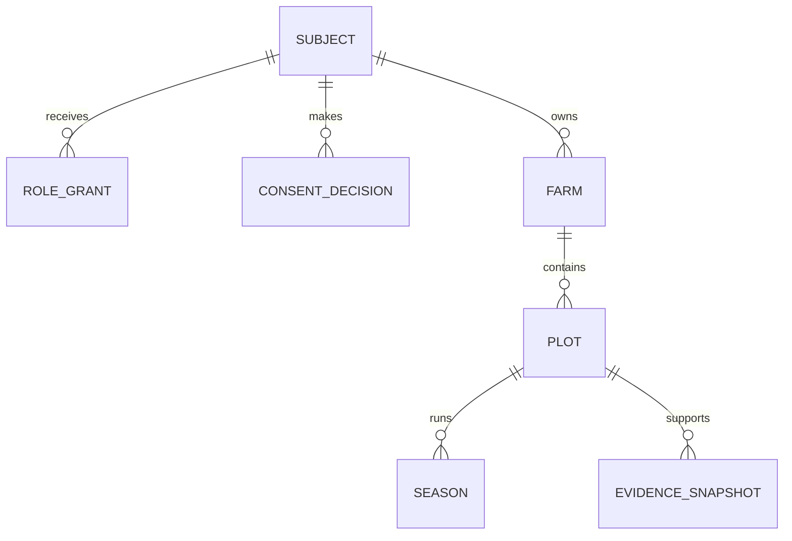
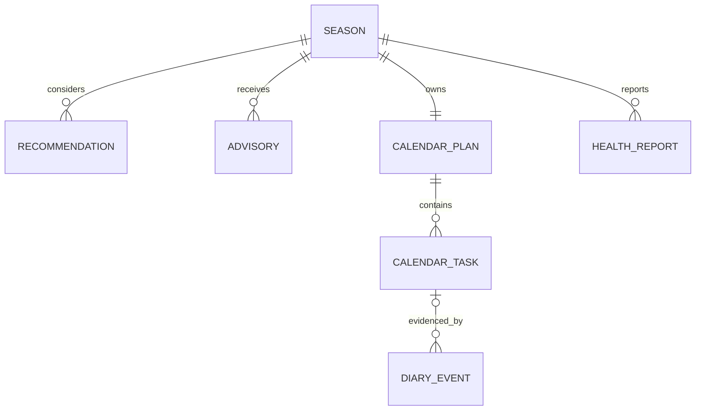
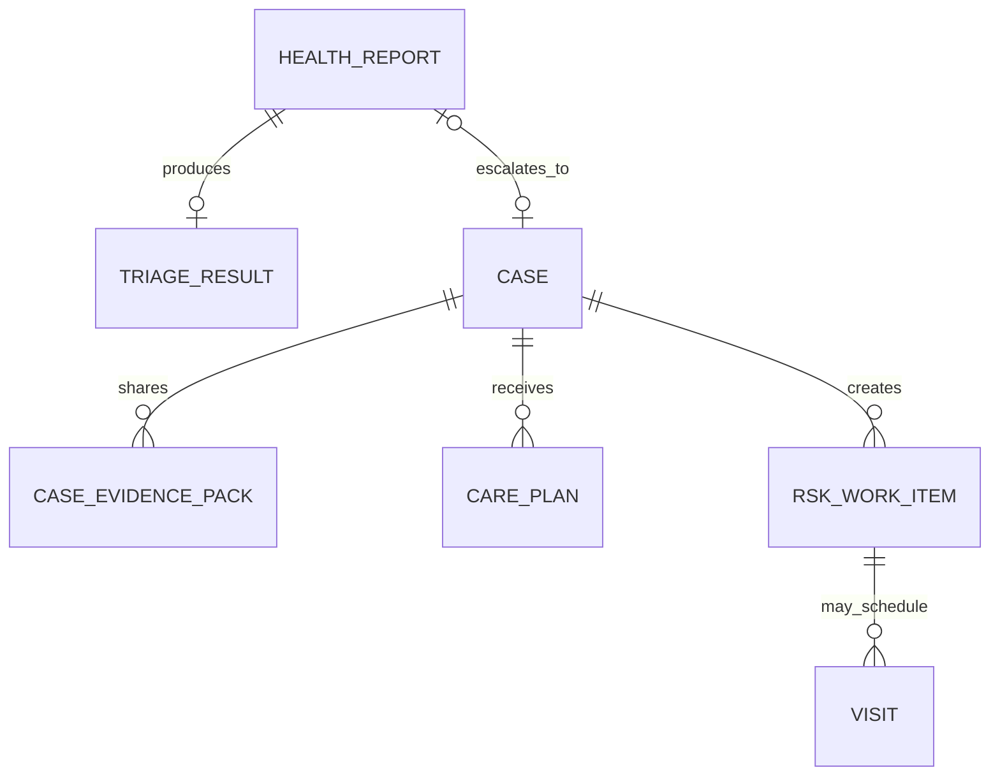
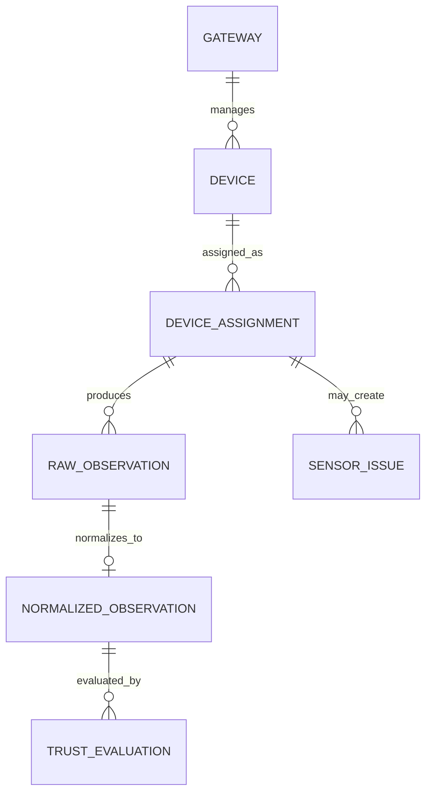
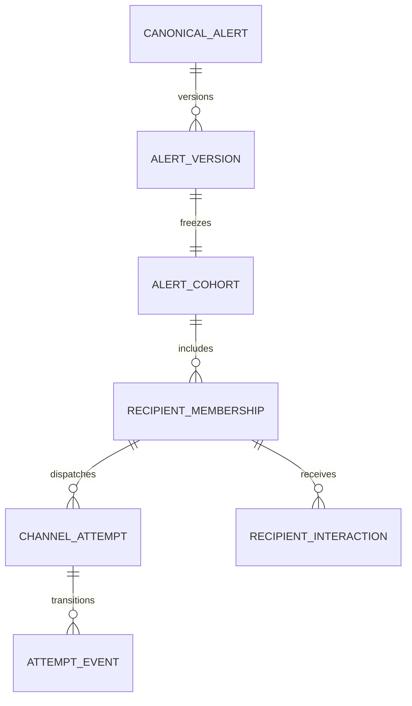

# Smart Fasal Kisan Alert

## Data Model and Event Catalogue

| Field | Value |
| --- | --- |
| Status | Approved |
| Version | 0.1.1 |
| Last updated | 13 July 2026 |
| Parent documents | `docs/01_PRD.md` through `docs/05_TECHNICAL_ARCHITECTURE.md` |
| Operational store | Cloud SQL for PostgreSQL 17 with PostGIS |
| Client stores | Farmer Dexie/IndexedDB; dedicated RSK Visit/Maintenance Dexie store |
| Analytics store | BigQuery sanitized zones plus immutable privacy-release snapshots |
| Pilot | Raigad district, Maharashtra |

## 1. Purpose

This document converts the approved product and architecture into a canonical logical data model and event catalogue. It defines ownership, identifiers, relationships, mutable and immutable records, revisions, idempotency, synchronization, evidence provenance, sensor observations, alert delivery, market records, voice proposals, privacy releases, audit facts, retention classes and deletion propagation.

It is authoritative for table intent, key relationships, invariant placement, event names and event semantics. It is not executable SQL. Migrations may add physical details such as index names, tablespaces or generated columns, but cannot weaken these constraints.

The later API specification controls HTTP representation. The AI/agronomy specification controls rule payload schemas. The security/privacy specification locks final retention durations and threat controls. Until those are approved, a non-demo deployment fails closed on any policy marked as requiring an approved registry value.

## 2. Normative rules

The words **must**, **must not**, **required** and **never** are release requirements.

Document authority is:

1. The PRD controls scope, stakeholders, exclusions and quality requirements.
2. Information Architecture controls surfaces and route boundaries.
3. End-to-End Flows control cross-feature state transitions.
4. Feature Specifications control behaviour and acceptance.
5. Technical Architecture controls runtimes, service and trust boundaries.
6. This document controls persistence, relationships and event semantics.

When a persistence convenience conflicts with an approved state, safety, privacy, consent or audit rule, the convenience is rejected.

## 3. Data-model principles

### 3.1 Relational current state plus immutable facts

The product is not fully event sourced. Mutable aggregate tables provide efficient current state, while append-only facts preserve actions, evidence, decisions, consent, delivery, corrections and governance history.

- A current projection can be rebuilt or verified from its owned facts where the feature requires reconstruction.
- Diary, consent, sensor raw observations, market raw records, published decision snapshots, governed versions, audit facts and privacy releases are append-only.
- A correction appends a correction, reversal, void, supersession or tombstone. It never rewrites the original fact.
- Generic `last write wins` is forbidden for consent, quantity, unit, crop stage, Task outcome, safety advice, evidence, case resolution and privacy state.

### 3.2 One owner per table

Every table belongs to one domain module. Another module calls the owner's application service or consumes an event; it cannot update the table directly. Cross-module foreign keys may protect identity, but do not grant write ownership.

### 3.3 Explicit unknown and unavailable

Missing, unknown, not applicable, withheld, stale, suppressed and unavailable are distinct states. Zero, empty string, `false` and an absent row cannot silently represent them.

### 3.4 Exact logical effect, at-least-once transport

Clients, Pub/Sub, Cloud Tasks, provider callbacks and hardware may retry. Stable IDs, request hashes, unique constraints, transactional outbox/inbox and original-outcome replay guarantee one logical effect. No table or comment may claim exactly-once transport.

### 3.5 Privacy is structural

Exact geometry, contact, free text, private media and direct identities stay in the operational boundary. The first analytics-safe event exists only after coarse-geography mapping, purpose-specific tokenization and schema validation. MP reads only a validated released snapshot.

## 4. Naming and type conventions

### 4.1 Database naming

- Schemas, tables and columns use `snake_case`.
- Primary keys use `<entity>_id`; foreign keys use the referenced primary-key name.
- Mutable aggregate versions use `revision` and start at 1.
- Event schema versions use `event_version`; payload schema versions use `schema_version`.
- Status columns use controlled PostgreSQL enum/domain values or referenced registries, never arbitrary display text.
- User-visible translations never become enum values.

### 4.2 Identifiers

- Application services generate opaque UUIDv7 identifiers before persistence.
- Sequential database IDs are never exposed through an API, route, deep link, event or file name.
- External provider IDs are stored separately, scoped by provider and never trusted as internal authorization identifiers.
- A client-created offline command/event ID is preserved end to end.
- Object names use random opaque paths and cannot contain Farmer, phone, farm, plot or Case names.

### 4.3 Time

| Field pattern | Meaning |
| --- | --- |
| `occurred_at` | When the real-world action or observation occurred |
| `client_recorded_at` | Device clock when the client saved it |
| `received_at` | First durable server acceptance |
| `created_at` | Server creation time for the row |
| `updated_at` | Last current-projection update; absent on immutable facts |
| `effective_from` / `effective_until` | Governance or access validity |
| `observed_at` | Source measurement time |
| `issued_at` / `valid_from` / `valid_until` | Forecast, warning or advice edition validity |

Server timestamps use `timestamptz` in UTC. A farmer occurrence also stores IANA `timezone_name` and original UTC offset. A suspicious device clock is retained and quality-labelled, not silently replaced.

### 4.4 Numeric values, units and money

- Measurements use `numeric`, never binary floating point, when an exact farmer-visible value matters.
- Preserve `original_value` and `original_unit_code` beside `normalized_value`, `normalized_unit_code` and `conversion_version_id`.
- Units come from a versioned Unit Registry supporting SI and approved local agricultural units.
- Area, quantity and dosage cannot share an untyped `value` field.
- Money stores `amount numeric`, ISO 4217 `currency_code` and price basis/unit. Floating-point money is forbidden.
- Suitability and confidence use `numeric(5,2)` constrained to 0–100.

### 4.5 Geospatial values

- Exact plot geometry uses PostGIS `geometry(Polygon, 4326)` or validated `MultiPolygon` only when required.
- Geometry validity, non-empty shape, approved pilot boundary and plausible area are checked before activation.
- Each geometry change creates an immutable version with source, consent version and checksum.
- A coarse `geography_id` references an approved geography registry. It is not calculated in an MP request.
- Exact geometry is never copied into URLs, events, logs, BigQuery or MP snapshots.

### 4.6 Language and text

- Language uses BCP 47 codes, initially `mr-IN`, `hi-IN` and `en-IN`.
- Critical structured facts are stored language-neutral; reviewed locale resources render them.
- Free text carries language, author, classification and retention class.
- Model-generated and translated text stores model/prompt/glossary versions and never replaces the structured source.
- Raw HTML is not a persistence format for product content.

### 4.7 Checksums

Use SHA-256 for evidence snapshots, registry payloads, files, imports, release manifests and idempotency request hashes. Store the algorithm with the digest so it can be upgraded. A checksum proves byte equality, not source truth.

## 5. Data classification

| Class | Name | Examples | Allowed propagation |
| --- | --- | --- | --- |
| C0 | Public | Approved methodology, public mandi facts, published attribution | Public/API when licence permits |
| C1 | Internal | Rule IDs, job status, non-sensitive operations metadata | Authorized services and staff |
| C2 | Personal | Farmer profile, owned farm IDs, preferences, ordinary Diary facts | Farmer and purpose-authorized RSK |
| C3 | Sensitive | Phone, exact geometry, Case evidence, private costs, media, transcript/audio | Minimum operational services only; audit access |
| C4 | Restricted security | OTP/session material, device secrets, KMS references, signed tickets | Dedicated security/service boundary only; never domain events |
| P1 | Pseudonymous analytics | Purpose-specific analytics subject ID with coarse dimensions | Privacy Pipeline and sanitized analytics only |

Every schema field receives a classification in migration comments or generated schema metadata. Pub/Sub domain events contain C0/C1 and bounded opaque C2 references only. C3 details use an authorized fetch by the owning service. C4 never appears in events, product analytics, fixtures or application logs.

## 6. Shared controlled vocabularies

The following are database domains or versioned registries. Display labels remain localized resources.

| Vocabulary | Values or source |
| --- | --- |
| `data_mode` | `LIVE`, `RECORDED`, `SIMULATED` |
| `provenance_type` | `SENSOR`, `FARMER_MANUAL`, `RSK_MANUAL`, `LABORATORY`, `SOIL_HEALTH_CARD`, `WEATHER`, `SATELLITE`, `PUBLIC_MARKET`, `DERIVED` |
| `evidence_quality` | `TRUSTED`, `USE_WITH_CAUTION`, `TREND_ONLY`, `DO_NOT_USE` |
| `freshness_state` | `CURRENT`, `DATA_IS_OLD`, `NO_RECENT_DATA`, `UNAVAILABLE` |
| `value_state` | `KNOWN`, `UNKNOWN`, `MISSING`, `PROXY`, `CONFLICTING`, `NOT_APPLICABLE`, `WITHHELD` |
| `privacy_class` | `C0`, `C1`, `C2`, `C3`, `C4`, `P1` |
| `actor_type` | `FARMER`, `RSK_STAFF`, `MP_STAFF`, `SYSTEM`, `DEVICE`, `PROVIDER` |
| `role_type` | `FARMER`, `RSK`, `MP` |
| `source_mode_derivation` | Versioned policy; never client-selected for derived output |

Mode derivation rules are stored with each result: any decision-driving synthetic input produces `SIMULATED`; an intentional frozen replay produces `RECORDED`; genuine dated historical context may support `LIVE` only under its source policy. The server rejects a client promotion to `LIVE`.

## 7. PostgreSQL schema ownership

| Schema | Owning modules | Content |
| --- | --- | --- |
| `identity` | Identity and Access | Subjects, authentication links, role/capability grants, jurisdictions, device and role contexts |
| `consent` | Consent and Purpose | Policies, append-only decisions, current projections, purpose grants and revocation work |
| `farm` | Farmer Registry; Farm and Plot; Season | Profile, farms, plots, geometry, soil, water, crop history, seasons and harvest facts |
| `agronomy` | Evidence; Recommendation; Advisory | Evidence snapshots, crop decisions, dry-spell/advisory results and reviews |
| `workflow` | Calendar; Diary; Crop Health; RSK Work | Tasks, actual work, Cases, care, visits, outreach and assisted sessions |
| `sensor` | Device and Sensor Trust | Gateway/device registry, assignments, raw/normalized observations, calibration, trust and issues |
| `alerting` | Canonical Alert and Delivery | Drafts, versions, cohorts, recipients, attempts, push registrations and incidents |
| `market` | Market Watch | Public import, ontology, mapping, comparable records, watches and market support |
| `voice` | Voice Orchestrator | Sessions, one-time tickets, metadata, proposals and consented offline-audio references |
| `media` | Media and Export | Upload intents, objects, scans, attachments and generated artifacts |
| `privacy` | Privacy Pipeline, Farmer Data Rights and MP Release | Analytics candidates, token mapping, retractions, Farmer export/deletion orchestration, release jobs/snapshots and briefing snapshots |
| `platform` | Platform | Commands, events, outbox/inbox, sync, conflicts, jobs, registries and retention policies |
| `audit` | Audit | Append-only authorization, protected-access, governance and security facts |

Migration, API, worker, ingest, privacy and audit database roles are separate. The MP Query API has no role on operational schemas.

## 8. Universal row patterns

### 8.1 Mutable aggregate

Every mutable aggregate contains:

```text
<entity>_id uuid primary key
revision bigint not null check (revision >= 1)
status controlled value not null
created_at timestamptz not null
created_by_subject_id uuid or system actor reference
updated_at timestamptz not null
updated_by_subject_id uuid or system actor reference
```

An update uses `WHERE id = ? AND revision = ?`, increments once and produces a domain fact in the same transaction. `updated_at` is not a concurrency token.

### 8.2 Immutable fact

Every append-only fact contains:

```text
<fact>_id uuid primary key
schema_version integer not null
occurred_at timestamptz not null
received_at timestamptz not null
actor_type controlled value not null
actor_ref uuid or bounded provider/device reference
correlation_id uuid not null
causation_id uuid null
data_mode controlled value where applicable
provenance_types controlled non-empty array where applicable
created_at timestamptz not null
```

Application roles receive no `UPDATE` or `DELETE` permission on append-only facts. Corrections use linked facts.

### 8.3 Versioned snapshot

A sealed snapshot contains `schema_version`, input or payload checksum, source versions, `sealed_at`, data mode, provenance, quality/freshness summary and `supersedes_id` where applicable. After sealing it is immutable. Draft construction occurs in a separate draft row or transaction-local object.

### 8.4 Soft deletion is not a universal rule

Do not add `deleted_at` to every table. Operational closure uses a domain status. Privacy deletion uses a deletion workflow, field scrubbing/anonymization and minimum tombstone. Ephemeral records are hard-deleted by retention policy. Append-only facts remain only when the approved purpose and retention allow them.

## 9. High-level entity relationships











These diagrams omit audit, event, media and registry joins for readability. The following catalogues are normative.

## 10. Relational integrity rules

### 10.1 Foreign keys

- Every stable same-database relationship uses a real foreign key and an index on the referencing columns.
- Default delete behaviour is `ON DELETE RESTRICT`.
- Cascading delete is allowed only for non-authoritative ephemeral children, such as an unused expired one-time ticket, and must be named in the migration review.
- Historical facts never reference a mutable natural key.
- Polymorphic `(entity_type, entity_id)` references are allowed for generic audit/event routing metadata. Consent may use its explicitly registered target-kind contract only when the owning module validates existence and ownership in the same transaction. They are never the sole integrity mechanism for Work, Visit, evidence dependency or media ownership.
- Cross-module references do not grant cross-module update permission.

### 10.2 JSONB policy

JSONB is allowed for immutable typed snapshots, model/tool metadata, provider metadata and fields not independently authorized, filtered or joined. A JSONB column must name a registered JSON Schema version and pass boundary validation.

Anything used for authorization, consent, lifecycle, privacy release, money, unit conversion, indexing, relationship integrity or a safety rule uses typed columns or child rows. One untyped JSON document per feature is forbidden.

### 10.3 Append-only enforcement

Normal application roles receive insert/select but no update/delete on immutable tables. A database trigger may reject accidental mutation as defence in depth. Retention/deletion uses narrowly scoped stored procedures or service roles that record the policy and purge outcome; it does not receive blanket ownership of every schema.

### 10.4 RLS request context

Protected transactions use `SET LOCAL` for stable subject, current role context, purpose, office, jurisdiction and authorization version. Missing context denies all. Helpers use fail-closed `current_setting(<key>, true)` semantics and never substitute a default identity. Connection-level `SET` is forbidden. A pool-reuse negative test proves context cannot leak. RLS is defence in depth; the application still performs current capability, ownership, assignment and consent checks.

Runtime roles are never table owners. `FORCE ROW LEVEL SECURITY` applies to protected operational tables and to every partition that may later be created. The minimum policy matrix is:

| Runtime principal | Permitted row scope | Additional rule |
| --- | --- | --- |
| Farmer API | Rows whose server-derived `farmer_subject_id` equals the stable authenticated subject | C3 reads still use narrow audited procedures and current consent/purpose checks |
| RSK API | Current office and jurisdiction rows allowed by an active grant | Contact, exact location, Case evidence and private market data require assignment/access grant plus audit-before-disclose |
| Device Ingest | Insert-only telemetry for its active server-assigned gateway/device/channel/Plot binding | Cannot select Farmer data, alter mode, or update accepted observations |
| Provider Callback Ingest | Insert-only verified callback intake for its configured provider/environment | Cannot update Alert attempts directly or read operational recipient data |
| Privacy Candidate Worker | Read only approved candidate source projections and insert restricted candidate rows | Cannot publish analytics-safe events or query identity-private fields |
| Privacy Publication Worker | Read candidate/token/retraction tables and publish minimized analytics-safe rows | Cannot access Farmer export/deletion tables merely because they share `privacy` schema |
| Farmer Data Rights Worker | Only export/deletion requests and explicitly enumerated owner procedures | Cannot access token maps, MP release work or unrestricted operational tables |
| Audit writer | Insert-only `audit.fact` through a validated procedure | No update/delete and no protected-content payload |
| MP Query API | No role on operational schemas or BigQuery working zones | Reads only verified active release objects through the MP release service |

### 10.5 Derived ownership keys

High-volume tables may copy immutable `farmer_subject_id`, `office_id`, `plot_id` or `jurisdiction_id` for efficient authorization and partitioning. The owning transaction derives them from authoritative parents; a client cannot supply them as trusted values. A constraint or consistency test verifies the copy.

### 10.6 Current-pointer, temporal and separation constraints

| Invariant | Database enforcement |
| --- | --- |
| One current Plot geometry | Non-null/current FK on `farm.plot` plus compare-and-swap Plot revision; geometry versions contain no current flag |
| No duplicate active grant | Partial uniqueness plus GiST exclusion on subject/role/office/jurisdiction and validity range where ranges must not overlap |
| Office jurisdiction validity | GiST exclusion prevents duplicate overlapping office/jurisdiction ranges |
| Sensor assignment | GiST exclusion prevents overlapping active channel/Plot assignments where the Signal Policy requires exclusivity |
| One current Work/Visit assignment | Unique Work or Visit key in mutable assignment projection; immutable assignment events preserve intervals |
| One active Advisory review | Partial unique index on advisory version + risk purpose for active states |
| One MP release pointer | Unique product/scope key and compare-and-swap revision; target FK must be validated and active |
| Governed separation of duties | Deferrable checks require creator subject to differ from approving reviewer for governed high-risk versions |
| Frozen Alert recipient | Unique `(cohort_id, farmer_subject_id)` and `(canonical_version_id, farmer_subject_id)` |
| Provider identity | Unique `(environment, provider_id, provider_attempt_id)` in an immutable binding inserted when known, plus unique `(environment, provider_id, provider_event_id)` callback intake |
| Singular Alert milestone | Unique `(canonical_version_id, farmer_subject_id, milestone)` for milestones counted once |
| Terminal delivery authority | Transition procedure rejects invalid state edges and any RSK attempt to promote provider terminal state |

Polymorphic routing metadata is always backed by a typed link with a real FK. Work and Visit use the typed source-link tables below. Media uses an immutable `media.attachment` asset-purpose header plus exactly one owning typed link such as `workflow.diary_media_link`, `workflow.health_media_link`, `workflow.visit_media_link`, `sensor.maintenance_media_link` or `voice.offline_audio_media_link`. Database validation rejects zero or multiple authoritative owner links.

## 11. Identity and access tables

| Table | Kind | Critical fields | Required constraints |
| --- | --- | --- | --- |
| `identity.subject` | Mutable | `subject_id`, subject type, status, security version | Opaque PK; disabled/deleted subjects cannot create a role context |
| `identity.auth_identity` | Mutable status | Subject, issuer, provider, encrypted provider subject reference, lookup token | Unique `(issuer, provider_subject_lookup)`; ciphertext never indexed |
| `identity.subject_private` | Mutable sensitive | Encrypted name, phone and approved contact fields | C3; access through audited field service only |
| `identity.office` | Governed mutable | Office type `RSK` or `MP`, verified name, status | MP and RSK remain distinct office types |
| `identity.jurisdiction` | Governed | Type, parent, approved geography reference, effective range | Acyclic hierarchy; geometry lives in restricted geography table |
| `identity.office_jurisdiction` | Versioned | Office, jurisdiction, validity | No duplicate overlapping active assignment |
| `identity.role_definition` | Governed | Stable role key and stakeholder type | Farmer role cannot imply staff capability |
| `identity.capability_definition` | Governed | Stable capability key, risk class | Keys are code contracts, not translated labels |
| `identity.role_capability` | Governed join | Role, capability | Unique pair |
| `identity.role_grant` | Mutable current aggregate | Subject, role, office, jurisdiction, approved validity, current status, revision | One current grant identity; compare-and-swap transition |
| `identity.role_grant_event` | Append-only lifecycle fact | Grant, issued/renewed/revoked/expired outcome, effective time, issuer/revoker, reason and resulting revision | History is never edited; no protected payload |
| `identity.role_context` | Expiring mutable | Subject, selected grant, origin, MFA time, capability-set version, issued/expiry/revoked | Expires no later than source grant/session; staff requires MFA |
| `identity.role_context_event` | Append-only lifecycle fact | Context, created/revoked/expired outcome, actor/system reason, capability/access version and time | No token or protected payload |
| `platform.client_installation` | Mutable | Random installation ID, environment, app/build, platform, App Check posture, first/last seen, status | No phone or Firebase UID in ID; environment-bound |
| `identity.subject_device_binding` | Mutable | Subject, installation, device mode, verification, lock/access version, revoked time | Unique active binding per subject/installation/mode |
| `identity.auth_return_state` | Ephemeral | Hash, exact allowed origin/route reference, expiry, used time | One-time, short-lived; no arbitrary return URL |

`subject_private` equality lookup uses a separately keyed HMAC token. Encryption keys and plaintext never enter indexes, events or fixtures.

## 12. Consent and purpose tables

### 12.1 Core tables

| Table | Kind | Critical fields | Required constraints |
| --- | --- | --- | --- |
| `consent.policy_version` | Immutable governed | Purpose/scope, locale wording references, version, effective/expiry | Approved before use; wording hash retained |
| `consent.decision` | Append-only | Subject, scope key, purpose key, typed target, `ALLOW`/`DENY`/`WITHDRAW`, policy version, capturer, occurrence/receipt, expiry, supersedes | Cannot be edited; actor and subject attribution separate |
| `consent.current_state` | Projection | Subject/scope/purpose/target key, current decision, derived state, monotonic `access_version` | Unique current key; increment on every effective change |
| `consent.access_grant` | Time-bound aggregate | Subject, authorized staff/device, purpose, target, role context, consent/access version, validity, status | Cannot outlive consent, assignment, role context or hard expiry |
| `consent.access_grant_event` | Append-only | Issued, used, expired, revoked, purged outcome | No protected content copied into payload |
| `consent.revocation_operation` | Mutable operation | Withdrawal, effect type, target reference, status, attempts, result | One logical cleanup per withdrawal/effect/target |

The current key is `(subject_id, scope_key, purpose_key, target_kind, target_id)`. A generic target reference may route to an owning module, but is never sole proof of existence or authorization.

### 12.2 Withdrawal transaction

One transaction:

1. Appends the `WITHDRAW` decision.
2. Advances `current_state.access_version`.
3. Invalidates affected active grants/session versions/assignments.
4. Creates revocation operations and outbox facts.

All later reads, stream messages, ingest packets and commands recheck the version. Cleanup may continue asynchronously but cannot extend access.

## 13. Farmer, farm, plot and season tables

| Table | Kind | Critical fields | Required constraints |
| --- | --- | --- | --- |
| `farm.farmer_profile` | Mutable aggregate | Farmer subject, language, timezone, accessibility, onboarding state, current preference-version FK and revision | One profile per Farmer subject; pointer changes by compare-and-swap |
| `farm.setup_progress` | Mutable aggregate | Farmer, current step, accepted draft snapshot, pending connected checks, completion state, revision | One active setup progress per Farmer |
| `farm.preference_version` | Immutable version | Notification, accessibility, units and farmer-visible preferences | Original earlier version retained |
| `farm.farm` | Mutable aggregate | Owner subject, safe display label, village/coarse geography, declared area | Owner immutable except governed transfer outside pilot |
| `farm.plot` | Mutable aggregate | Farm, label, declared area, cultivation method, status, current geometry-version FK, revision | Area positive with confirmed unit; geometry body remains versioned |
| `farm.plot_geometry_version` | Immutable | Plot, version number, PostGIS geometry, capture method, consent decision, checksum | Unique version; valid SRID 4326 geometry; no mutable current flag |
| `farm.geography_unit` | Governed | Geography type, parent, coarse boundary, version | Raigad hierarchy approved before use |
| `farm.plot_geography_mapping` | Immutable version | Geometry version, coarse geography, mapper/version, confidence | Exact geometry never copied into analytics row |
| `farm.soil_record` | Immutable header | Plot, source type, observed/issued/received times, source reference, quality | Source and data mode required |
| `farm.soil_measurement` | Immutable child | Soil record, signal, original/normalized values/units, method, value state | Exactly one typed known value or explicit unknown state |
| `farm.water_context_version` | Immutable version | Plot, sources, availability band, reliability, method, constraints, as-of | Units and Unknown explicit |
| `farm.crop_history` | Immutable fact/version | Plot, crop profile/declared crop, season dates, outcome facts, provenance | No causal-yield claim stored as fact |
| `farm.profile_snapshot` | Sealed snapshot | Farmer/farm/plot input versions and checksum | Immutable after seal |
| `farm.season` | Mutable aggregate | Plot, crop-profile version, lifecycle, proposed/actual start references, area allocation, revision | `ACTIVE` requires accepted actual start event |
| `farm.season_start_event` | Append-only | Proposed, confirmed or corrected sow/transplant fact | Actual and proposed dates remain distinct |
| `farm.harvest_fact` | Append-only | Season, readiness/actual event, quantity and unit, occurrence time | Readiness and actual harvest remain separate facts |

### 13.1 Geometry and season rules

- Geometry is valid, non-empty and inside the approved pilot handling policy. Plausible area mismatch creates review; it is not silently corrected.
- Exact geometry access is C3 and audit-before-disclose.
- Multiple seasons can be represented on one plot when area allocation/cultivation context is explicit. No accidental database constraint forbids intercropping; the pilot UI may restrict unsupported setup through its governed crop profile.
- Calendar activation refers to the accepted actual start event, never merely a proposed date.
- Geometry, soil and water corrections create new versions. Existing decision snapshots retain the version they used.
- Publishing new geometry inserts the immutable version and compare-and-swap updates `farm.plot.current_geometry_version_id`; it never updates an earlier geometry row.

## 14. Governed registry tables

Use a common envelope for all versioned configuration while keeping query-critical fields typed in owned extension tables.

| Table | Kind | Critical fields | Required constraints |
| --- | --- | --- | --- |
| `platform.registry_definition` | Governed | Registry type/key, owner, payload-schema version, risk/approval class | Stable unique key |
| `platform.registry_version` | Immutable content version | Definition, database-derived registry type, semantic version, geography, typed JSON payload, checksum, proposed effective/expiry and supersedes/rollback target | Payload immutable; composite uniqueness/FKs bind definition and registry type |
| `platform.registry_version_event` | Append-only lifecycle fact | Version, created/submitted/approved/rejected/retired/expired outcome, actor/authority, reason and time | Lifecycle never edits version content |
| `platform.registry_version_projection` | Mutable projection | Version, current lifecycle state, effective/expiry result and revision | Derived from version events; one row per version |
| `platform.registry_approval` | Append-only | Version, reviewer, authority, decision, reason, time | High-risk creator cannot approve own version |
| `platform.registry_alias` | Mutable governed pointer | Logical alias, active version, revision, kill switch, rollback target | Compare-and-swap activation; inactive/expired target rejected |
| `agronomy.crop_profile_version` | Immutable typed extension | Registry-version PK/FK, crop key, geography/season, cultivation method, sowing/duration/water classes | Parent registry type must be Crop Profile; candidate query never scans arbitrary JSON |
| `agronomy.rule_set_version` | Immutable typed extension | Registry-version PK/FK, purpose, resolver version and deterministic evaluation order | Parent type Agronomy Rule; one approved rule-set identity/version |
| `agronomy.rule_gate` | Immutable child | Rule-set, stable gate key, operator, typed threshold/unit and failure disposition | Hard gates are relational and unit-validated |
| `agronomy.rule_component` | Immutable child | Rule-set, stable component key, score/weight bounds and evidence key | Unique component key; total weighting policy validated |
| `agronomy.rule_set_binding` | Immutable typed extension | Rule-set, geography/crop/stage applicability and priority | One deterministic resolved binding set per context |
| `agronomy.freshness_policy_version` | Immutable typed extension | Registry-version PK/FK, evidence/source key, maximum age, observed/issued/received clock basis and fallback state | Parent type Evidence/Freshness; no implicit freshness default |
| `agronomy.calendar_template_version` | Immutable typed extension | Registry-version PK/FK, crop/geography/cultivation applicability and anchor policy | Parent type Calendar Template |
| `agronomy.calendar_template_stage` | Immutable child | Template, stable stage key, order and entry/exit criteria refs | Unique stage key/order per template |
| `agronomy.calendar_template_task` | Immutable child | Template/stage, stable task key, offset/window, instruction and safety source refs | Unique task key per template |
| `agronomy.calendar_template_dependency` | Immutable child | Template, predecessor task, successor task, dependency type | Real FKs; no self-link or directed cycle |
| `platform.unit_definition` | Governed typed definition | Stable unit key, quantity kind, UCUM/code/display metadata | Unit key and quantity kind immutable after use |
| `platform.unit_conversion_version` | Immutable typed extension | Registry-version PK/FK, from/to unit FKs, deterministic formula/precision and effective range | Parent type Unit Conversion; dimensions must match |
| `alerting.alert_policy_version` | Immutable typed extension | Registry-version PK/FK, severity/action rules, cohort/channel/retry/expiry policy | Parent type Alert Policy; safety fields cannot live only in JSONB |
| `sensor.signal_policy_version` | Immutable typed extension | Registry-version PK/FK, signal/unit/range/freshness/quality rules | Parent type Device/Signal/Calibration |
| `privacy.metric_dimension` | Immutable typed child | Metric version, stable dimension key, source field, allowlisted bins and release classification | No arbitrary client-selected dimension |
| `privacy.metric_grain` | Immutable typed child | Metric version, geography/time/cohort grain, contribution and minimum-threshold rules | Exactly one approved release grain per metric version |

Required registry types are Crop Profile, Calendar Template, Agronomy Rule, Evidence/Freshness, Unit Conversion, External Source, Earth Feature, Crop Health, Model/Prompt, Voice Intent/Tool, Device/Signal/Calibration, Alert Policy, Market Ontology, Privacy Metric, Retention and Demo Scenario.

External-source versions additionally store licence/terms version, attribution, geography, cadence, product freshness, maximum staleness, `raw_cache_ttl`, `derived_storage_allowed`, `model_input_allowed`, `training_allowed` and deletion rule. A source missing these values is unavailable outside an isolated demo adapter.

Every typed extension uses `registry_version_id` as its primary key and carries a database-checked constant `registry_type`. `registry_version` repeats the definition's type under a composite FK and exposes unique `(registry_version_id, registry_type)`; each extension uses a composite FK plus `CHECK (registry_type = '<EXPECTED_TYPE>')`. Database enforcement is mandatory—a service check is not a substitute—so a Crop Profile FK can never point to an Alert Policy version. Authorization-, query- and safety-critical values are typed even when the signed registry payload also carries a machine-readable copy.

## 15. Evidence and decision tables

### 15.1 Evidence

| Table | Kind | Critical fields | Required constraints |
| --- | --- | --- | --- |
| `agronomy.evidence_item` | Immutable typed fact | Plot/season where applicable, evidence key, source entity/version/rights version, value state, original/normalized value/unit, observed/issued/received times, mode, optional contract-delete-at | No ambiguous zero/missing; source version required |
| `agronomy.evidence_provenance` | Immutable join | Evidence item, provenance type | Unique pair; one or more where applicable |
| `agronomy.evidence_quality_decision` | Immutable assessment | Item/interval, quality, freshness, policy version, reasons, assessed time | Assessment never rewrites evidence |
| `agronomy.evidence_snapshot` | Sealed immutable snapshot | Decision kind/context, as-of, data mode, provenance, policy version, checksum, sealed time and planned expiry | Finalized input immutable; no late invalidation field |
| `agronomy.evidence_snapshot_event` | Append-only lifecycle fact | Snapshot, finalized/expired/invalidated outcome, source/cause, policy and effective time | Lifecycle does not alter sealed inputs |
| `agronomy.evidence_snapshot_projection` | Mutable projection | Snapshot, current eligibility/freshness state, latest lifecycle event and revision | Current decision use rechecks projection |
| `agronomy.evidence_snapshot_item` | Immutable membership | Snapshot, stable input key, exact evidence item/version, exact quality-decision ID, assessed freshness state/time, calibration/conversion/source-rights versions, decision-driving, proxy/missing metadata, order | Unique input key per snapshot; every decision interpretation pinned |
| `agronomy.decision_dependency` | Immutable reverse-index header | Source kind, target kind, cause and created watermark | Used for impact review; exactly one typed source and one typed target link required |
| `agronomy.dependency_evidence_item_link` | Immutable typed FK | Dependency, Evidence item | Unique dependency/source |
| `agronomy.dependency_sensor_interval_link` | Immutable typed FK | Dependency, Sensor trust/invalidation interval | Unique dependency/source |
| `agronomy.dependency_evidence_snapshot_link` | Immutable typed FK | Dependency, Evidence snapshot | Unique dependency/source |
| `agronomy.dependency_earth_snapshot_link` | Immutable typed FK | Dependency, Earth feature snapshot | Unique dependency/source |
| `agronomy.dependency_weather_edition_link` | Immutable typed FK | Dependency, retention-licensed forecast edition | Google display-only edition rejected as decision dependency |
| `agronomy.dependency_recommendation_link` | Immutable typed FK | Dependency, Recommendation result | Unique dependency/target |
| `agronomy.dependency_advisory_link` | Immutable typed FK | Dependency, Advisory version | Unique dependency/target |
| `agronomy.dependency_task_link` | Immutable typed FK | Dependency, workflow Task/version | Unique dependency/target |
| `agronomy.dependency_alert_link` | Immutable typed FK | Dependency, canonical Alert version | Unique dependency/target |
| `agronomy.dependency_triage_link` | Immutable typed FK | Dependency, workflow Triage result | Unique dependency/target |
| `agronomy.source_dependency_impact` | Mutable operation | Expired/corrected/invalidated source or consent version, dependency watermark, affected decision IDs/counts, required action, state and result | One idempotent impact operation per source-version/cause; complete dependency scan required |
| `agronomy.source_dependency_impact_item` | Mutable item/projection | Impact operation, decision-dependency FK, required action, current processing state and resulting correction/recalculation ref | Unique operation/dependency; terminal item required before operation completion |

A source cannot be decision-driving if its licence forbids retaining the required evidence for the result's retention period. Google Weather content is therefore display-only and cannot appear as a decision-driving snapshot item. The canonical snapshot checksum covers item IDs/revisions, quality decisions, freshness assessment, calibration, conversion, source-rights and proxy versions as well as typed values.

### 15.2 Generic decision metadata

Every Recommendation, Advisory or Triage result stores the evidence snapshot, deterministic rule/policy versions, any model/prompt versions, output checksum, data mode, created/effective/expiry times, review status and superseded/corrected reference. Suitability, confidence, severity and priority remain distinct typed fields.

## 16. Crop Recommendation tables

| Table | Kind | Critical fields | Required constraints |
| --- | --- | --- | --- |
| `agronomy.recommendation_request` | Mutable operation | Actor, plot/planning context, command ID, state, requested time | One operation per idempotent command |
| `agronomy.recommendation_result` | Immutable result | Request, evidence snapshot, rule version, confidence, fixed outcome class, checksum and supersedes | Reproducible from retained inputs/rule |
| `agronomy.recommendation_candidate` | Immutable child | Result, crop-profile version, eligible, rank, suitability, confidence, exclusion summary | Unique crop version; unique non-null rank; ineligible has no eligible rank |
| `agronomy.recommendation_gate_result` | Immutable child | Candidate, gate key, pass/fail/unknown, evidence refs, rule version | Every hard gate represented |
| `agronomy.recommendation_component_score` | Immutable child | Candidate, component, raw score, weight, weighted score, evidence refs | Score/weight range constrained |
| `agronomy.recommendation_acceptance` | Append-only outcome | Result, actor, accepted crop, proposed/actual start, resulting season/calendar | Unique per result; original command outcome retained |

Acceptance revalidates governed versions and transactionally creates the acceptance, Season and Calendar/Tasks or creates none.

## 17. Advisory and dry-spell tables

| Table | Kind | Critical fields | Required constraints |
| --- | --- | --- | --- |
| `agronomy.advisory` | Mutable aggregate | Plot/season, logical purpose/dedup key, current version, lifecycle, revision | One current version pointer |
| `agronomy.advisory_version` | Immutable result | Evidence snapshot, rule version, action class, time window, confidence, limitations, validity, mode, supersedes | Validity ordered; immutable after approval/publication |
| `agronomy.dry_spell_evaluation` | Immutable | Component scores, agreement evidence, stage/water feasibility, output, rule version | Missing signal cannot count as agreement |
| `agronomy.advisory_review` | Mutable aggregate | Advisory version, risk, claimant, state, expected version, expiry | One active review per version/risk purpose |
| `agronomy.advisory_review_decision` | Append-only | Review, actor, approve/reject/more-data, reasons, evidence/source versions | Reviewer authority retained |
| `agronomy.advisory_recalculation` | Append-only | Prior/new version, cause, materiality, impacted Task/Alert references | Earlier version unchanged |
| `agronomy.advisory_publication` | Mutable operation | Advisory version, optional Alert version, state, attempts and result revision | Approved is distinct from published |
| `agronomy.advisory_publication_task` | Immutable FK join | Publication, dependent workflow Task | Unique publication/Task pair; no unconstrained ID array |

An Advisory and its dependent Tasks publish atomically. A canonical Alert is created only when the versioned Alert Policy requires it. `No Action` creates neither Task nor Alert.

## 18. Calendar, Task and Diary tables

### 18.1 Calendar and Task

| Table | Kind | Critical fields | Required constraints |
| --- | --- | --- | --- |
| `workflow.calendar` | Mutable aggregate | Season, sealed template version/snapshot, lifecycle, revision | One authoritative Calendar per season |
| `workflow.task` | Mutable projection | Calendar, stable task key, current version, execution state, due window, priority, blocking state, revision | Current plan and actual outcome are not the same column |
| `workflow.task_version` | Immutable plan version | Task, source template/advisory/expert, instruction refs, window, prerequisites, safety refs, supersedes | Unique version number per Task |
| `workflow.task_dependency` | Governed join | Predecessor, successor, dependency type | No self-link or directed cycle |
| `workflow.task_response` | Append-only | Task, Farmer response, occurrence, scope, reason/constraint, command | Responses do not rewrite Task versions |
| `workflow.task_completion_projection` | Projection | Task, designated logical completion, completion band and latest evidence | One current projection; duplicate facts retained |
| `workflow.calendar_review` | Mutable aggregate | Calendar/season, RSK work, state, claimant, expected version | Governed review state |
| `workflow.calendar_change_application` | Idempotent operation | Change set, prior/new versions, state, command/outbox refs | All affected Task changes commit or recover visibly |
| `workflow.scheduled_reminder` | Mutable | Subject/device partition, Task/Alert, due time, permission/state, fallback | Local and server reminder identities distinct |
| `workflow.today_briefing_snapshot` | Retention-limited immutable | Farmer/date/context, primary action ref, unique priority refs, data-as-of/mode, source revisions, checksum/expiry | At most approved counts; viewing does not mutate source state |

Indexes support `(season_id, due_start, status)`, Farmer Today by owner/status/due, and RSK blocked work. Overdue is derived from due window and current time; it is not an irreversible fact.

### 18.2 Diary

| Table | Kind | Critical fields | Required constraints |
| --- | --- | --- | --- |
| `workflow.diary_event` | Append-only | Client event ID, actor/device/local sequence, plot/season, event kind, occurrence/client/received time, mode/provenance, original/normalized quantity/unit | Stable client event creates one server logical fact |
| `workflow.diary_task_link` | Immutable join | Diary event, Task, link type | Actual remains even if Task is later rescheduled |
| `workflow.diary_correction` | Append-only | New event, corrected/voided event, reason, actor | Cannot mutate or delete original |
| `workflow.diary_media_link` | Immutable join | Diary event, verified media attachment | Only clean attached asset |
| `workflow.diary_projection` | Rebuildable | Farmer-visible current summary, source event IDs, projector version | Never evidence authority |
| `workflow.season_summary_snapshot` | Immutable | Season, factual counts/known harvest, source watermark, checksum | No unsupported causal impact claim |

Unique keys include `client_event_id` and `(actor_subject_id, client_installation_id, local_sequence)`. A correction has its own event ID and cannot reuse the original command ID.

## 19. Crop Health and Case tables

| Table | Kind | Critical fields | Required constraints |
| --- | --- | --- | --- |
| `workflow.health_report` | Mutable aggregate until submitted | Farmer, plot/season/crop, structured symptom state, lifecycle, revision | Offline/local is not server submitted |
| `workflow.health_answer` | Immutable/versioned input | Report, question key, typed answer/Unknown, language, original Farmer account | Extraction cannot erase original |
| `workflow.health_media_link` | Immutable typed FK join | Report, authorized media attachment, required angle/part, evidence quality | Quarantine/unattached asset cannot link |
| `workflow.health_evidence_quality` | Immutable assessment | Report/media, checks, quality band, validator version | Separate from diagnosis confidence |
| `workflow.triage_result` | Immutable result | Report, extraction/evidence refs, deterministic severity/escalation, possible/unclear state, versions | Says possible/unclear, no confirmed diagnosis |
| `workflow.triage_possible_category` | Immutable child | Triage result, supported category, confidence/limitations | Maximum approved count; allowlisted category |
| `workflow.case` | Mutable aggregate | Health report, office/jurisdiction, severity, lifecycle, sharing decision/access version, revision | Consented pack required before RSK evidence access |
| `workflow.case_evidence_pack` | Immutable manifest/version | Case, purpose, bounded date range/items, consent/access version, expiry, checksum | Minimum necessary evidence only |
| `workflow.case_evidence_ref` | Immutable child | Pack, authorized typed evidence/media reference | Reference fetched through owner; no copy into queue |
| `workflow.care_plan_version` | Immutable governed | Case, expert, approved source versions, actions, follow-up/safety, supersedes | Chemical detail only from authorized expert/current content |
| `workflow.case_follow_up` | Append-only | Case, due/recorded outcome, author, evidence | Mandatory follow-up retained |
| `workflow.case_resolution` | Append-only | Case, outcome/reason, authority, follow-up satisfied, time | High/Critical requires correct authority/follow-up |

Reopening creates a new active service interval and preserves the earlier resolution. AI extraction, deterministic triage and expert care remain separately authored records.

## 20. RSK Work, outreach, Visit and assisted-service tables

### 20.1 Work queue

| Table | Kind | Critical fields | Required constraints |
| --- | --- | --- | --- |
| `workflow.rsk_work_item` | Mutable aggregate | Work type, routing source metadata, office/jurisdiction, priority, status, received time, due/SLA, revision | One active work identity per typed source/purpose unless reopened interval |
| `workflow.work_case_link` | Immutable typed FK | Work item, Case | Required when source kind is Case; unique work/source purpose |
| `workflow.work_advisory_link` | Immutable typed FK | Work item, Advisory/version | Required when source kind is Advisory |
| `workflow.work_sensor_issue_link` | Immutable typed FK | Work item, Sensor Issue | Required when source kind is Sensor Issue |
| `workflow.work_alert_recipient_link` | Immutable typed FK | Work item, Alert recipient membership | Required for delivery/outreach source |
| `workflow.work_market_support_link` | Immutable typed FK | Work item, Market support request | Required for market-support source |
| `workflow.work_assignment` | Mutable current projection | Work item, current assignee, assigned time/reason and revision | At most one current assignment; claim uses expected revision |
| `workflow.work_assignment_event` | Append-only interval fact | Work item, assignee, assigned/reassigned/ended outcome, effective time, reason and revision | Reconstructs assignment history without late mutation |
| `workflow.work_service_interval_projection` | Mutable projection | Work, current reopen sequence, received, first substantive response and resolution state | One current interval projection per Work item |
| `workflow.work_service_interval_snapshot` | Immutable closed interval | Work, received, first substantive response, resolved, reopen sequence and metric version | Inserted when interval closes; reopen never rewrites it |
| `workflow.work_event` | Append-only | Claimed, started, waiting, scheduled, resolved, reopened, cancelled, duplicate | State fact linked to actor and revision |
| `workflow.constraint_report` | Append-only | Source Farmer/RSK context, allowlisted type, detail ref, occurrence | Private text not copied to analytics |

Service clock definitions are fixed: `received_at` is durable acceptance of the work-creating event; `first_response_at` is the first qualifying substantive human response; `resolved_at` follows valid domain resolution and mandatory follow-up. Assignment, opening, drafting and automated acknowledgement do not qualify.

### 20.2 Outreach

| Table | Kind | Critical fields | Required constraints |
| --- | --- | --- | --- |
| `workflow.outreach` | Mutable aggregate | Alert/recipient/work context, purpose, lifecycle, assignee, revision | Contact reveal requires active claim/grant |
| `workflow.outreach_attempt` | Append-only | Outreach, channel, occurrence, outcome, next step, contact-access audit ref | No phone copied into row |
| `workflow.outreach_response` | Append-only | Farmer response, constraint/dispute/wrong recipient, correction ref | Response cannot promote provider delivery state |

### 20.3 Field Visit and Sensor Maintenance offline packs

| Table | Kind | Critical fields | Required constraints |
| --- | --- | --- | --- |
| `workflow.field_visit` | Mutable aggregate | Routing source kind, purpose, status, schedule and revision | Consent/access required for protected pack; source proven by typed link; assignment authority is `visit_assignment` only |
| `workflow.visit_case_link` | Immutable typed FK | Visit, Case | Required when source is Case |
| `workflow.visit_sensor_issue_link` | Immutable typed FK | Visit, Sensor Issue | Required when source is Sensor maintenance |
| `workflow.visit_work_link` | Immutable typed FK | Visit, RSK Work item | Required for every queued Visit |
| `workflow.visit_assignment` | Mutable current projection | Visit, current staff, managed device, validity and revision | At most one current assignment |
| `workflow.visit_assignment_event` | Append-only interval fact | Visit, staff/device, assigned/reassigned/ended outcome, validity, actor and reason | Assignment history is immutable |
| `workflow.offline_pack_manifest` | Immutable signed manifest | Pack type, assignment, device, consent/access versions, expected entity revision, issue/not-before/hard-expiry, item manifest/hash, signing key and key-envelope ID/fingerprint | Minimum items; signature covers only immutable fields, never mutable key material |
| `workflow.offline_pack_key_envelope` | Restricted revocable aggregate | Manifest, encrypted wrapped data key, recipient device/key version, status, destroyed time and revision | Key material can be destroyed without mutating or invalidating manifest signature |
| `workflow.offline_pack_state` | Mutable aggregate | Manifest, issued/downloaded/revoked/expired/synced/purge-pending/purged state, revision and current recovery ref | State changes never mutate signed manifest |
| `workflow.offline_pack_event` | Append-only | Manifest/state revision, lifecycle outcome, actor/device, occurrence/receipt and reason | Reconstructs state/audit chronology |
| `workflow.visit_outcome` | Append-only | Pack/Visit, offline event/command, occurrence/receipt, structured findings, Farmer response, media refs | Offline occurrence never backdates server service clocks |
| `workflow.visit_outcome_review` | Append-only governed decision | Visit/outcome, reviewer, accept/request-correction/reject-safe-effect, reasons, accepted service effect and time | Original outcome remains; reviewer authority and separation rules enforced |
| `workflow.visit_media_link` | Immutable typed FK join | Visit outcome, authorized media attachment | Only verified and attached asset; unique purpose link |
| `workflow.offline_pack_purge_receipt` | Append-only attestation | Pack, manifest hash, key reference destroyed, counts, client build/time and receipt checksum | Attestation does not claim proof of physical bit deletion |
| `workflow.offline_pack_purge_reconciliation` | Mutable projection | Pack/receipt, acknowledgement state, server checked time, remaining action and revision | Lifecycle backed by immutable pack events |
| `workflow.offline_recovery` | Restricted aggregate | Pack/session, owner, encrypted recovery ref, state, expiry, supervisor action | Another user cannot browse it |

### 20.4 Assisted Farmer Session

| Table | Kind | Critical fields | Required constraints |
| --- | --- | --- | --- |
| `workflow.assisted_session` | Mutable aggregate | Officer, verified Farmer, office, purpose, consent/access version, device binding, validity, lifecycle, revision | Search alone reveals no record; expiry/revocation fail closed |
| `workflow.assisted_mutation_receipt` | Append-only | Session, Farmer/officer attribution, read-back, command/outcome, domain event refs | One receipt per confirmed command |
| `workflow.assisted_recovery` | Restricted aggregate | Unsynced encrypted work, authorized owner, state, expiry/purge | Purge after accepted sync/recovery |

## 21. Sensor and hardware tables

| Table | Kind | Critical fields | Required constraints |
| --- | --- | --- | --- |
| `sensor.gateway` | Mutable aggregate | Gateway public ID, environment, hardware/firmware profile, server-locked mode, connectivity projection and revision | No Google service-account key; credential authority is `gateway_credential_projection`; mode not device-controlled |
| `sensor.gateway_credential_version` | Immutable restricted version | Gateway, credential fingerprint/key ref, approved validity and issued time | Secret outside table or encrypted; content never mutates |
| `sensor.gateway_credential_event` | Append-only lifecycle fact | Credential version, issued/activated/revoked/expired outcome, reason and effective time | Immediate revocation is an immutable fact |
| `sensor.gateway_credential_projection` | Mutable projection | Gateway, current credential version/state and revision | Ingest checks projection and validity on every batch |
| `sensor.device` | Mutable aggregate | Device model, firmware, lifecycle, gateway, revision | Opaque device ID; no Farmer contact |
| `sensor.channel` | Governed/mutable | Device, signal type, original unit, placement/depth, expected interval | Unit/signal registry validated |
| `sensor.assignment_version` | Immutable interval version | Device/channel, plot/zone, collection/location consent versions, approved validity and supersedes | Prevent overlapping approved intervals where policy requires |
| `sensor.assignment_event` | Append-only lifecycle fact | Assignment version, activated/stopped/deassigned/expired outcome, access version, reason and effective time | History never edited |
| `sensor.assignment_projection` | Mutable projection | Device/channel, current assignment version/state and revision | One current eligible assignment where policy requires |
| `sensor.calibration_profile_version` | Immutable | Channel, method/coefficients/reference, technician/source, performed/expiry and issue-time validation disposition | Expiry changes eligibility projection, not history |
| `sensor.raw_batch` | Append-only | Gateway/boot/batch, sequence range, sent/challenge path, received/durable acceptance, checksum, auth outcome, derived mode | Unique gateway/boot/batch and sequence range |
| `sensor.raw_payload` | Immutable reference | Batch, private object generation/checksum, retention | No public URL |
| `sensor.observation` | Append-only | Stable observation, channel/assignment, original value/unit, observed/time quality, gateway/server times, battery/radio, raw ref | Unique `(device, boot, sequence, channel)` |
| `sensor.normalized_observation` | Append-only | Observation, normalized value/unit, normalizer/conversion version | Original retained |
| `sensor.quality_decision` | Append-only | Observation/interval, individual checks, policy, quality/freshness, reasons | Transport acceptance is not trust |
| `sensor.trust_interval` | Immutable version | Channel/time range, trust band, source/authority, supersedes | Technician assessment and agronomy invalidation distinct |
| `sensor.issue` | Mutable aggregate | Assignment/channel, type, severity, lifecycle, current owner, revision | Reopen creates new work interval |
| `sensor.issue_event` | Append-only | Triage, mitigation, resolution, reopen, evidence | Original issue history retained |
| `sensor.maintenance_work_order` | Mutable aggregate | Issue/device/Visit, assigned technician, validation state, revision | Offline outcome is not completion until server accepted |
| `sensor.maintenance_media_link` | Immutable typed FK join | Maintenance Work order/outcome fact, authorized media attachment | Only verified attached asset; unique purpose link |
| `sensor.invalidation` | Append-only governed | Channel/interval, Agronomy Expert, rule/reason, effective time | Cannot delete underlying observations |
| `sensor.decision_impact` | Mutable operation | Invalidation/evidence, affected decision/task/alert, state, recalculated result | Complete impact list auditable |

`sensor.observation_received` means durable raw acceptance, not HTTP arrival and not decision eligibility. Monthly partitioning and BRIN indexes apply only when measured volume justifies them; B-tree `(channel_id, observed_at desc)` is required.

## 22. Alert and delivery tables

| Table | Kind | Critical fields | Required constraints |
| --- | --- | --- | --- |
| `alerting.alert_draft` | Mutable aggregate | Office, purpose, lifecycle, current version, creator, revision | Governed separation of duties |
| `alerting.alert_draft_version` | Immutable | Structured action/content refs, languages, source/policy, checksum, supersedes | Generated wording not authority |
| `alerting.alert_review` | Append-only decision | Draft version, reviewer, approve/reject/change, reason | Creator cannot approve own governed draft |
| `alerting.canonical_alert` | Mutable stable thread | Deduplication identity/source family and revision | Stable across corrected/replaced versions; current-version authority is `canonical_projection` only |
| `alerting.canonical_version` | Immutable content version | Meaning/action, severity/priority, validity/expiry, source/warning ref, policy, checksum and supersedes | Contains no mutable lifecycle state |
| `alerting.canonical_lifecycle_event` | Append-only | Version, `ACTIVATED`/`CORRECTED`/`CANCELLED`/`REPLACED`/`EXPIRED`, actor/cause, occurrence and resulting revision | Correction creates a new version; event never mutates content |
| `alerting.canonical_projection` | Mutable projection | Canonical Alert, current version, lifecycle state, effective/terminal time and revision | One projection per canonical thread; derived from lifecycle facts |
| `alerting.cohort_manifest` | Immutable | Canonical version, frozen policy, checksum/count, frozen time | One frozen cohort per version |
| `alerting.recipient_membership` | Immutable membership | Cohort, canonical version, Farmer subject, historical eligibility and inclusion reason | Unique `(cohort_id, farmer_subject_id)` and `(canonical_version_id, farmer_subject_id)` |
| `alerting.recipient_milestone_event` | Append-only | Membership, milestone, source attempt/interaction, occurrence/receipt and dedup key | Unique `(canonical_version_id, farmer_subject_id, milestone)` where milestone is singular |
| `alerting.recipient_projection` | Rebuildable projection | Membership, reached/opened/heard/acknowledged/response state and source facts | Multiple channels count one recipient once |
| `alerting.channel_endpoint_version` | Immutable sensitive version | Subject/device, encrypted destination, channel, language, consent/access version, environment, validity and supersedes | No real endpoint in demo project |
| `alerting.channel_endpoint_projection` | Mutable projection | Subject/device/channel, current endpoint version, eligibility state and revision | Current consent/access rechecked before use |
| `alerting.push_registration_version` | Immutable sensitive version | Subject-device binding, FCM token ciphertext/fingerprint, language, channel-consent/access version, environment and issued time | Token value never copied to events/logs |
| `alerting.push_registration_event` | Append-only lifecycle fact | Registration version, created/rotated/revoked outcome, reason and time | Logout/account switch/wrong recipient revokes future use |
| `alerting.push_registration_projection` | Mutable projection | Subject-device/environment, current registration version, state and revision | One eligible current token per approved policy key |
| `alerting.delivery_plan` | Mutable work | Recipient membership/channel, eligibility decision, due time, policy/consent versions, reason | `ATTEMPT_NOT_CREATED` lives here |
| `alerting.channel_attempt` | Immutable attempt identity | Plan, previous attempt, channel/provider, payload checksum, idempotency key and created time | Unique attempt ID; no late-filled provider fields |
| `alerting.provider_attempt_binding` | Immutable provider identity | Attempt, environment/provider and provider attempt ID | Unique attempt binding and unique `(environment, provider_id, provider_attempt_id)` |
| `alerting.channel_attempt_event` | Append-only lifecycle fact | Attempt, `QUEUED`/`PROVIDER_ACCEPTED`/`DELIVERED`/`FAILED`/`UNKNOWN`/`EXPIRED`, optional provider-attempt binding/callback-inbox ref, occurrence/receipt and reason | Unique transition dedup key; terminal transition cannot be promoted by RSK action |
| `alerting.channel_attempt_projection` | Rebuildable projection | Attempt, current state, accepted/delivered/failed/expired times and source event | Exactly one current state derived from attempt events |
| `alerting.recipient_interaction` | Append-only | Recipient, milestone/response, channel, occurrence, command | Delivery cannot create acknowledgement |
| `alerting.delivery_incident` | Mutable aggregate | Provider/channel/environment, severity, state, owner, revision | Cannot mutate recipient facts manually |
| `alerting.delivery_exception` | Mutable aggregate | Attempt/recipient, reason, ownership, resolution | Every retry new attempt |

Governed publication atomically marks the Draft published, creates the immutable canonical content version, appends its `ACTIVATED` lifecycle event, advances the canonical projection, freezes recipients and writes required Integration Events/outbox rows. Current consent/destination checks occur before each attempt, but never rewrite frozen membership.

Provider intake exists only in `platform.provider_callback_inbox`. After verified intake, the Alert consumer records processing in `platform.consumer_inbox` and appends a `channel_attempt_event` referencing the intake row. Provider signature/replay/processing state is never duplicated in an Alert callback table.

## 23. Harvest, Mandi and Market Watch tables

| Table | Kind | Critical fields | Required constraints |
| --- | --- | --- | --- |
| `market.source` | Governed | Source/terms/attribution, adapter and retention versions | Credentials excluded from stored URL |
| `market.import_run` | Mutable operation | Source, edition/cursor, start/end, adapter build, counts/status | Idempotent source edition where possible |
| `market.raw_record` | Append-only version | Source record/version, checksum, market/geography, reported commodity/variety/grade/form/unit, separate min/modal/max value and value-state columns, report/ingest time, supersedes | Unique `(source_id, source_record_id, source_version)`; each price is either typed known value or explicit missing/unknown state |
| `market.ontology_term` | Governed version | Canonical commodity/variety/grade/form/unit, effective range | Stable key and reviewed labels |
| `market.mapping_case` | Mutable work | Unknown term/affected records, state, claimant, revision | Unmapped excluded from comparison |
| `market.mapping_version` | Immutable decision | Source term, canonical terms, `EXACT`/`WITH_CAVEAT`/`INCOMPATIBLE`, caveat, impact, creator/approver, supersedes | High-impact creator differs from approver |
| `market.unit_conversion_version` | Immutable governed | From/to unit, deterministic formula, precision, effective range | Original retained |
| `market.reprocessing_run` | Mutable operation | Mapping version, affected watermark, status/counts | Idempotent and correction-aware |
| `market.comparison_snapshot` | Immutable | Farmer-visible comparable records, mapping/conversion/source versions, freshness, caveats, checksum | Incompatible/unmapped never included |
| `market.watch` | Mutable aggregate | Farmer-private target context, current version, lifecycle, revision | Private values C3; no MP candidate |
| `market.watch_version` | Immutable | Crop/market/grade/unit/threshold/window/channel, reset/cooldown, supersedes | Original and normalized unit retained |
| `market.watch_evaluation` | Append-only | Watch version, raw record version, crossing state, comparability/freshness, trigger ref | Unique `(watch_version, raw_record_version, crossing_state)` |
| `market.support_request` | Mutable aggregate | Farmer, purpose, consented fields, RSK work, state, revision | Private market fields withheld unless consented |
| `market.support_response` | Append-only sourced guidance | Support request, RSK author, public price/source versions, comparable-record refs, guidance/limitations ref and occurrence | No invented live price; private values stay behind purpose grant |
| `market.support_follow_up` | Append-only | Support request/response, due time, outcome, author and resulting Work state | Required follow-up cannot be overwritten |
| `market.sale_event` | Append-only private | Farmer/season, quantity, price, costs where provided, occurrence | Never MP analytics or ranking input |

Public facts and Farmer-derived harvest data remain separate. Any combined MP metric passes through the stricter Privacy Pipeline.

## 24. External data, Weather and Earth tables

### 24.1 Common ingestion

| Table | Kind | Critical fields | Required constraints |
| --- | --- | --- | --- |
| `platform.external_import_run` | Mutable operation | Source/version, adapter/build, schedule/start/end, edition/cursor, mode, status/counts/failure | Idempotent source edition where supported |
| `platform.external_raw_artifact` | Retention-limited immutable | Import, private object generation/checksum/type, sanitized source ref, contractual delete-at and product expiry | Store only when licence permits; credentials removed |
| `platform.external_artifact_purge_event` | Append-only | Artifact, due/attempted/deleted/failed outcome, policy and safe reason | Purge lifecycle never mutates artifact metadata |

Contractual deletion cannot be extended by an ordinary internal hold unless the provider agreement permits it.

### 24.2 Weather

| Table | Kind | Critical fields | Required constraints |
| --- | --- | --- | --- |
| `agronomy.weather_cell` | Governed | Coarse cell/geography, mapping version, centroid/coverage permitted for provider | Exact Plot geometry not copied |
| `agronomy.weather_forecast_edition` | Retention-limited version | Source/version, cell, issue/Unknown state, fetch/receipt, validity, freshness/contract expiry, attribution, mode, raw ref | Google edition display-only; decision eligibility explicit |
| `agronomy.weather_forecast_point` | Immutable under source rights | Edition, valid time, field, original/normalized value/unit, missing state | Retain only under licence; decision-driving only with sufficient rights |
| `agronomy.official_warning_version` | Immutable authoritative version | Issuer/source ID, exact content/ref, severity/certainty, validity, correction/cancellation/supersedes, Smart Fasal explanation ref | Canonical warning requires authorized retention-licensed source |

Google Weather points are cached only until contractual TTL and cannot link as decision-driving Evidence items. A separate current-conditions read model may display them with required attribution.

### 24.3 Earth Engine

| Table | Kind | Critical fields | Required constraints |
| --- | --- | --- | --- |
| `agronomy.earth_feature_job` | Mutable operation | Plot/geometry revision, purpose/location-consent version, dataset/feature versions, temporal window, code hash, state/quota/retry/provider task | Recheck consent before provider call |
| `agronomy.earth_feature_snapshot` | Sealed immutable | Plot/geometry revision, datasets/acquisition range, reducer/scale/window, coverage/newest observation, quality/freshness/limitations, mode/expiry/checksum | No future-yield/diagnosis claim |
| `agronomy.earth_feature_value` | Immutable child | Snapshot, feature key, value/unit or missing reason, source band/version, decision-use permission | Unique feature key per snapshot |

CHIRPS is historical/regional context unless the exact asset and publication lag pass the current-source freshness policy. Location-consent withdrawal blocks new exact-geometry jobs and invalidates affected snapshots under policy.

An Earth/Weather/source expiry, correction, rights change or consent invalidation resolves every row in `agronomy.decision_dependency` through a `source_dependency_impact` operation. The operation either marks the affected current Recommendation/Advisory/Triage/Task/Alert stale or invalid, enqueues deterministic recalculation/correction and records why no action was needed. It cannot silently delete the prior decision or stop after a partial dependency scan.

## 25. Voice and AI metadata tables

### 25.1 Voice

| Table | Kind | Critical fields | Required constraints |
| --- | --- | --- | --- |
| `voice.session` | Expiring aggregate | Actor, role context, origin, language, route/context refs, tool/model versions, consent/access version, start/end/status | No default transcript/audio archive |
| `voice.session_ticket` | One-time ephemeral | Ticket hash, session, bound origin/context, issued/expiry/used | Secret stored only as hash; single-use |
| `voice.intent_result` | Metadata fact | Session, allowlisted intent, confidence/clarification, tool registry | No raw utterance by default |
| `voice.proposal` | Mutable state plus immutable payload | Session, operation, target, expected revision, structured slots, read-back ref, policy/tool/access versions, payload hash, stable command ID, expiry | Correct creates new proposal; hash immutable |
| `voice.proposal_event` | Append-only | Created, confirmed, corrected, cancelled, expired, execution outcome | Confirmation author/time retained |
| `voice.provider_call` | Mutable operation | Provider/model alias, request reference/hash, current status, revision and terminal summary | No raw prompt/audio/response by default |
| `voice.provider_call_event` | Append-only lifecycle fact | Call, started/completed/failed/timed-out outcome, latency/usage/validation summary and receipt | Every transition immutable; payload minimized |
| `voice.offline_audio_ref` | Consented temporary aggregate | Local capture identity, language/context, consent version, pending/processed/declined state, delete-at and revision | Cannot auto-execute after transcription |
| `voice.offline_audio_media_link` | Immutable typed FK join | Offline-audio ref, verified media attachment | One attachment per accepted capture identity; exact Voice purpose |

Proposal state and command execution state are separate. A disconnect after confirmation may leave the command committed; reconnect reads `platform.command_execution` and returns its original outcome.

Controlled proposal states are `PENDING_CONFIRMATION`, `CONFIRMED`, `CORRECTED`, `CANCELLED`, `EXPIRED` and `SUPERSEDED`. Execution states are `NOT_STARTED`, `IN_PROGRESS`, `COMMITTED`, `REJECTED` and `CONFLICT`. Offline audio states are `LOCAL_SAVED`, `UPLOAD_PENDING`, `TRANSCRIPTION_PENDING`, `NEEDS_CONFIRMATION`, `CONFIRMED`, `DECLINED`, `EXPIRED` and `DELETED`. Only a confirmed proposal may enter execution, and offline transcription never skips `NEEDS_CONFIRMATION`.

### 25.2 AI invocation and output

| Table | Kind | Critical fields | Required constraints |
| --- | --- | --- | --- |
| `agronomy.ai_invocation` | Mutable operation | Logical alias/resolved model, purpose/risk, input ref/hash, schema/prompt/tool versions, current status, revision, terminal latency/usage/validation summary and mode | Raw personal content absent by default |
| `agronomy.ai_invocation_event` | Append-only lifecycle fact | Invocation, started/completed/failed/cancelled outcome, resolved versions, safe validation/usage summary and receipt | Every transition immutable; no personal prompt copy |
| `agronomy.ai_extraction` | Immutable typed output | Invocation, source media/evidence, extracted fields, schema/validator, checksum, accepted/rejected/reasons, retention-policy version, retention-parent kind/ID and deletion-lineage ref | Cannot contain final agronomic authority; follows owning evidence/Case decision retention |
| `agronomy.ai_explanation` | Immutable/retention-limited output | Invocation, authoritative decision, language, template/model source, validated text/object ref and checksum | Numeric/unit/date/source validation required |
| `agronomy.ai_explanation_publication_event` | Append-only | Explanation, validated/published/withdrawn outcome, validator/policy and reason | Publication lifecycle never mutates generated content |
| `privacy.ml_dataset_manifest` | Immutable governed | Purpose authorization, source/licence versions, selection/transforms, geometry-removal proof, split strategy, checksum, expiry | No training without approved manifest |
| `privacy.ml_dataset_lineage` | Restricted append-only fact | Manifest, pseudonymous source fact/version, fixed `INCLUDED`/`RETRACTED`/`DELETED` outcome and supersedes | Propagates Farmer deletion without operational content in model registry |
| `agronomy.model_evaluation_run` | Mutable operation | Model alias/version, dataset manifest, environment, metric schema, current state and revision | Farm/time/geography leakage checks required before completion |
| `agronomy.model_evaluation_event` | Append-only lifecycle fact | Run, started/completed/failed/cancelled outcome, code/data versions and safe reason | Terminal result immutable and correlated to metric children |
| `agronomy.model_evaluation_metric` | Immutable child | Run, metric/subgroup, value/threshold/pass | Safety metrics distinct from quality metrics |
| `agronomy.shadow_prediction` | Retention-limited immutable | Model/evidence snapshot, output/hash, rule-output comparison, non-publication guard | Physical shadow-only flag; never current decision ref |

Deleting a generated explanation never makes the deterministic decision unusable. Native audio before an authoritative tool result is not stored as the official answer.

## 26. Media, export and deletion tables

### 26.1 Media

| Table | Kind | Critical fields | Required constraints |
| --- | --- | --- | --- |
| `media.upload_intent` | Expiring aggregate | Subject/purpose, consent/access version, expected checksum/type/size, quarantine object, expiry/status | One environment; short-lived signed target |
| `media.asset` | Mutable lifecycle | Actual checksum/detected type/size/dimensions/duration, quarantine/protected object generation, classification, retention, state | Private object only; checksum recomputed |
| `media.scan_result` | Append-only | Asset, malware/polyglot/decode/metadata checks, scanner version, result/reasons | Failed/quarantine object never reaches AI/domain |
| `media.derivative` | Immutable | Asset, safe derivative purpose, object generation, checksum, transform version | Source linkage retained |
| `media.attachment` | Append-only asset-purpose header | Verified asset/derivative, purpose, command/Domain Event and consent/access version | Exactly one owning-module typed FK link required; upload alone does not attach evidence |
| `media.generated_artifact` | Mutable lifecycle | Export/briefing/TTS purpose, encrypted object, identity binding, ready/retrieved/expiry/delete times | No reusable public URL |

Do not perform user-observable cross-subject deduplication by checksum. Resumable upload session references are bearer secrets encrypted locally and absent from logs.

The media lifecycle is:

```text
LOCAL_CAPTURED -> INTENT_PENDING -> INTENT_ISSUED -> UPLOADING
-> UPLOADED_UNVERIFIED -> SCANNING -> VERIFIED
-> ATTACH_PENDING -> ATTACHED
```

Branches are `FAILED_RETRYABLE`, `REJECTED`, `EXPIRED`, `CANCELLED` and `SAVE_WITHOUT_MEDIA`. A state transition carries the owning command/attempt and expected prior state. `VERIFIED` is a technical storage result; only `ATTACHED` plus the owning Domain attachment event makes the asset evidence.

### 26.2 Farmer export

| Table | Kind | Critical fields | Required constraints |
| --- | --- | --- | --- |
| `privacy.export_request` | Mutable operation | Subject/requester, scope, device mode, authorization version, state, expiry | Reauthentication required |
| `privacy.export_manifest` | Immutable | Included categories, exclusions/reasons, item/media checksums, partial-media confirmation | Cannot resurrect deleted content |
| `privacy.export_artifact` | Mutable lifecycle | Request, generated artifact, binding, ready/retrieved/expiry/delete times | Whole-scope failure on authorization error |

### 26.3 Deletion

| Table | Kind | Critical fields | Required constraints |
| --- | --- | --- | --- |
| `privacy.deletion_request` | Mutable aggregate | Verified requester, scope, policy version, lifecycle, revision | Reauthentication and receipt |
| `privacy.deletion_operation` | Mutable operation | Request, owning schema/object class, delete/anonymize/crypto-shred/detach/retain-minimum action, state/result | One operation per target class/version |
| `privacy.deletion_ledger` | Append-only minimum | Monotonic sequence, `INTENT`/`APPLIED` phase, request/operation non-personal hashes, subject/entity tombstone refs, action/effective time, policy/key versions, external acknowledgement and checksum | Contains no deleted value; external intent is acknowledged before destructive effect |
| `platform.entity_tombstone` | Append-only minimum | Deleted entity/subject keyed non-identifying hash, HMAC key version, deletion epoch/version, purpose, expiry | No deleted personal value; blocks resurrection |
| `privacy.retraction_barrier` | Mutable operation | Request, every analytics identifier version, correction/retraction status, replacement release | Mapping cannot be destroyed before barrier |

Deletion/revocation uses a crash-safe external-intent protocol:

1. The service creates a non-personal, idempotent `INTENT` record and writes it with a create-only precondition to an append-only ledger outside the Cloud SQL backup set.
2. It verifies and stores the external generation/acknowledgement. If the independent ledger is unavailable, the destructive operation remains pending; no deletion effect is claimed complete.
3. Only after acknowledgement does the owning transaction revoke access, apply delete/anonymize/crypto-shred work, append the local ledger/tombstone and record its immutable outcome.
4. The service appends/acknowledges the external `APPLIED` outcome and only then marks the deletion operation complete.

An acknowledged `INTENT` with no `APPLIED` outcome is fail-safe: restore and reconciliation treat it as deletion still required, never as permission to expose restored data. Both phases are idempotent by intent ID. The independent ledger retention is at least maximum backup age + restore-verification window + maximum offline/recovery replay window + approved safety margin.

Backup restoration starts in network- and application-blocked mode. It replays the independently mirrored deletion/tombstone/revocation ledger through a signed high-water mark, verifies counts/checksums and reruns pending purges before any API, worker, device or administrator can read restored data. A missing or unverifiable watermark keeps the environment unavailable.

The tombstone lookup key is a purpose-specific HMAC over entity type plus former opaque ID. On an old-device command the server derives the same key, rejects resurrection and never needs to restore the deleted personal row.

The purpose-specific tombstone MAC key ring is independent from deleted-data encryption keys. Derivation/verification ability for each recorded HMAC key version must remain available for every unexpired tombstone and restorable ledger. Before a key version retires, a governed rotation job either dual-writes/verifies a replacement tombstone hash or securely rehashes from an authorized non-personal lookup source, records coverage and proves restore compatibility. Missing key coverage fails closed; it can never turn an old-device resurrection check into “not found.”

## 27. Platform command, event and synchronization tables

### 27.1 Command execution and idempotency

| Table | Kind | Critical fields | Required constraints |
| --- | --- | --- | --- |
| `platform.command_execution` | Mutable operation/terminal receipt | Principal, role context, command ID, operation/schema, canonical request hash, lease, status, safe outcome code/reference, event IDs, aggregate revision, first/completed/retention times | Unique `(principal_id, command_id)` |
| `platform.long_operation` | Mutable operation | Command, operation type, status/progress, result ref, safe error, expiry | Retry returns same operation |

Canonical request hash is SHA-256 over RFC 8785/JCS canonical JSON of operation, schema version, target, expected revision and semantic payload. Trace IDs, attempt count and transport timestamps are excluded.

`principal_id` is the stable authenticated subject plus environment identity. It is not an expiring role-context ID. The admitted role context, capability-set version and authorization version are stored separately and rechecked on every retry.

- Same principal/command/hash returns the original disposition.
- Same principal/command with a different operation/hash is conflict plus security audit.
- Terminal committed, policy-rejected and conflict outcomes are retained per command class.
- An infrastructure failure leaves a recoverable lease; it is not a permanent business rejection.
- Authorization failure before command admission emits audit but need not create a command record.

Do not duplicate a full sensitive response body by default. If exact replay cannot be reconstructed safely from the outcome reference, store the minimum classified response encrypted with its retention class. A retry reauthorizes current access before returning any sensitive original outcome.

Retain command ID, canonical request hash and terminal receipt for at least the longest supported offline replay or locked-recovery horizon plus the configured safety margin; never less than the 90-day client compatibility horizon. Owning-domain uniqueness and deletion tombstones survive long enough to reject every recoverable old command even after richer receipt data is purged.

### 27.2 Domain event and outbox

| Table | Kind | Critical fields | Required constraints |
| --- | --- | --- | --- |
| `platform.domain_event` | Append-only internal authority | Canonical internal envelope, authoritative payload or owned reference, payload schema/checksum, classification/retention and aggregate revision/ordinal | Unique domain-event ID and aggregate revision ordinal; may be C2/C3 and is never broadly published |
| `platform.technical_event` | Append-only internal lifecycle fact | Canonical technical envelope, owned operation/fact reference, payload schema/checksum, classification/retention and ordinal | Unique technical-event ID; never implies a business fact |
| `platform.integration_event` | Append-only destination contract | Exactly one source Domain-event or Technical-event FK, destination contract/topic, canonical public event name/version, minimized envelope/payload schema/checksum, classification/retention | Unique source/destination/name/version; no forbidden field |
| `platform.outbox` | Mutable delivery record | Integration event, destination/topic, available time, lease/attempts, published time and safe failure | One row per integration event/destination; payload immutable |
| `platform.consumer_inbox` | Mutable processing receipt | Consumer, event, lease/status, owned effect ref, final disposition | Unique `(consumer_name, event_id)` |
| `platform.provider_callback_inbox` | Immutable verified intake | Environment/provider, provider event ID, signature/replay decision, payload ref/hash and received time | Unique `(environment, provider_id, provider_event_id)`; no processing state |
| `platform.dead_letter` | Mutable quarantine | Source event/task, failure class, owner, replay status, correlation | Replay idempotent; payload classification preserved |

Outbox claim uses a short `FOR UPDATE SKIP LOCKED` transaction and `claimed_until`; provider/Pub/Sub I/O happens after commit. Consumer inbox insert, owned database effect and final disposition commit together. Callback processing disposition exists only in `consumer_inbox`; a domain-specific transition references the immutable callback intake. Non-transactional provider work uses a recoverable lease and provider idempotency/Unknown reconciliation.

### 27.3 Server sync feed

| Table | Kind | Critical fields | Required constraints |
| --- | --- | --- | --- |
| `platform.sync_stream` | Mutable | Environment, stable subject-device binding, stakeholder/scope, authorization version, schema compatibility and state | Ordinary session renewal does not change stream identity |
| `platform.sync_feed_event` | Append-only minimized | Stream/subject partition, monotonic sequence, source Domain Event, authorized sync Integration Event/projection ref and schema | Unique `(stream_scope, sequence)` and Integration Event |
| `platform.sync_bootstrap` | Expiring immutable | Authorized projection snapshot, high-water mark, versions, checksum, expiry | Snapshot and watermark consistent |
| `platform.sync_conflict` | Mutable aggregate | Command/client events/entity, typed conflict, revisions, safe summaries, resolution policy/state | Original intent retained |
| `platform.sync_acknowledgement` | Immutable receipt | Command, client event IDs, disposition, server event IDs, received time | Retry returns same receipt |
| `platform.schema_compatibility` | Governed | Artifact kind/version/hash, support state, horizon/retirement, upcaster/migration | No handler removal inside supported horizon |

A sync cursor is opaque and integrity-protected, bound to environment + stable subject-device binding + stakeholder/scope + stream + authorization version. It is a position, never authority. The current role context and capability/consent/access versions are rechecked on every request. Ordinary token refresh or reauthentication does not force bootstrap; a material authorization-version or scope change may invalidate the stream. Feed expiry returns bootstrap required and cannot delete the local outbox.

Registered conflict types and default policies are:

| Conflict type | Default policy |
| --- | --- |
| `EXPECTED_REVISION_MISMATCH` | Show safe current/local summaries; explicit new command or allowed merge |
| `DUPLICATE_LOGICAL_ACTION` | Preserve both evidence facts, designate one logical outcome |
| `CONCURRENT_MUTABLE_FIELD` | Auto-merge only registered independent fields; otherwise user/RSK choice |
| `TASK_ACTUAL_VS_PLAN_CHANGE` | Preserve actual and plan change separately |
| `CROP_STAGE_DISAGREEMENT` | Preserve both; approved planning stage remains identified |
| `TOMBSTONED_ENTITY` | Reject resurrection; offer new-record path only when policy allows |
| `ASSIGNMENT_CHANGED` | Lock offline outcome for authorized reassignment/review |
| `CONSENT_OR_ACCESS_VERSION_CHANGED` | Fail closed; disclose no newly unauthorized detail |
| `CLOCK_UNTRUSTED` | Retain times/quality and require correction or review |
| `MEDIA_INTEGRITY_MISMATCH` | Reject asset, retain structured work and safe retry |
| `SCHEMA_REQUIRES_MIGRATION` | Forward-migrate/recover; never delete queue |

Resolution always creates a new command/fact and never overwrites the original local event.

## 28. Client-local data model

### 28.1 Event-layer separation

| Record | Authority | Example | Storage |
| --- | --- | --- | --- |
| Client-local event | Proves a durable local action only | `diary.entry_saved_local` | Subject-specific IndexedDB |
| Client command | Requests an authoritative transition | `RecordDiaryActivity` | Local outbox and server command execution |
| Domain event | Accepted business fact | `diary.activity_recorded` | PostgreSQL domain fact/event |
| Integration event | Minimized consumer notification | Event name plus schema version | Outbox and Pub/Sub |
| Audit fact | Access/governance/security evidence | `case.evidence_accessed` | Restricted audit schema |
| Analytics-safe event | Coarse privacy-validated fact | `service.work_received` | Privacy Pipeline/BigQuery |

A local event is never relabelled as a server fact. Acceptance creates server event IDs and an acknowledgement mapping.

Examples are fixed as follows:

| Client-local fact | Client command | Accepted server event |
| --- | --- | --- |
| `farmer.setup_saved_local` | `SaveFarmerSetup` | `farmer.setup_saved` |
| `diary.entry_saved_local` | `RecordDiaryActivity` | `diary.activity_recorded` |
| `health_report.saved` | `SubmitHealthReport` | `health_report.synced` |
| `health_media.queued` | Upload then `AttachHealthMedia` | `media.upload_verified`, then `health_media.attached` |
| `visit.saved_offline` | `SubmitVisitOutcome` | `visit.synced` and qualifying Visit events |
| `sensor.maintenance_saved_offline` | `SubmitMaintenanceOutcome` | Accepted Sensor Maintenance events |

### 28.2 Farmer Dexie stores

The database name is derived from environment plus an opaque subject-device partition; it never contains phone or raw Firebase UID.

Every C2/C3 payload or summary in `localEvents`, `projections`, `outbox`, `conflicts`, acknowledgement mappings, media and recovery stores is AES-GCM ciphertext under the partition data key. Only opaque IDs, schema/state, safe priority/order indexes, ciphertext checksum and non-sensitive retry timing remain plaintext. Personal mode uses the approved persistent key policy; Family/Assisted modes use a PIN/local-unlock-wrapped key and auto-lock. Browser encryption reduces at-rest exposure but cannot defend against same-origin XSS.

| Store | Required content |
| --- | --- |
| `localEvents` | Immutable semantic client fact: event ID/type/schema, actor/device/binding, local sequence, aggregate, times/timezone, base revision, mode/provenance, correlation, encrypted payload/hash and linked command; no mutable server mapping fields |
| `projections` | Type/entity, schema, authoritative revision, source client/server IDs, data, authority state, freshness |
| `outbox` | Command ID/operation/schema/hash/payload, expected revision, causal links, priority, lease/attempt, transport state, safe problem, acknowledgement/server events |
| `syncState` | Stream/stable subject-device binding/stakeholder scope, opaque cursor, schema, snapshot, last server/sync time and authorization version; current role context stored separately |
| `conflicts` | Typed conflict, command/events/entity, revisions, safe summaries, allowed actions, policy, resolution command/state |
| `acknowledgements` | Immutable command disposition, acknowledgement ID, server event IDs, authoritative revision and received time; separate from semantic local fact |
| `mediaBlobs` | Encrypted blob, checksum/type/size/duration, purpose/consent, capture time, links, priority, key ref |
| `mediaUploads` | Upload intent, encrypted resumable reference, offset/expiry/attempt, server asset and verification state |
| `tombstones` | Deletion epoch/version and minimum resurrection barrier |
| `scheduledReminders` | Task/Alert, due, notification permission/state and in-app fallback |
| `cacheMetadata` | DB/build/schema, approved locale bundles, quota and migration state |
| `partitionLock` | Key envelope, device mode, lock/recovery state and last unlock |
| `purgeReceipts` | Assisted-session purge attestations awaiting acknowledgement |

Projection authority values are `CURRENT_LOCAL`, `SERVER_CONFIRMED`, `NEEDS_RECONCILIATION`, `INVALID` and `TOMBSTONED`. Outbox transport values are `QUEUED`, `SYNCING`, `AUTH_BLOCKED`, `ACCEPTED`, `ALREADY_ACCEPTED`, `REJECTED` and `CONFLICT`.

One Dexie transaction applies server events, rebuilds projections, updates command dispositions/mappings, removes or marks acknowledged outbox rows and advances the cursor last. If it fails, the prior cursor remains.

On `CURSOR_RESET_REQUIRED`, the server supplies an authorized bootstrap snapshot at high-water mark `H`. One client transaction replaces only the server-confirmed projection base, preserves tombstones, immutable local facts, outbox, conflicts and media, replays unaccepted local facts over that base, and sets the cursor to `H` last. Bootstrap can never overwrite or discard locally committed work.

### 28.3 Local save transaction

`Saved on This Phone` requires one transaction that appends the local event, updates its projection and adds the outbox command. Media persists separately with `MEDIA_PENDING` or `SAVE_WITHOUT_MEDIA`. Cross-tab Web Locks or a local lease prevents two tabs processing the same outbox; server idempotency remains authoritative.

### 28.4 RSK Visit/Maintenance Dexie stores

Use a separate database per environment, staff subject and managed device with `packManifests`, `packState`, `encryptedPackPayloads`, `locationGrants`, `offlineEvents`, `visitProjections`, `outbox`, `syncState`, `conflicts`, `acknowledgements`, media stores, `farmerReceipts`, `partitionLock`, `lockedRecovery` and `purgeAttestations`.

All pack contents, location/evidence, outcomes, receipts, conflict summaries and recovery data are AES-GCM ciphertext under the per-pack/partition key; only safe lease/state/expiry indexes are plaintext. One local transaction appends the offline event, updates the Visit/Maintenance projection and queues the command before `Awaiting Sync`. One response transaction applies server events, acknowledgement, conflict/rejection, projection and cursor last. Rejected/conflicting outcomes remain encrypted and recoverable for the original authorized staff flow.

Pack validity uses signed server time anchors and monotonic elapsed time, not browser wall time alone. Clock rollback/ambiguous expiry fails closed. Offline outcomes never set `received_at`, `first_response_at` or `resolved_at` until server acceptance. A purge receipt is an attestation and reconciliation signal, not proof that browser storage bits were physically erased.

### 28.5 Compatibility

Keep local database, client event, command, domain event, integration event, projection, offline pack and media protocol versions separate. The 90-day horizon applies to emitted client/local schemas; immutable server events retain their original schema for their full retention. Upcasters operate in memory and never rewrite historical facts.

## 29. Privacy Pipeline, BigQuery and MP release model

### 29.1 Operational boundary

| Table | Kind | Critical fields | Required constraints |
| --- | --- | --- | --- |
| `privacy.analytics_candidate` | Restricted append-only/versioned | Source fact/revision, internal subject, pre-mapped coarse geography, purpose/metric hints, allowlisted measures/dimensions, mode/provenance/times, correction ref | No exact geometry/contact/media/free text/private market field |
| `privacy.subject_token_version` | Restricted mapping | Internal subject, purpose, jurisdiction, KMS identifier version, token state | Only Privacy Worker; incompatible versions not combined |
| `privacy.analytics_dispatch` | Immutable sanitized event | Candidate, analytics event ID/schema, purpose token version, minimized payload hash and created time | Contains no operational subject ID; delivery state exists only in Privacy outbox |
| `privacy.analytics_outbox` | Mutable delivery record | Analytics dispatch, destination, available time, lease/attempts, published time and safe failure | One row per dispatch/destination; Privacy Worker cannot replace payload |
| `privacy.retraction_barrier` | Mutable | Deletion/correction, every identifier version, dispatch/release state | Mapping destruction waits for completion |

For the pilot, the counted analytics subject is the Farm, not the user account or device. The restricted token is:

```text
HMAC-SHA256(
  purpose-specific KMS MAC key version,
  purpose | jurisdiction | identifierVersion | internalFarmUuid
)
```

The sanitized event contains the token and `identifierVersion`, never `internalFarmUuid`. A different purpose or jurisdiction cannot join it.

### 29.2 BigQuery zones

| Dataset | Allowed content |
| --- | --- |
| `analytics_ingest` | Sanitized schema-validated events only |
| `analytics_curated` | Fixed-grain, correction-aware facts |
| `public_facts` | Standalone dated public source facts |
| `privacy_work` | Restricted cohort and suppression computation |
| `mp_release` | Optional released cells/suppression markers only |

The MP API never queries these datasets directly. BigQuery row security is defence in depth, not the release boundary.

### 29.3 Release records

| Table/object | Kind | Critical fields | Required constraints |
| --- | --- | --- | --- |
| `privacy.metric_definition` | Governed stable key | Product/metric key, owner, risk and active alias | Fixed allowlist; no arbitrary query metric |
| `privacy.metric_version` | Immutable typed registry extension | Registry-version PK/FK, metric definition, cohort basis, threshold, contribution/suppression and staleness policy | Parent type Privacy Metric; five farms minimum or stricter; typed dimension/grain children required |
| `privacy.release_job` | Mutable operation | Input watermark, policies/identifier versions, state/counts/validation | Correction-aware |
| `privacy.suppression_decision` | Restricted fact | Cell, threshold/complementary/sticky reasons | Not MP-readable |
| Release cell object | Immutable | Snapshot/dimension key, released value/unit/limitations or suppression marker | Suppressed record physically omits value/counts |
| Release manifest object | Immutable/KMS-signed | Schema, metric versions, input watermark, hashes/generations/counts, data-as-of/completeness, signature key | Written last with create-only precondition |
| `privacy.release_snapshot` | Mutable metadata projection | Snapshot ID, manifest generation/hash/signature, current state, expiry/invalidation reason and revision | Activate only after verification; immutable release objects never change |
| `privacy.release_snapshot_event` | Append-only lifecycle fact | Snapshot, validated/activated/invalidated/expired outcome, policy, actor/system authority and time | Reconstructs every current-state transition |
| `privacy.current_snapshot_pointer` | Mutable compare-and-swap | Product/scope, active snapshot, revision | One active validated pointer |
| `privacy.mp_briefing` | Mutable aggregate | MP office, allowlisted filter set, source release, `DRAFT`/`GENERATING`/`READY`/`FAILED`/`SAVED`, current saved snapshot and revision | One current workflow state; source must be released |
| `privacy.briefing_generation_attempt` | Append-only terminal fact | Briefing, released snapshot, methodology/generator/validator versions, started/completed times, outcome, safe reason and draft checksum | Retry creates a new attempt; no suppressed values |
| `privacy.saved_briefing` | Immutable version | Briefing, released snapshot, filters, methodology, narrative/fact checksum, retention and supersedes | Original never mutates |
| `privacy.briefing_export_operation` | Mutable operation | Briefing/saved version, requester role context, current release-validation result, artifact ref, state and safe refusal | One idempotent export per command; reauthorizes before artifact creation |

An MP-readable suppressed cell contains no value, numerator, denominator or precise cohort size. Public facts may be served standalone; a join with Farmer-derived facts requires a released snapshot under the stricter policy.

Every saved Briefing view, voice playback and export rechecks the referenced release snapshot, current pointer policy, expiry/invalidation and current MP authorization. If the original is no longer releasable, the service returns an approved redacted replacement or a typed refusal; it never leaks or silently serves the historical content.

## 30. Audit tables

| Table | Kind | Critical fields | Required constraints |
| --- | --- | --- | --- |
| `audit.fact` | Append-only | Actor/role context, action/capability, target opaque ref, purpose/jurisdiction, consent/access version, allow/deny/fail outcome/reason, before/after revision, times, correlation/trace, classification | No protected contents; writer cannot update/delete |
| `audit.digest` | Optional append-only | Time window, fact range/checksum, KMS signature/key version | Tamper evidence only; not blockchain |

For contact, exact location, private evidence and assisted/Visit data, the authorization transaction sets RLS context, checks current access, inserts the allow/deny audit fact and reads allowed fields. Data is returned only after commit. Audit failure means no disclosure.

Staff accountability references are retained for the approved security/governance period and remain resolvable only through the restricted Identity service. On Farmer deletion, an audit actor/target reference is detached or replaced with a purpose-scoped pseudonym according to the approved policy unless a specific legal obligation requires retention. Audit rows never retain contact, exact geometry, symptoms, transcript or other deleted content merely to preserve traceability.

## 31. Event architecture

### 31.1 Record classes

| Class | Meaning | Authoritative storage | Broad publication |
| --- | --- | --- | --- |
| `CLIENT_LOCAL` | Durable intent on one authorized client, not yet accepted | Subject-specific IndexedDB | Never |
| `COMMAND_RECEIPT` | Admission/idempotency/disposition of a command | `platform.command_execution` | Never as an accepted fact |
| `DOMAIN` | Accepted business fact | Owning schema plus `platform.domain_event` | Minimized integration form when needed |
| `AUDIT` | Protected access, authorization or governed-action evidence | `audit.fact` | Never on broad domain topics |
| `TECHNICAL` | Internal lifecycle such as import, scan or job outcome | Owning technical table/event | Only a narrow internal topic when needed |
| `PRODUCT_TELEMETRY` | Optional interaction metadata | Product analytics after minimization | No personal/sensitive payload |
| `ANALYTICS_CANDIDATE` | Private correction-aware fact awaiting minimization | `privacy.analytics_candidate` | Never |
| `ANALYTICS_SAFE` | Purpose-tokenized, coarse, allowlisted fact | Privacy Pipeline/BigQuery | Analytics topic only |
| `RELEASED` | Thresholded, signed MP-readable fact | Physical release snapshot | MP Query API only |

A rejected command may create a command receipt and Audit fact. It cannot emit an accepted Domain event.

### 31.2 Canonical event envelopes and minimization boundary

| Field | Requirement |
| --- | --- |
| `event_id` | UUIDv7, globally unique in environment |
| `event_name` | Frozen canonical name from this catalogue |
| `event_version` | Positive integer identifying immutable schema |
| `aggregate_type`, `aggregate_id` | Owning aggregate reference |
| `aggregate_revision`, `event_ordinal` | Revision and event order within that revision; unique composite |
| `occurred_at` | Business occurrence time; may be client/device supplied and quality-labelled |
| `client_recorded_at` | Optional original client time |
| `server_received_at`, `committed_at` | Server-controlled durable times |
| `actor_type`, `actor_ref` | Minimum permitted actor reference; may be omitted from broad integration form |
| `role_context_ref`, `device_ref` | Optional bounded references when required and allowed |
| `jurisdiction_id`, `purpose_code` | Routing/purpose where required, never authorization by themselves |
| `consent_access_version` | Version evaluated for a consent-sensitive fact |
| `data_mode` | One server-derived mode |
| `provenance_types` | Non-empty allowlisted array where applicable |
| `mode_derivation_version` | Policy that derived output mode |
| `correlation_id`, `causation_id` | Cross-operation and causal chain |
| `trace_id` | Optional observability reference, not business identity |
| `producer_service`, `producer_build` | Reproducible producer |
| `payload_classification`, `retention_class` | Policy controls |
| `payload_schema_version`, `payload` or owned ref, `payload_checksum` | Strict schema; classification differs by record boundary |

The source Event and Integration Event are two immutable records, not two views of one mutable payload. The internal Domain Event may carry the minimum authoritative C2/C3 payload or an owning-table reference required for replay; a Technical Event identifies an internal lifecycle fact without pretending it is business authority. For each destination, the producer materializes a separately schema-validated `integration_event` with its own ID, checksum, classification, retention and exactly one source-event correlation. A broad payload may omit actor, jurisdiction and sensitive fields even when the internal fact retained them. A later outbox retry republishes the stored Integration Event; it never reminimizes from mutable current state.

Broad integration payloads contain no name, phone, exact geometry, symptom/free text, transcript, signed media URL, private sale/cost/target, provider secret or suppressed value. Sensitive consumers receive opaque references and fetch authorized current details from the owning module. An analytics-safe dispatch remains a further physical Privacy boundary and is never produced merely by relabelling an Integration Event.

### 31.3 Versioning

- `(event_name, event_version)` identifies one immutable JSON Schema.
- Existing field meaning never changes. A breaking change creates the next version.
- Historical events are not rewritten during upcast.
- Consumers support every retained event version or use an in-memory upcaster.
- Unknown critical fields are rejected for commands. Integration consumers may ignore only explicitly forward-compatible optional fields.
- The checked-in code registry and generated schema artefacts must match this catalogue in CI.

### 31.4 Publication transaction

An accepted domain change commits its owned immutable fact, `platform.domain_event`, every required destination-specific `platform.integration_event` and their outbox rows together. An internal operation that needs publication commits its owned lifecycle fact, `platform.technical_event`, required Integration Events and outbox rows together. Publication occurs later. An outbox retry sends the same immutable Integration Event ID and checksum. A consumer claims its inbox record, applies its owned database effect and records disposition in one transaction.

### 31.5 Commands and capabilities are not events

Capability identifiers such as `case.response.draft`, `case.care_plan.issue`, `case.severe.resolve`, `advisory.review.decide`, `alert.draft`, `alert.approve`, `alert.publish`, `alert.delivery.monitor`, `alert.delivery.operate`, `sensor.agronomic_invalidate`, `template.draft`, `template.approve`, `template.publish`, `calendar.review`, `market.support`, `market.mapping.review`, `market.mapping.approve`, `assisted_session.operate`, `visit.manage`, `visit.execute.field`, `visit.execute.sensor`, `visit.outcome.review` and `audit.investigate_sensitive` are authorization keys. Operational keys added by the API contract are `rsk.work.read`, `rsk.work.operate`, `rsk.work.assign`, `rsk.protected_search`, `rsk.access_grant.issue`, `rsk.protected_disclose`, `case.read`, `case.evidence.request`, `case.follow_up.record`, `case.resolve.routine`, `advisory.review.read`, `outreach.operate`, `sensor.issue.operate`, `sensor.install`, `sensor.calibration.record`, `sensor.maintenance.execute`, `template.read`, `alert.read`, `identity.role_context.select`, `profile.correct` and `device_mode.change`. They must not be emitted as past business facts.

Parent-document event identifiers are preserved exactly, including the established underscore namespaces `health_report.*` and `health_media.*`.

## 32. Canonical event catalogue

The Class column names the primary record class. When an action also requires audit, it creates a separate correlated `audit.fact`; the Domain/Technical row is never reused as the Audit row.

### 32.1 Farmer setup, farm and season

| Event | Class | Minimum payload references and meaning |
| --- | --- | --- |
| `farmer.setup_saved_local` | `CLIENT_LOCAL` | Client event/command and local commit only; never a server/MP fact |
| `farmer.setup_saved` | `DOMAIN` | Accepted setup draft/snapshot reference, Farmer and server revision |
| `farmer.preferences_changed` | `DOMAIN` | Farmer and preference version; no private values in integration payload |
| `farmer.setup_completed` | `DOMAIN` | Farmer/profile snapshot and completion revision |
| `identity.role_context_created`, `identity.role_context_revoked` | `TECHNICAL` | Context/subject/role/office or Farmer scope, capability/access version, expiry/reason; no token |
| `identity.device_mode_changed` | `DOMAIN` | Subject-device binding, prior/new approved mode, access version and repartition/recovery outcome; no device secret |
| `consent.decision_recorded` | `DOMAIN` | Decision ID, scope/purpose, outcome class, access version; a separate correlated Audit fact records capture/access and contains no wording/private evidence |
| `farm.created`, `farm.updated` | `DOMAIN` | Farm ID/revision, owner opaque ref and coarse jurisdiction |
| `plot.created`, `plot.updated` | `DOMAIN` | Plot/farm ID, revision and geometry-version ref where applicable; no geometry |
| `soil_record.added` | `DOMAIN` | Soil record/plot, source, observed time, mode/quality; no broad raw values |
| `water_context.updated` | `DOMAIN` | Plot and water-context version, as-of/mode |
| `farm.crop_history_recorded` | `DOMAIN` | Plot, crop-history fact, source/provenance, season dates and mode; no private outcome detail in broad payload |
| `profile.snapshot_created` | `DOMAIN` | Snapshot/context/checksum and schema version |
| `season.created` | `DOMAIN` | Season/plot/crop-profile version and initial lifecycle |
| `season.start_confirmed` | `DOMAIN` | Season/start-event/occurrence and revision |
| `season.activated` | `DOMAIN` | Season and accepted actual-start reference |
| `harvest.window_confirmed`, `harvest.readiness_updated`, `harvest.actual_recorded` | `DOMAIN` | Season, immutable fact/snapshot, occurrence, mode; private quantity excluded from broad form |

### 32.2 Today and product interaction

| Event | Class | Minimum payload references and meaning |
| --- | --- | --- |
| `today.briefing_generated` | `PRODUCT_TELEMETRY` | Briefing version, data-as-of/mode and safe card-count metadata |
| `today.briefing_played` | `PRODUCT_TELEMETRY` | Briefing ID, language and playback outcome; no audio/transcript |
| `today.primary_action_selected` | `PRODUCT_TELEMETRY` | Safe action type/reference and rule version |
| `today.card_opened` | `PRODUCT_TELEMETRY` | Safe card type; viewing never implies completion/acknowledgement |

Product telemetry is optional, consent/minimization-aware and never a source of Task, Alert, Case or Diary authority.

### 32.3 Recommendation and evidence

| Event | Class | Minimum payload references and meaning |
| --- | --- | --- |
| `evidence.validated` | `DOMAIN` | Evidence/snapshot, quality/freshness policy and disposition |
| `evidence.snapshot_created`, `evidence.snapshot_finalized`, `evidence.snapshot_invalidated`, `evidence.freshness_changed` | `TECHNICAL` | Snapshot, checksum, state/cause and policy versions |
| `recommendation.requested` | `DOMAIN` | Request, plot/planning season and command reference |
| `recommendation.input_rejected` | `DOMAIN` | Request and safe reason codes; no accepted result |
| `recommendation.generated` | `DOMAIN` | Result/evidence/rule/checksum, eligible count, mode |
| `recommendation.no_safe_result` | `DOMAIN` | Result/evidence/rule and exclusion reason codes |
| `recommendation.review_requested` | `DOMAIN` | Result/context and created RSK Work reference |
| `recommendation.accepted` | `DOMAIN` | Result/acceptance/selected crop and resulting Season/Calendar refs |
| `recommendation.superseded` | `DOMAIN` | Prior/new result and reason/input change ref |
| `decision.impact_review_requested`, `decision.impact_review_completed` | `TECHNICAL` | Invalidated evidence, affected decision and resolution/recalculation ref |

Integration forms include IDs, result classes, checksums and versions—not soil values or exact location.

### 32.4 Advisory and governed review

| Event | Class | Minimum payload references and meaning |
| --- | --- | --- |
| `dry_spell.evaluated` | `DOMAIN` | Evaluation/evidence/rule, risk/action class, mode |
| `advisory.evaluated` | `DOMAIN` | Advisory/evidence/rule and outcome class |
| `advisory.no_action` | `DOMAIN` | Evaluation, evidence/rule and reason; creates no Task/Alert |
| `advisory.review_requested` | `DOMAIN` | Advisory version/risk and RSK Work |
| `advisory.review_claimed` | `DOMAIN` | Review/work, expert and revision |
| `advisory.consent_checked` | `AUDIT` | Review/subject/purpose, access version and allow/deny outcome |
| `advisory.evidence_accessed` | `AUDIT` | Review/evidence opaque ref, actor/purpose and decision outcome |
| `advisory.review_decided` | `DOMAIN` | Review/version, decision, reviewer authority and reasons |
| `advisory.issued` | `DOMAIN` | Advisory version, validity, action class and publication result |
| `advisory.publication_started`, `advisory.publication_failed`, `advisory.publication_retried`, `advisory.publication_blocked` | `TECHNICAL` | Publication operation, attempt, safe failure/block/next action |
| `advisory.published` | `DOMAIN` | Advisory version, dependent Task refs and optional policy-required Alert ref |
| `advisory.recalculated` | `DOMAIN` | Previous/new version, cause/materiality and impact operation |
| `advisory.replaced`, `advisory.cancelled` | `DOMAIN` | Prior/new or cancellation version/reason, correction Alert if any |
| `advisory.disputed` | `DOMAIN` | Advisory/Farmer response and linked outreach/work; no free text broad payload |
| `farmer.response_recorded`, `constraint.recorded` | `DOMAIN` | Source entity, response/allowlisted constraint class and owning fact ref |

### 32.5 Template governance

| Event | Class | Minimum payload references and meaning |
| --- | --- | --- |
| `template.version_created`, `template.submitted`, `template.reviewed` | `DOMAIN` | Registry definition/version, state, actor/reviewer and checksum |
| `template.approved`, `template.changes_requested` | `DOMAIN` | Version, governed decision and reviewer authority |
| `template.activation_started`, `template.activation_failed` | `TECHNICAL` | Alias/activation operation, expected revision and safe failure |
| `template.published` | `DOMAIN` | Version, active alias revision, effective/expiry |
| `template.expired`, `template.retired`, `template.rolled_back` | `DOMAIN` | Version/alias, reason, replacement/rollback target |

### 32.6 Calendar and Diary

| Event | Class | Minimum payload references and meaning |
| --- | --- | --- |
| `calendar.instantiated` | `DOMAIN` | Calendar/season/template snapshot and Task count |
| `calendar.task_created`, `calendar.task_changed`, `calendar.task_replaced` | `DOMAIN` | Task/version/source, due window and reason/version refs |
| `calendar.task_completed`, `calendar.task_partially_completed`, `calendar.task_blocked`, `calendar.task_cancelled` | `DOMAIN` | Task response, Diary/constraint ref and occurrence |
| `calendar.reminder_scheduled_local` | `CLIENT_LOCAL` | Locally scheduled reminder and in-app fallback; no delivery proof |
| `calendar.reminder_requested` | `DOMAIN` | Accepted Task/Alert reminder request, due time and target binding |
| `calendar.review_created`, `calendar.review_claimed`, `calendar.review_evidence_requested`, `calendar.review_decided` | `DOMAIN` | Calendar review/Work, actor, state and decision |
| `calendar.change_application_started`, `calendar.change_application_failed` | `TECHNICAL` | Idempotent change operation and safe failure |
| `calendar.change_applied` | `DOMAIN` | Calendar prior/new revision and affected Task versions |
| `diary.entry_saved_local` | `CLIENT_LOCAL` | Client event/command IDs and local commit; never server/MP authority |
| `diary.activity_recorded`, `diary.observation_recorded` | `DOMAIN` | Diary event, plot/season, occurrence, mode/provenance and optional Task ref |
| `diary.entry_corrected`, `diary.entry_voided` | `DOMAIN` | Original/new event, reason, actor and revision link |

### 32.7 Sync, media, export and deletion

| Event | Class | Minimum payload references and meaning |
| --- | --- | --- |
| `sync.batch_started` | `TECHNICAL` | Batch/stream/build/count; no business authority |
| `sync.event_accepted`, `sync.event_already_accepted`, `sync.event_rejected` | `COMMAND_RECEIPT` | Client command/event, acknowledgement and safe disposition/problem; never accepted business authority |
| `sync.conflict_detected`, `sync.conflict_resolved` | `TECHNICAL` | User-visible conflict/entity/revisions/policy and resolution command/outcome; owning resolution emits its Domain fact |
| `media.upload_verified` | `TECHNICAL` | Asset/derivative checksum, scan/version and purpose; not attachment authority |
| `diary.media_attached`, `health_media.attached`, `visit.media_attached` | `DOMAIN` | Verified asset/derivative, owning entity, purpose, attachment command and consent/access version |
| `data.export_requested`, `data.export_retrieved`, `data.export_cancelled` | `DOMAIN` | Export request/retrieval/cancellation, actor and safe outcome; no URL |
| `data.export_preparation_started`, `data.export_ready`, `data.export_failed`, `data.export_expired`, `data.export_artifact_deleted` | `TECHNICAL` | Export operation/artifact lifecycle and safe outcome; no URL or content |
| `data.deletion_requested`, `data.deletion_completed` | `DOMAIN` | Request/policy and accepted completion outcome; no deleted values |
| `data.deletion_started`, `data.deletion_item_completed`, `data.deletion_item_failed`, `data.deletion_ledger_committed`, `data.restore_ledger_verified` | `TECHNICAL` | Deletion operation class, ledger/watermark and safe outcome; no deleted values |
| `data.tombstone_created` | `DOMAIN` | Tombstone ID/deletion epoch/purpose only |

### 32.8 Crop Health and Case

| Event | Class | Minimum payload references and meaning |
| --- | --- | --- |
| `health_report.saved` | `CLIENT_LOCAL` | Locally durable report/client command only; server authority begins with `health_report.synced` |
| `health_media.queued` | `CLIENT_LOCAL` | Client media/report, checksum and pending priority; never upload/analysis proof |
| `health_report.synced` | `DOMAIN` | Accepted structured Report and acknowledgement, independently of pending media |
| `health_report.triage_ready` | `TECHNICAL` | Report and required verified attachment/evidence refs; analysis prerequisites satisfied |
| `triage.completed` | `DOMAIN` | Triage/report/evidence, severity/escalation class, versions and mode |
| `triage.escalated` | `DOMAIN` | Triage, Case/RSK Work, sharing decision/access version |
| `triage.escalation_sharing_declined` | `DOMAIN` | Triage and declined decision ref; no evidence pack created |
| `case.created` | `DOMAIN` | Case/report/office, severity/state and consent/access version |
| `case.contact_access_authorized` | `AUDIT` | Case/actor/purpose/grant and audit decision |
| `case.evidence_accessed` | `AUDIT` | Case/pack/evidence opaque ref and allow decision |
| `case.evidence_requested` | `DOMAIN` | Case/request version, requested evidence keys and due time |
| `case.care_plan_issued` | `DOMAIN` | Case/care-plan version, expert, source versions and follow-up |
| `case.visit_scheduled` | `DOMAIN` | Case/Visit/Work/schedule revision |
| `case.follow_up_recorded` | `DOMAIN` | Case/follow-up/outcome and occurrence |
| `case.resolved`, `case.closed`, `case.reopened` | `DOMAIN` | Case prior/new lifecycle, resolution/follow-up/authority and Work interval refs |

### 32.9 RSK Work and delivery operations

| Event | Class | Minimum payload references and meaning |
| --- | --- | --- |
| `rsk.work_created`, `rsk.work_assigned`, `rsk.work_claimed`, `rsk.work_started`, `rsk.work_resumed`, `rsk.work_waiting`, `rsk.work_scheduled`, `rsk.work_resolved`, `rsk.work_reopened`, `rsk.work_cancelled`, `rsk.work_marked_duplicate` | `DOMAIN` | Work/source/office, lifecycle revision, actor/assignment and service interval refs |
| `outreach.created`, `outreach.assigned`, `outreach.claimed` | `DOMAIN` | Outreach/Alert recipient/Work, assignment and revision |
| `outreach.contact_access_checked`, `outreach.contact_revealed` | `AUDIT` | Outreach/actor/purpose/access version and allow/deny; no contact value |
| `outreach.attempted`, `outreach.response_recorded`, `outreach.follow_up_scheduled`, `outreach.resolved` | `DOMAIN` | Outreach attempt/response class/follow-up and Work outcome |
| `contact.correction_requested` | `DOMAIN` | Subject/channel endpoint correction work; no contact value broad payload |
| `alert.delivery_incident_created`, `alert.delivery_incident_triaged`, `alert.delivery_mitigation_started`, `alert.delivery_incident_resolved`, `alert.delivery_incident_reopened`, `alert.delivery_exception_resolved` | `DOMAIN` | Incident/provider/channel/environment, state, owner and safe reason |
| `alert.retry_requested`, `alert.alternate_channel_selected`, `alert.provider_noncritical_pause_started` | `DOMAIN` | Incident/recipient/plan decision, actor and policy version; creates new attempt only after eligibility |

### 32.10 Assisted service

| Event | Class | Minimum payload references and meaning |
| --- | --- | --- |
| `assisted.search_attempted`, `assisted.protected_data_accessed` | `AUDIT` | Officer/office/purpose, masked query policy/target ref and decision; no search text/results |
| `assisted.farmer_verified`, `assisted.consent_checked` | `AUDIT` | Session/Farmer verification method class and access version/outcome; subsequent session state has its own Domain event |
| `assisted.session_started`, `assisted.session_revoked` | `DOMAIN` | Session/actor/Farmer/purpose, validity/reason and revision |
| `assisted.mutation_confirmed` | `DOMAIN` | Session/receipt/command/domain outcome and read-back version |
| `assisted.receipt_issued` | `DOMAIN` | Session/receipt/domain event refs and safe summary checksum |
| `assisted.client_data_purged` | `TECHNICAL` | Session/attestation/reconciliation; not proof of physical deletion; separate Audit fact required |
| `assisted.recovery_locked` | `DOMAIN` | Session/recovery owner/expiry and reason; separate Audit fact required |

### 32.11 Field Visit and Maintenance

| Event | Class | Minimum payload references and meaning |
| --- | --- | --- |
| `visit.requested`, `visit.approved`, `visit.scheduled`, `visit.assigned`, `visit.accepted`, `visit.cancelled` | `DOMAIN` | Visit/source/Work, state, schedule/assignment/acceptance or terminal reason and revision |
| `visit.consent_checked`, `visit.location_accessed` | `AUDIT` | Visit/actor/purpose/access version and allow/deny |
| `visit.pack_issued` | `DOMAIN` | Pack/Visit/assignment/device, manifest hash, validity and access version; separate disclosure Audit fact required |
| `visit.started`, `visit.observation_recorded`, `visit.farmer_response_recorded` | `DOMAIN` | Visit/outcome fact, occurrence/receipt and pack/command refs |
| `visit.saved_offline` | `CLIENT_LOCAL` | Pack/client event/command and local commit only |
| `visit.synced` | `DOMAIN` | Accepted outcome, acknowledgement and server received time |
| `visit.completed`, `visit.outcome_reviewed`, `visit.closed` | `DOMAIN` | Visit outcome/review/authority and linked Work interval |
| `visit.access_revoked` | `DOMAIN` | Pack/grant/access version and reason; separate Audit fact required |
| `visit.client_data_purged` | `TECHNICAL` | Pack purge attestation and reconciliation; separate Audit fact required |

### 32.12 Sensor and hardware

| Event | Class | Minimum payload references and meaning |
| --- | --- | --- |
| `sensor.consent_recorded`, `sensor.consent_withdrawn` | `DOMAIN` | Assignment/scope/purpose decision/access version |
| `sensor.collection_stopped`, `sensor.location_access_revoked`, `sensor.deassigned`, `sensor.removal_requested` | `DOMAIN` | Assignment/device, lifecycle/access version and reason/work ref |
| `sensor.installed`, `sensor.activated` | `DOMAIN` | Device/assignment/channels, calibration and activation revision |
| `sensor.device_registered`, `sensor.calibration_recorded`, `sensor.maintenance_requested` | `DOMAIN` | Device/calibration/Work order identity, source/method/Issue/Visit refs and revision; no credential secret |
| `sensor.batch_rejected` | `TECHNICAL` | Gateway/batch, auth/schema/replay reason; no raw payload broad form |
| `sensor.batch_durably_accepted` | `TECHNICAL` | Batch/gateway/boot/sequence/checksum/mode and durable time |
| `sensor.observation_received` | `DOMAIN` | Durable raw observation/channel/assignment, times/time quality and mode; not trust |
| `sensor.observation_normalized` | `TECHNICAL` | Observation/normalizer/conversion and output ref |
| `sensor.trust_interval_created`, `sensor.interval_flagged` | `DOMAIN` | Channel/interval, quality/trust policy and reasons |
| `sensor.issue_created`, `sensor.issue_triaged`, `sensor.issue_mitigation_recorded`, `sensor.issue_resolved`, `sensor.issue_reopened` | `DOMAIN` | Issue/assignment/Work, lifecycle/mitigation/owner and revision |
| `sensor.location_accessed` | `AUDIT` | Actor/purpose/assignment/access version and allow decision |
| `sensor.interval_invalidated` | `DOMAIN` | Invalidation/interval/expert/rule and impact operation |
| `sensor.advice_impact_reviewed` | `DOMAIN` | Impact record/decision, recalculation/correction refs |
| `sensor.maintenance_saved_offline` | `CLIENT_LOCAL` | Pack/work order, client event/command and local commit only |
| `sensor.maintenance_started`, `sensor.maintenance_observation_recorded`, `sensor.maintenance_validation_started`, `sensor.maintenance_completed`, `sensor.maintenance_closed`, `sensor.returned_to_service` | `DOMAIN` | Work/device/Visit, accepted observations/outcomes, validation and lifecycle revision |
| `sensor.maintenance_media_attached` | `DOMAIN` | Work order/outcome, verified media attachment, purpose and consent/access version |
| `sensor.credential_revoked` | `TECHNICAL` | Gateway/credential version, actor/reason/effective time; separate Audit fact required |

### 32.13 Canonical Alert and recipient delivery

| Event | Class | Minimum payload references and meaning |
| --- | --- | --- |
| `alert.draft_created`, `alert.draft_submitted`, `alert.draft_approved`, `alert.changes_requested`, `alert.draft_rejected`, `alert.draft_expired`, `alert.draft_cancelled` | `DOMAIN` | Draft/version/review, office/actor and lifecycle revision |
| `alert.publication_started`, `alert.publication_failed` | `TECHNICAL` | Draft publication operation/attempt and safe outcome |
| `alert.draft_published` | `DOMAIN` | Draft/version and new canonical version/cohort refs |
| `alert.version_created` | `DOMAIN` | Canonical/version/source/policy/validity and checksum |
| `alert.cohort_frozen` | `DOMAIN` | Canonical version/cohort manifest/checksum/count/policy; no recipient list broad payload |
| `alert.attempt_queued` | `DOMAIN` | Attempt/recipient/channel/provider/plan and due time |
| `alert.provider_accepted`, `alert.delivered`, `alert.delivery_failed`, `alert.delivery_unknown`, `alert.attempt_expired` | `DOMAIN` | Attempt/provider ref and terminal/accepted/expiry time; no payload content |
| `alert.recipient_reached`, `alert.opened_or_heard`, `alert.acknowledged`, `alert.response_recorded` | `DOMAIN` | Recipient/canonical version/milestone, source attempt/interaction and occurrence |
| `alert.expired`, `alert.replaced`, `alert.corrected`, `alert.cancelled` | `DOMAIN` | Canonical prior/new version, reason/source warning version and validity |
| `alert.push_registration_created`, `alert.push_registration_rotated`, `alert.push_registration_revoked` | `TECHNICAL` | Subject-device binding, endpoint version, environment/reason; no token value |

`ATTEMPT_NOT_CREATED`, preference denial or consent denial is a Delivery Plan disposition, not a Channel Attempt event/state. Frozen cohort membership remains unchanged.

### 32.14 Harvest and Market

| Event | Class | Minimum payload references and meaning |
| --- | --- | --- |
| `market.raw_record_archived` | `DOMAIN` | Accepted raw record/source/version/checksum/report time and mode |
| `market.mapping_requested`, `market.mapping_claimed`, `market.mapping_decided`, `market.mapping_approved`, `market.mapping_rejected`, `market.mapping_superseded` | `DOMAIN` | Mapping case/version/actor/reviewer, decision class and affected watermark |
| `market.mapping_rollback_started` | `TECHNICAL` | Mapping alias/prior/target version and operation start |
| `market.mapping_rolled_back` | `DOMAIN` | Mapping alias/prior/target active version and governed outcome |
| `market.reprocessing_started`, `market.reprocessing_completed`, `market.reprocessing_failed` | `TECHNICAL` | Run/mapping/watermark/counts/safe failure |
| `market.comparison_replaced` | `DOMAIN` | Prior/new comparison snapshot and mapping/source change |
| `market.watch_created`, `market.watch_updated`, `market.watch_paused`, `market.watch_resumed`, `market.watch_completed`, `market.watch_expired`, `market.watch_cancelled` | `DOMAIN` | Watch/version/lifecycle; private threshold/target absent broad payload |
| `market.watch_triggered`, `market.watch_cooldown_started`, `market.watch_rearmed` | `DOMAIN` | Watch evaluation/raw record/crossing state/cooldown and Alert/Task ref if created |
| `market.support_created`, `market.support_claimed`, `market.support_information_requested`, `market.support_response_issued`, `market.support_follow_up_recorded`, `market.support_resolved`, `market.support_closed` | `DOMAIN` | Support/Work/actor/state and consented field-set version; no private values broad payload |
| `market.sale_recorded` | `DOMAIN` | Private sale fact/Season/command and occurrence only; no quantity, price, cost or Farmer ID in Integration payload and no MP dispatch |

### 32.15 Voice and AI

| Event | Class | Minimum payload references and meaning |
| --- | --- | --- |
| `voice.session_started`, `voice.session_ended` | `TECHNICAL` | Session/role/language/tool/model versions, times/outcome metadata; no transcript |
| `voice.intent_recognized`, `voice.clarification_requested` | `TECHNICAL` | Session/allowlisted intent/confidence/reason metadata; no raw speech |
| `voice.proposal_created`, `voice.proposal_cancelled` | `TECHNICAL` | Proposal/hash/command, target revision and state; slots minimized in any integration form |
| `voice.proposal_confirmed` | `AUDIT` | Actor, proposal/hash, read-back/tool/policy versions and confirmation time; owning command emits its Domain fact |
| `voice.proposal_corrected`, `voice.proposal_expired`, `voice.proposal_superseded` | `TECHNICAL` | Prior/new proposal or terminal proposal state/reason; no domain mutation |
| `voice.provider_failed` | `TECHNICAL` | Session/provider alias/failure class/fallback outcome |
| `voice.offline_audio_attached`, `voice.offline_audio_transcription_started`, `voice.offline_audio_needs_confirmation`, `voice.offline_audio_declined`, `voice.offline_audio_deleted` | `TECHNICAL` | Offline-audio ref/verified attachment/consent version, bounded lifecycle and delete-at; no raw transcript/audio and never command authority |
| `ai.invocation_started`, `ai.invocation_completed`, `ai.invocation_failed` | `TECHNICAL` | Invocation/model alias/purpose/schema/status/latency; no personal input |
| `ai.output_validation_failed`, `ai.extraction_accepted`, `ai.extraction_rejected`, `ai.explanation_published` | `TECHNICAL` | Invocation/output/schema/validator/decision ref and safe reason; owning decision events remain authoritative |
| `model.kill_switch_activated`, `model.alias_rolled_back` | `DOMAIN` | Registry alias/prior/target, actor/authority/reason/effective time; separate correlated Audit fact required |

### 32.16 External data, Weather and Earth Engine

| Event | Class | Minimum payload references and meaning |
| --- | --- | --- |
| `external.import_started`, `external.import_completed`, `external.import_failed` | `TECHNICAL` | Import/source/adapter/edition, counts and safe outcome |
| `external.raw_artifact_deleted` | `TECHNICAL` | Artifact/source/contract delete-at/purge result; separate Audit fact if required by policy |
| `weather.forecast_edition_ingested`, `weather.forecast_edition_expired`, `weather.freshness_changed` | `TECHNICAL` | Source/cell/edition/validity/contract expiry; Google edition remains display-only |
| `weather.warning_version_ingested`, `weather.warning_corrected`, `weather.warning_cancelled` | `TECHNICAL` | Authorized warning source/version, prior/new ref and validity; canonical Alert events carry product authority |
| `earth.job_requested`, `earth.job_started`, `earth.job_completed`, `earth.job_failed`, `earth.job_cancelled` | `TECHNICAL` | Job/plot geometry version/purpose/consent/source versions and outcome |
| `earth.snapshot_created`, `earth.snapshot_expired`, `earth.snapshot_invalidated` | `TECHNICAL` | Earth snapshot/checksum/coverage/freshness/limitations and cause |
| `earth.location_consent_blocked` | `AUDIT` | Job/plot purpose/access version and refusal; no geometry; technical job cancellation has its own event |

### 32.17 Privacy Release and MP

| Event | Class | Minimum payload references and meaning |
| --- | --- | --- |
| `analytics.candidate_recorded`, `analytics.candidate_corrected`, `analytics.candidate_withdrawn` | `ANALYTICS_CANDIDATE` | Candidate/source fact/revision/coarse geography/purpose; private topic forbidden |
| `analytics.safe_fact_recorded`, `analytics.safe_fact_corrected`, `analytics.safe_fact_retracted` | `ANALYTICS_SAFE` | Purpose token and identifier version, allowlisted metric/dimensions, coarse geography/time, mode/provenance and correction/retraction target; no operational ID or private field |
| `privacy.release_started`, `privacy.release_validated`, `privacy.release_failed`, `privacy.release_signed` | `TECHNICAL` | Release/snapshot/watermark/metric versions/signature or safe failure |
| `privacy.release_activated`, `privacy.release_invalidated`, `privacy.release_expired` | `DOMAIN` | Released product/snapshot pointer state and policy reason |
| `privacy.cell_suppressed` | `TECHNICAL` | Restricted release/cell key hash and suppression reason only; no hidden value/count |
| `mp.aggregate_query_completed`, `mp.aggregate_query_refused` | `AUDIT` | Actor/role context, released snapshot, allowlisted filter/policy IDs and outcome |
| `mp.safe_rollup_returned` | `AUDIT` | Snapshot/query policy and released result reference; no suppressed value |
| `mp.briefing_generation_requested`, `mp.briefing_generation_failed`, `mp.briefing_export_requested` | `TECHNICAL` | Released snapshot/filter/methodology and generator/export validation outcome |
| `mp.briefing_draft_created` | `DOMAIN` | Validated draft/snapshot/filter/methodology and checksum |
| `mp.briefing_snapshot_saved`, `mp.briefing_exported` | `DOMAIN` | Saved Briefing/snapshot/actor/authorization and export artifact reference; separate access Audit fact required |
| `mp.briefing_export_refused` | `AUDIT` | Briefing/snapshot/actor/authorization and refusal policy; no suppressed content |

No MP event contains an operational Farmer, farm, Case, device, media, exact-location or stable cross-purpose identifier.

## 33. Required atomic transactions

| Transaction | Must commit together |
| --- | --- |
| Farmer setup/correction | Current aggregate/version, immutable snapshot/fact, audit where required, Domain Event, required Integration Events and outbox |
| Recommendation acceptance | Revalidated acceptance, Season, Calendar and initial Tasks, events/outbox; all or none |
| Advisory publication | Advisory version and dependent Tasks; policy-required canonical Alert only when required |
| Offline command acceptance | Owned domain fact/current projection, terminal command disposition, immutable sync acknowledgement/mapping, sync-feed event, Domain/Integration events and outbox |
| Task response to Diary | Task response, Diary actual/link, Task projection and dependent Work/Alert event where qualified |
| Case sharing | Current consent/access check, evidence-pack manifest, Case, RSK Work and audit/outbox |
| Governed Alert publication | Draft `PUBLISHED`, immutable canonical version, activation lifecycle event/current pointer, frozen recipient membership, minimized Integration Events and outbox |
| Consent withdrawal | Decision, current access-version increment, active grant/assignment invalidation, revocation operations and outbox |
| Device withdrawal | Consent/access state, assignment/credential ineligibility, removal Work and decision-impact request |
| Sensor invalidation | Expert decision, trust interval/invalidation, affected-decision rows and recalculation operations |
| Source expiry/correction/consent invalidation | Source/evidence state, complete dependency-impact operation, affected decision rows and recalculation/invalidation intents |
| RSK claim/reassign | Expected Work revision, assignment interval, lifecycle fact and audit |
| Domain resolution | Valid Case/Issue/Outreach outcome and follow-up plus Work/service interval |
| Visit/pack issue | Assignment/consent/access version, signed manifest metadata and disclosure audit before return |
| Market mapping publication | Approved mapping/alias, reprocessing operation, event/outbox |
| Protected disclosure | Current authorization/consent check and immutable audit fact before data return |
| Deletion retraction | Retraction state for every analytics identifier version before mapping destruction |
| Analytics-safe publication | Candidate/version and correction state, purpose-token resolution, immutable analytics dispatch and Privacy outbox; no operational ID crosses boundary |
| MP snapshot activation | Complete object/hash/schema/KMS-signature validation and current-pointer compare-and-swap |
| Provider callback application | Immutable callback intake already present, consumer-inbox disposition, valid attempt lifecycle fact and attempt projection; no duplicate callback record |
| MP Briefing save/export | Current release/authorization validation, immutable saved version or idempotent export operation, Audit fact and artifact intent/refusal |

No database transaction performs Earth Engine, Gemini, Speech, SMS, IVR, FCM, malware scanning, Storage upload or another provider network call. It commits an intent/operation and outbox/task first. A database lock is never held across provider I/O.

## 34. Indexing, partitioning and query contracts

### 34.1 Required index families

- Every foreign key.
- Partial active-state indexes rather than indexing every low-cardinality status.
- GiST on exact Plot and governed Geography geometry.
- Farmer Today by owner, current state and due window.
- RSK Work by office, active state, priority descending and received/due time.
- Case by office, state, severity and update time.
- Diary by Plot/Season and occurrence time.
- Evidence by Plot/Season, evidence key and observed time descending, plus eligible/fresh partial index.
- Sensor by Channel/Device and observed time descending; BRIN by received time on large partitions.
- Delivery Plan/attempt by due time and active attempt state.
- Current consent exact composite key and active access-grant expiry.
- Market comparable records by market, ontology term, report date and mapping state.
- Platform and Privacy outboxes by unpublished `available_at`; inbox unique consumer/event.
- Analytics Candidate and retention/purge jobs by state and due time.
- Unique HMAC lookup tokens, never encrypted ciphertext.

### 34.2 Partitioning

For the Raigad pilot, Domain/Integration events, Sensor observations, provider-callback intake and Alert attempts/events remain unpartitioned so PostgreSQL can enforce their global IDs and replay/deduplication keys. Audit facts may be time-partitioned only when every partition has the same forced RLS and append-only controls.

Partition another globally deduplicated table only after measured need and one of these designs is approved: an unpartitioned deduplication ledger claimed in the same transaction, or a partition key included in every authoritative uniqueness key with proof that duplicates cannot cross partitions. Time partitions then align with retention-aware detach/purge. Never weaken globally unique event IDs, `(device, boot, sequence, channel)`, provider callback identity or attempt identity for partitioning convenience. Do not partition small transactional tables for appearance.

Blanket GIN indexes on JSONB are forbidden. A JSONB index needs a named query, execution plan, size budget and authorization review.

### 34.3 Query ownership

- API list queries use opaque cursor pagination with a deterministic tie-breaker.
- No endpoint performs an unbounded table scan or arbitrary sort/dimension selected by a client.
- MP filters are fixed by Metric Registry and query only released objects.
- RSK search uses masked, jurisdiction-scoped read models; sensitive exact lookup is rate-limited and audited.
- A projection query never substitutes for the immutable fact when evidence/audit detail is requested.

## 35. Retention framework

Every retained row/object has a Retention Registry version, trigger time, `retain_until`, optional earlier `contract_delete_at`, deletion action and purge state. The earliest mandatory contractual deletion wins. A provider-contract deletion cannot be extended by an internal legal-hold flag unless that agreement expressly permits it.

The following are pilot engineering defaults. The Security/Privacy specification must approve or tighten them before production; absence of an approved value means do not retain.

| Retention class | Pilot default |
| --- | --- |
| Non-consented live voice audio | Memory/session only; discard immediately |
| Consented offline voice pending transcription | Until confirm/decline plus 24 hours; absolute maximum 7 days |
| Voice transcript | Session only unless separately retained as consented evidence; confirmed structured fields survive |
| Voice proposal/command metadata | 90 days after terminal state |
| Voice session, intent and provider-call metadata | 90 days after session end by default; minimized, no raw utterance/prompt/audio/response |
| Consent decisions and access-grant facts | Purpose/account life plus 24 months by default, or shorter approved legal/policy period; withdrawal effect/tombstone survives every replay path |
| Failed quarantine media | 24 hours; up to 7 days only for explicit recoverable retry |
| Accepted Crop Health media/audio | Case closure plus 180 days, subject to deletion and care policy |
| Google Weather content | Exact contractual TTL; never a decision snapshot input |
| Other external raw content | Source licence/contract; no approved rule means no retention |
| Earth feature snapshots | Active Season plus 24 months if dataset terms permit |
| Sensor raw/normalized observations | Active Season plus 24 months; shorter for rejected telemetry when allowed |
| Calibration/trust/invalidation facts | Device service life plus 24 months |
| Recommendation, Advisory, Calendar and Diary | Season closure plus 24 months |
| Case/care structured facts | Case closure plus 24 months; media may expire earlier |
| Canonical Alert/recipient facts | Alert expiry plus 24 months |
| Provider callback/payload detail | 90 days or shorter provider/security rule |
| Market raw public records | Source licence; mapping/comparison versions up to/default 24 months for audit, subject to earlier contractual deletion |
| Private Market Watch/sale values | Season closure plus 12 months or Farmer deletion |
| Analytics Candidates | Inclusion/correction plus 90 days unless correction window requires longer |
| MP released snapshots | 24 months or approved Metric Registry period |
| AI invocation metadata/evaluation result | 12 months; no raw personal model input by default |
| AI extraction | Follows its owning Evidence/Case decision and deletion lineage; never outlives the permitted parent merely because AI metadata has a longer default |
| AI explanation | Farmer-visible lifetime of its authoritative decision or shorter consent/source-rights limit; generated text may be deleted independently of the decision |
| Purpose-approved ML dataset | Maximum 12 months before reapproval; deletion lineage retained without personal content |
| Application audit facts | 24 months provisional |
| Domain/Technical/Integration events | Owning fact/operation retention; minimized Integration copy may be shorter but never longer without separate approved purpose |
| Command receipts and sync acknowledgements | Maximum accepted offline/recovery horizon + maximum retry queue + safety margin; critical logical-effect key for entity lifetime |
| Deletion request/operation detail | Through verified completion and appeal/audit window; personal detail then minimized under approved policy |
| Independent deletion ledger | Maximum backup age + restore verification + offline/recovery replay window + safety margin; minimal critical entries may be indefinite |
| Prepared export artifact | 24 hours after retrieval or 7 days after creation, whichever comes first |
| One-time voice/auth tickets | Used immediately or hard expiry measured in minutes |
| Demo fixtures | Until superseded; no real personal data |
| Deletion tombstone | Longer than the oldest recovery/backup, every supported client schema, command idempotency, offline/locked-recovery and reauthenticated-old-device path plus safety margin; critical minimal tombstones may be indefinite |

Local unsynced work is not silently evicted because a retention timer elapsed. It stays encrypted/locked until accepted, recovered/exported then explicitly discarded, or processed by the authorized deletion flow.

## 36. Deletion and correction propagation

| Data family | Required deletion/correction behaviour |
| --- | --- |
| Identity/contact | Revoke access first; crypto-shred/delete private fields and lookup tokens; retain minimum non-identifying security tombstone |
| Farm/Plot geometry | Block location processing, cancel Earth jobs, remove exact geometry under policy; retain only approved coarse non-identifying releases |
| Soil/water/history | Delete or anonymize subject/Plot linkage; invalidate dependent current decisions and preserve only permitted non-identifying audit facts |
| Diary/Task | Append correction/void before privacy deletion; tombstone prevents old-device resurrection |
| Recommendation/Advisory | Preserve only if permitted after detaching/anonymizing subject context; current farmer access and dependent Alerts/Tasks update truthfully |
| Crop Health/Case/media | Revoke evidence grants and signed access, purge media/derived text, close or anonymize workflow under care/audit policy |
| Sensor | Stop assignment/credential access; detach or anonymize observations as policy permits; recalculate affected decisions |
| Alert recipient | Revoke endpoint, remove personal destination/linkage, retain permitted canonical and non-identifying aggregate facts |
| Private market/sale | Delete Farmer-private values; public raw price remains under source terms |
| Voice/AI | End session, delete audio/transcript/explanation per consent; retain only permitted command/audit metadata |
| Analytics | Publish correction/retraction for every identifier version, activate replacement release, then destroy token mapping |
| Saved MP Briefing | Historical artifact remains immutable under policy; later delivery reauthorizes and may redact/refuse |
| Export | Delete prepared artifact and access path; export cannot resurrect deleted data |
| Backups | Retained until backup expiry; restoration stays isolated until the independent deletion/revocation ledger high-water mark is replayed, purges rerun and verification passes |

Current released snapshots invalidated by correction/deletion become unqueryable through the active pointer. Archived manifests remain restricted audit artefacts, not active MP data.

## 37. Schema migration and compatibility

### 37.1 PostgreSQL changes

Use expand, migrate/backfill and contract phases. New application versions remain compatible with the old and expanded shapes during rollout. Destructive contraction waits until active web builds, workers, queued commands, outbox events and recovery artefacts no longer depend on the old shape.

- Migrations run once under a migration role.
- Backfills checkpoint and resume; projection-only backfills do not invent business Domain events.
- A semantic correction uses an explicit correction command/event.
- Constraint validation and large indexes use online/low-lock techniques supported by Cloud SQL.
- Rollback targets remain compatible with the expanded schema.

### 37.2 Event and client schemas

- Immutable historical events keep their original version.
- In-memory upcasters are retained for the full event-retention period.
- The Farmer/RSK client command compatibility horizon is at least 90 days.
- IndexedDB migrations are expand-only while an older build can run, retain a complete forward chain across that horizon and are verified before service-worker activation. A new worker waits while an active local transaction/form exists; rollback either understands the expanded schema or keeps the prior build active.
- Removing a command handler requires telemetry proving no supported queue or locked recovery can emit it.
- Unsupported old queues enter forward recovery; they are never deleted.
- Projection rows record projector/version and source event IDs.

## 38. Demo and seed data

- Demo Scenario Registry versions name every seeded entity, frozen clock, data mode, provider adapter and expected event outcome.
- Live, Recorded and Simulated use separate environments/credentials or server-locked assignments.
- Synthetic Farmer/contact/geometry values are visibly fictional and cannot resemble real personal data.
- Referential integrity and all event schemas apply to fixtures; demo code cannot bypass the domain model.
- Deterministic IDs may be used only in isolated fixtures and never create enumerable production routes.
- Every seeded MP metric comes from a signed release snapshot, not a UI constant.
- Hardware recordings use `RECORDED`; simulator output uses `SIMULATED`; only a durably accepted real packet may be `LIVE`.

## 39. Data-model release gates

The model is correctly implemented only when:

- **DM-AC01:** Every authoritative table has one owning module and no other module writes it directly.
- **DM-AC02:** All stable relationships have indexed foreign keys and historical chains default to restricted deletion.
- **DM-AC03:** Mutable commands enforce expected revision; no protected aggregate uses generic last-write-wins.
- **DM-AC04:** Append-only facts reject ordinary update/delete and corrections create linked facts.
- **DM-AC05:** Original and normalized values/units plus conversion version are retained wherever normalization occurs.
- **DM-AC06:** Missing, Unknown, proxy, conflicting, suppressed and zero remain distinguishable.
- **DM-AC07:** While its evidence may legally be retained, a sealed Evidence/Decision snapshot is exactly reproducible and never points merely to `latest`; an authorized deletion preserves only a non-personal checksum, policy/reason and invalidation lineage rather than falsely claiming full replayability.
- **DM-AC08:** Google Weather content cannot be a decision-driving snapshot item and is deleted at contractual TTL.
- **DM-AC09:** Recommendation acceptance creates Acceptance, Season and Calendar/Tasks exactly once or creates none.
- **DM-AC10:** Advisory publication creates dependent Tasks atomically and creates an Alert only when policy requires it.
- **DM-AC11:** Planned Task state and actual Diary facts remain separate under reschedule/correction.
- **DM-AC12:** A Case evidence pack cannot exist without current purpose-specific sharing consent/access version.
- **DM-AC13:** RSK service clocks derive only from qualifying accepted Domain events and reopen preserves earlier intervals.
- **DM-AC14:** `sensor.observation_received` means durable raw acceptance and cannot imply trust or current field state.
- **DM-AC15:** Device mode is server-derived and offline replay deduplicates by gateway/boot/sequence/batch identity.
- **DM-AC16:** Channel Attempt states contain no `Skipped`/`Blocked`; those are Delivery Plan dispositions before an attempt exists.
- **DM-AC17:** Multiple delivered channels produce one Recipient Reached milestone.
- **DM-AC18:** Market mapping creator cannot approve the same high-impact mapping and reprocessing cannot duplicate a Watch trigger.
- **DM-AC19:** A voice confirmation executes only its stored exact payload hash/command and uncertain reconnect returns the original outcome.
- **DM-AC20:** A verified media asset is not domain evidence until an authorized attachment fact exists.
- **DM-AC21:** Inbox claim, owned database effect and final disposition are atomic; outbox locks do not span network I/O.
- **DM-AC22:** Applying sync events, projections, command dispositions and cursor advancement is one client transaction.
- **DM-AC23:** A local event never becomes a server Domain event without a distinct acknowledgement/server event mapping.
- **DM-AC24:** RSK offline pack expiry/access uses signed server anchors and offline outcomes do not backdate service metrics.
- **DM-AC25:** Consent withdrawal advances access version and blocks subsequent reads/streams/commands before asynchronous cleanup.
- **DM-AC26:** No broad event, audit or analytics fact contains phone, exact geometry, private media/text, transcript or private market value.
- **DM-AC27:** The first analytics-safe event contains no operational subject ID and only the Privacy Worker can publish it.
- **DM-AC28:** Suppressed MP cells physically omit value, numerator, denominator and exact cohort size.
- **DM-AC29:** MP activation rejects a partial, unsigned, hash-mismatched, invalidated or stale-beyond-policy snapshot.
- **DM-AC30:** Analytics token mappings survive until corrections/retractions complete for every identifier version.
- **DM-AC31:** Audit-before-disclose failure returns no contact, exact location or protected evidence.
- **DM-AC32:** Every event emitted by code exists in the checked-in canonical registry with a compatible generated schema.
- **DM-AC33:** Command/capability identifiers cannot be emitted as Domain events.
- **DM-AC34:** Retention jobs obey the earliest contractual delete time and record purge disposition.
- **DM-AC35:** An old offline client cannot resurrect a deleted entity across the 90-day compatibility horizon.
- **DM-AC36:** A restored backup remains inaccessible until an independently retained deletion/revocation ledger is verified through its required high-water mark.
- **DM-AC37:** Every Domain/Technical message published through the Platform outbox is an immutable minimized Integration Event distinct from exactly one internal source Event; analytics-safe dispatch uses the separate Privacy boundary/outbox.
- **DM-AC38:** No immutable content/version/fact table contains a mutable current flag, processing status or late-filled lifecycle timestamp.
- **DM-AC39:** Forced RLS, non-owner runtime roles and fail-closed request context enforce the documented Farmer, RSK, device, callback, privacy, audit and MP boundaries.
- **DM-AC40:** Every authoritative Work, Visit, evidence-dependency and media polymorphic route has exactly one validated typed FK link; the cross-cutting Consent target contract requires registered kinds plus same-transaction owner validation, and routing metadata alone never proves existence.
- **DM-AC41:** Alert content, recipient membership and attempt identity are immutable; lifecycle facts and projections enforce all unique recipient/provider/milestone keys.

## 40. Follow-on contract

After approval, `07_API_AND_INTEGRATION_SPECIFICATION.md` must map every public/internal operation to:

- The exact authenticated role/capability/purpose.
- Command ID, request hash and expected revision.
- Owned transaction and emitted event names.
- Request/response schemas and safe errors.
- Sync, media, voice-ticket, provider-callback and hardware protocols.
- Rate, size, freshness, consent and compatibility limits.

It may not expose a table merely because the table exists.

## 41. Approval statement

When approved, this document locks persistence and event semantics. Migrations and generated schemas must implement these constraints, and any material change requires an architecture/data decision record plus migration, privacy, replay and compatibility analysis.

## 42. Approved additive amendment log

| Version | Date | Amendment |
| --- | --- | --- |
| `0.1.1` | 13 July 2026 | API-contract reconciliation added typed Sensor Maintenance and offline-voice media links plus missing canonical lifecycle events for role context, device mode, crop history, device/calibration/maintenance operations, private sale and MP export request. No stakeholder, feature or privacy boundary changed. |
