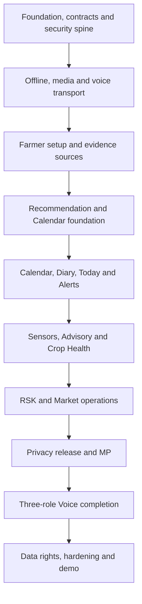

# Smart Fasal Kisan Alert

## Implementation Sequence, Delivery Backlog and Demo Journey

| Field | Value |
| --- | --- |
| Status | Approved for implementation |
| Version | 0.1.0 |
| Last updated | 13 July 2026 |
| Parent documents | `docs/01_PRD.md` through `docs/10_SECURITY_PRIVACY_TESTING_AND_QUALITY_SPECIFICATION.md` |
| Pilot | Raigad district, Maharashtra |
| Delivery intent | Build the complete locked scope through testable vertical slices; demonstrate the four core strengths first without removing secondary features |

## 1. Purpose

This is the execution document Codex should follow when turning the approved specifications into code. It defines repository bootstrap, dependency order, vertical-slice standards, workstreams, feature coverage, implementation milestones, release gates, demo data and the final video journey.

All locked features remain in scope except the explicit exclusions already approved: Web3, credit scoring and insurance adjudication. Hardware is an optional evidence source. The demo spends only about 30 seconds on hardware and focuses on the Farmer, RSK and MP applications.

The sequence prioritizes visible working proof of the three organizer core features and the multilingual voice agent, but it does not authorize dead placeholder screens for the remaining features. A later milestone may be reached after an earlier vertical slice is complete; no feature is considered implemented merely because its route or card exists.

## 2. Sources of truth

Implementation resolves questions in this order:

1. `01_PRD.md` — outcome, stakeholders, scope, exclusions and non-functional targets.
2. `02_INFORMATION_ARCHITECTURE.md` — product boundaries, routes and navigation.
3. `03_END_TO_END_FLOWS.md` — state ownership and cross-feature effects.
4. `04_FEATURE_SPECIFICATIONS.md` — user behaviour and acceptance.
5. `05_TECHNICAL_ARCHITECTURE.md` — chosen stack and service boundaries.
6. `06_DATA_MODEL_AND_EVENT_CATALOG.md` — persisted meaning and canonical events.
7. `07_API_AND_INTEGRATION_SPECIFICATION.md` — wire/API/protocol contracts.
8. `08_AI_ML_AND_AGRONOMY_SPECIFICATION.md` — evidence, rule and model authority.
9. `09_UI_DESIGN_SYSTEM_AND_WIREFRAMES.md` — presentation, responsive and accessibility contract.
10. `10_SECURITY_PRIVACY_TESTING_AND_QUALITY_SPECIFICATION.md` — build/release gates.
11. This document — execution order, task readiness and demo orchestration.

If a proposed shortcut conflicts with a parent contract, Codex stops that change and records the conflict. It does not silently choose the shortcut.

## 3. Delivery principles

1. **Vertical slices, not disconnected layers.** A slice includes contract, data, domain, authorization, API, UI, states, tests and observability.
2. **One authority for shared truth.** Contracts, event names, capability keys, state enums and agronomy rules are generated or imported from one source.
3. **Domain before decoration.** Build the deterministic decision/state kernel before AI explanation or charts.
4. **Real application paths first.** Demonstration data enters through the same APIs and projections as normal data, with visible mode labels.
5. **No dead feature theatre.** A visible action works, is honestly disabled with a reason, or is absent until its slice lands.
6. **Provider adapters are replaceable.** Simulators/Recorded fixtures let the product work without network providers; sandbox/Live adapters use the same interface.
7. **Security and tests travel with the slice.** Authorization, privacy, accessibility and failure tests are not deferred to a final sprint.
8. **Three real products.** Farmer, RSK and MP remain separate builds/origins even when sharing packages.
9. **Demo truth is part of correctness.** Live, Recorded and Simulated are visible on evidence, decisions, voice and MP metrics.
10. **Mergeable increments.** Each task leaves the monorepo type-safe, lint-clean, testable and bootable.

## 4. Definition of Ready

A task may enter implementation when it has:

- owning Feature/flow/route and acceptance IDs;
- exact actor, capability, purpose and data classification;
- input/output/result-state contract;
- owning aggregate/table/event names;
- offline/provider/data-mode behaviour;
- UI loading/current/stale/empty/error/permission states;
- required locale keys;
- test cases, including negative/safety paths; and
- no unresolved conflict among Documents 01–10.

If one item is missing, Codex may prepare a small specification patch first but must not invent production semantics in code.

## 5. Vertical-slice Definition of Done

A feature slice is done only when all applicable rows pass:

| Area | Required evidence |
| --- | --- |
| Contract | Versioned strict request/result schemas; generated clients compile; no duplicate handwritten type |
| Domain | Pure rule/state/command with deterministic clock/ID/provider injection |
| Authorization | Exact owner/capability/jurisdiction/purpose/consent policy and negative tests |
| Persistence | Migration, constraints/RLS, repository and immutable/correction rules |
| Migration/compatibility | Create-from-zero, prior-version upgrade, expand/contract compatibility, service-worker/IndexedDB/pack migration and never-delete forward recovery |
| Transaction | Owned facts/events/outbox/receipt are atomic and idempotent |
| API | Exact Document 07 route, stable problem codes, limits and concurrency checks |
| UI | Owning route, responsive layout, all required states and no dead control |
| Offline | Local projection/outbox/conflict or explicit connected-only truthful state |
| Accessibility | Keyboard, focus, labels, axe and relevant map/chart/audio alternative |
| Localization | Marathi/Hindi/English critical keys and reviewed dynamic terminology boundary |
| Security/privacy | Classification, minimization, redaction, abuse and disclosure tests |
| Tests | Unit/property, contract, integration and the affected E2E journey |
| Provider/worker | Typed fake plus sandbox/Live adapter contract, timeout/retry/circuit breaker, callback/replay, uncertain reconciliation, Unavailable and no silent mode fallback |
| Observability | Safe correlation, metrics/reasons, no protected payload |
| Demo | Scenario manifest and Live/Recorded/Simulated behaviour where feature appears |
| Quality | Format, lint, strict type, build, coverage and applicable Sonar/security gates |

Quality evidence means generated-contract zero diff; Sonar New Code coverage at least 80%; committed-runner branch coverage at least 90% for agronomy, authorization, Alert Policy, sync-conflict and privacy packages; every registered safety branch; new-code duplication at most 3%; cognitive complexity at most 15 or an owned expiring exception; zero unresolved validated Critical/High; migration compatibility; applicable rollback/kill-switch; validated environment schema; and no known flaky critical test.

## 6. Locked stack and repository bootstrap

Use current stable versions at implementation time and pin them in lockfiles/container digests. No `latest`, canary or preview dependency in a critical path.

### 6.1 Root tooling

- `pnpm` workspace and Turborepo.
- Node active LTS and pinned Python stable runtime.
- strict TypeScript, ESLint, Prettier, Python formatter/linter/type checker.
- shared `tsconfig`, package-boundary/cycle rules and committed coverage config.
- Vitest, Testing Library, MSW, Playwright, axe-core, Lighthouse CI, Pytest and property-test tools.
- Changesets or an equivalent internal-package version discipline if packages are published; otherwise workspace version lockstep is sufficient.

### 6.2 Target topology

```text
apps/
  farmer-web/
  rsk-web/
  mp-web/
  domain-api/
  domain-worker/
  device-ingest/
  provider-callback-ingest/
  mp-query-api/
  privacy-pipeline/
  media-scanner/
  intelligence-service/
  voice-gateway/

packages/
  contracts/src/{http,commands,events,sync,device,voice,privacy}/
  contracts/generated/{openapi,json-schema,typescript,pydantic}/
  application/
  authz/
  domain/
  persistence/
  events/
  offline/
  ui/
  i18n/
  voice/
  maps/
  observability/
  test-kit/
  config/

infra/terraform/environments/
tests/{contract,integration,e2e-farmer,e2e-rsk,e2e-mp,authorization,offline,privacy,load}/
tooling/{workbox,scripts,quality}/
```

### 6.3 Bootstrap outputs

The first code change creates:

- workspace/package graph and root scripts;
- three empty but real Next.js applications with independent origins/builds;
- Fastify Domain API health/readiness entry point;
- Python intelligence service health/readiness entry point;
- typed environment schemas and safe `.env.example` with names/descriptions only;
- local Docker/compatible PostgreSQL 17 + PostGIS setup;
- initial Terraform module/environments skeleton without production secrets;
- test-kit, provider sink adapters and scenario loader;
- CI workflow with fast checks and placeholders only for jobs that already have a real command; and
- root security/architecture boundary tests.

No static prototype JavaScript or `innerHTML` pattern is copied. Before any actual repository replacement, verify current HEAD, create the annotated legacy tag/migration branch note and keep the existing Vercel deployment as rollback until rebuilt Farmer smoke succeeds.

Create root configuration in this order so later scaffolds share one contract: `package.json`, `pnpm-workspace.yaml`, lockfile, `turbo.json`, base TypeScript/lint/format/editor/runtime files, Python project/lock, `.gitignore`, safe `.env.example`, local Postgres/PostGIS composition, README, then application/package directories. Root scripts include `dev`, `build`, `format`, `format:check`, `lint`, `typecheck`, `test`, `test:unit`, `test:integration`, `test:e2e`, `test:a11y`, `contracts:generate`, `contracts:check`, `db:migrate`, `db:seed:synthetic` and `quality`.

A clean checkout must reproduce frozen dependency install, format/lint/type, contract generation with zero diff, database create/migrate/seed, unit/integration smoke, all production builds, secret scan and dependency scan without undocumented machine state.

## 7. Build dependency graph



Voice transport/overlay exists early; exact tools land only inside the owning feature slice after its API/authorization tests pass. Sensor ingest may run beside Calendar/Alert work, but an Advisory cannot publish until Task/Diary/Canonical-Alert foundations are complete. Farmer-derived MP output cannot appear before the Privacy Pipeline activates a valid Release Snapshot.

## 8. Parallel-work rules for Codex agents

One coordinator owns integration, root configuration, contracts, migrations, generated artifacts and merge order. Concurrency is bounded to available isolated work and non-overlapping files.

- Only one declared owner edits shared contracts, events, migrations, registries, root tooling or tokens at a time.
- Contracts/migrations land before consumers; generated artifacts are regenerated once by the owner and never hand-edited.
- Separate agents may implement bounded domain, adapter, UI or test tasks only after upstream IDs/versions freeze.
- Every agent returns changed files, public-contract/migration/event impact, assumptions and exact tests run.
- Coordinator inspects the diff, reconciles public interfaces and runs combined gates before dependent work starts.
- If branches touch the same capability/state/event, stop and reconcile the source contract.

## 9. Milestone 0 — Repository and developer runway

Before replacement, verify current Git HEAD, create annotated `legacy-static-submission`, record a migration branch/note and keep the existing Vercel deployment available as rollback until the rebuilt Farmer smoke passes. No prototype runtime is deleted first.

Tasks: initialize pinned pnpm/Turbo/Python tooling; scaffold independent Farmer/RSK/MP builds and all service health entries; create local PostgreSQL 17/PostGIS, contract generator, test-kit, provider sinks, tokens/locales, Terraform skeleton, CI/Sonar/security jobs and README.

Exit requires clean frozen install; format/lint/TS+Python type; deterministic contract generation with zero diff; database create/migrate/synthetic seed; all app/service health and production builds; boundary/cycle test; secret/dependency scans; README clean-checkout reproduction; three physically separate web builds; and verified legacy tag/deployment rollback. No fake metric, route or action appears.

## 10. Milestone 1 — Contracts, identity and transactional security spine

Implement canonical contracts/events/problems/capabilities, generated role clients, Identity/App Check/MFA/role context, ownership/jurisdiction/purpose/consent, Audit-before-disclose, FORCE RLS/service roles, command receipts/idempotency/revisions, event/outbox/inbox, safe logging/classification/retention and generic authenticated shells.

Exit: authorization/RLS pool isolation, consent races, protected disclosure, replay/hash conflict, event transaction and MP service-isolation tests pass.

## 11. Milestone 2 — Offline, media and voice foundations

### M2A Farmer offline

Build partitioned encrypted Dexie event/projection/outbox, sync/bootstrap/cursor/conflict, Workbox static policy, staged migrations, Locked Recovery and the 90-day Farmer compatibility foundation.

### M2B Media

Build intent → quarantine → verification/derivative → typed attachment → protected streaming with consent, generation, checksum, MIME/decoder/polyglot/EXIF and retention controls.

### M2C Voice transport

Build the real contextual overlay, session/ticket/WebSocket/HTTPS/offline-audio/proposal transport and provider interfaces. Before owning tools exist, Speak opens a working bounded shell with help/typed input and an honest `Voice unavailable for this action — use touch or text` state. It is never a dead placeholder and does not count as FS-06 completion.

Exit: offline restart/replay/user switch, quarantine bypass, voice ticket/reconnect/unconfirmed mutation and provider-outage tests pass.

## 12. Milestone 3 — Farmer and Farm Setup (FS-01)

Implement Marathi-first onboarding, Device Mode, independent consents, Profile/Farm/Multi-Plot/geometry/soil/water/history/current crop/optional sensor, safe Maps alternatives, My Farm/Settings/Sync/Help and setup voice tools after APIs pass.

Exit: two-Plot J1 setup works with denied GPS, skipped hardware and offline resume; cross-owner/context/consent and shared-device tests pass.

## 13. Milestone 4 — Evidence and source spine

Implement unit/source/rights/freshness/quality/proxy/disagreement registries, immutable evidence/dependencies, retained weather editions, display-only Google Weather, async Earth jobs/snapshots, soil/manual/lab inputs and correction/invalidation. Fake/Recorded adapters precede approved sandbox/Live adapters; failure never silently changes mode.

Exit: evidence/source/rights/freshness and dependency-impact tests pass; Farmer pages never wait synchronously for Earth.

## 14. Milestone 5 — Recommendation, Season and Calendar foundation (FS-03/FS-09)

Before Recommendation acceptance, implement the minimum complete Calendar/Task contracts, schema, Template snapshot, domain handler, API/events and atomic initial-Task tests.

Then implement Crop Profiles, exact readiness, hard gates, suitability/confidence/rank/reasons, immutable result/diff, Farmer Ready/Needs Input/No Safe Result/Failed UI and optional validated explanation. Acceptance creates Acceptance + proposed/actual Season + profile snapshot + Calendar + initial Tasks once or none.

Do not show Mandi context yet; the governed Market read API lands in Milestone 12. Required tests cover every gate/boundary, missing/proxy/conflict, no hardware, deterministic math/order/checksum, model failure/injection and acceptance races.

## 15. Milestone 6 — Calendar, Diary, Today and offline completion (FS-02/FS-09/FS-11 core)

Complete Template/task dependencies, agenda/Calendar/Task/change UI, immutable Diary/correction/void/media, Task→Diary actual transaction, offline Sync Centre/conflicts/tombstones, Today prioritization and corresponding voice tools only after APIs pass.

Exit: J4 and Calendar→Diary pass across restart, retry, conflict, rejection, storage pressure and shared-phone recovery. FS-11 remains release-partial until Milestone 15 completes data rights and the full 90-day/Locked-Recovery gate.

## 16. Milestone 7 — Canonical Alerts and Delivery Centre (FS-12)

Implement canonical version/lifecycle/cohort/recipient/interaction, Inbox, correction/replacement/expiry, official-warning separation, Delivery Plan/attempt/recipient milestones, push registration, sink then sandbox FCM/SMS/IVR, callback intake/consumer, IVR interaction, RSK Outreach/Delivery Health and alert voice tools.

Exit: provider/callback cannot acknowledge or complete; old-version response cannot acknowledge replacement; Wrong Recipient stops disclosure; uncertain delivery remains Unknown; canonical Alert response/expiry/Cannot Do journey passes.

## 17. Milestone 8 — Live Monitor and sensor trust (FS-10 foundation)

Implement device/gateway/credential/assignment/calibration, HMAC challenge/batch/receipt, raw→normalized→quality/trust/freshness, Farmer Monitor, RSK Issue/install/maintenance foundation and signed Recorded replayer before physical adapter.

Exit: J5 ingest/trust/problem path passes; replay/hash/revocation/assignment/mode tests pass; receipt is not trust and NPK is Experimental/Trend Only. FS-10 maintenance closure remains release-partial until RSK pack hardening in Milestone 15.

## 18. Milestone 9 — Advisory, dry spell and input guidance (FS-04)

With Task/Diary/Canonical-Alert foundations already complete, implement evidence triggers, dry-spell components, independent signals/persistence, stage/water feasibility, irrigation classes, fertilizer/spray gates, review/materiality/expiry/dependency impact and atomic Advisory + Task + policy Alert publication. Add Farmer/RSK review UI and voice tools after APIs pass.

Exit: J2 passes; single outlier/missing agreement/no-water/recent actual/weather disagreement/exact-dose/unsafe spray/expiry/replacement/publication failure/invalidation tests pass.

## 19. Milestone 10 — Crop Health and Case loop (FS-05 plus FS-07 Case slice)

Implement Report/original account, guided capture, verified media, evidence quality, bounded extractor, deterministic triage/escalation, Farmer result, consented Case/pack/Work or share nothing, RSK Case workspace/Care Plan/follow-up/resolution/reopen and Case tools with required visual stops.

Exit: J3 passes with poor/unsupported media, injection, model outage/prohibited output, consent decline/withdrawal, pack minimization, severe authority and worsening reopen.

## 20. Milestone 11 — RSK operations completion (FS-07 functional core)

Complete unified Work Queue, advisory/calendar review, Template governance, Alert approval/publication, sensor operations, Field Visits, Assisted Session and Audit. Every tool lands only with its owning API.

FS-07 remains release-partial until Milestone 15 verifies Visit/Maintenance offline-pack hardening, data rights and full 90-day compatibility. There is no Farmer Directory, generic Admin authority or voice completion of prohibited actions.

## 21. Milestone 12 — Harvest, Mandi and Market Watch (FS-13)

Implement raw public Market editions, mapping/conversion, compatible comparison/trend gaps, harvest readiness/Tasks, indicative net formula, Watch lifecycle, private support consent, RSK mapping approval/reprocessing/rollback and Farmer/RSK Market voice tools.

Emit only eligible analytics candidates/events and standalone public facts. Do not expose a Farmer-derived MP harvest aggregate yet; Milestone 13 must apply the privacy pipeline and activate a valid Release Snapshot.

## 22. Milestone 13 — Privacy Pipeline and MP Office (FS-08)

Implement analytics-safe boundary, coarse geography, Metric Registry, contribution bounds/minimum cohort, complementary/sticky suppression, signed complete Release Snapshot, isolated MP Query API and all MP visual/Briefing/export routes. Operational synthetic facts flow through the real Privacy Pipeline; the seeder cannot insert or activate an MP snapshot directly.

Exit: J7 visual/query/Briefing/export plus IAM, threshold/differencing, map/table parity, invalid release and saved-Briefing invalidation pass. MP voice is still unavailable for owning queries until Milestone 14.

## 23. Milestone 14 — Three-role Voice completion (FS-06)

Compile the exact Farmer/RSK/MP tool matrices from their now-stable APIs, controlled TTS/STT/Gemini adapters, private-environment check, offline confirmation, glossary and full language/noise/injection/suppression/kill-switch evaluations. Unknown/unmapped tools fail closed.

Exit: every approved visual read/action has the intended voice query/proposal/visual-stop outcome; unsafe/unconfirmed mutation and suppressed speech counts are zero.

## 24. Milestone 15 — Data rights, offline-pack hardening and production readiness

Complete Farmer export/deletion, external INTENT/APPLIED ledger, analytics retraction, tombstone/restore barrier, Retention jobs, RSK Visit/Maintenance pack hardening, 90-day Farmer/RSK handlers/upcasters/Locked Recovery, full IAM/perimeter/secret/backup/incident controls, provider sandboxes and accessibility/performance/Sonar/security evidence.

Only here may FS-07, FS-10 and FS-11 reach complete release status. No Critical/High, zero-tolerance or release-manifest mismatch passes.

## 25. Milestone 16 — Integrated release and honest demo

Run J1–J7 and cross-role/provider/hardware/no-voice/no-hardware/failure variants on the exact promoted artifact. Produce SBOM/provenance, release evidence, Demo Data/Hardware Manifest, rollback and provider/model/rule/release kill-switch proof. All 13 features must be `PASS`, never Placeholder/Untested.

## 26. Feature coverage matrix

| Feature | Primary milestones | Mandatory demo visibility |
| --- | --- | --- |
| FS-01 Farmer/Farm Setup | 3 | yes, concise |
| FS-02 Farmer Home | 6–10; final cross-cutting gate 15 | yes |
| FS-03 Crop Recommendation | 5 | core proof |
| FS-04 Advisory/Dry spell/Input | 9 | core proof |
| FS-05 Crop Health/Care | 10 | core proof |
| FS-06 Voice agents | 2 foundation; owning tools 3–13; final 14 | core proof across roles |
| FS-07 RSK Operations | Case 10; core 11–12; release complete 15 | yes, service loop |
| FS-08 MP Dashboard | 13 | yes, privacy proof |
| FS-09 Calendar/Planner | 5–6; reviews/templates 11 | yes |
| FS-10 Live Monitor/Sensor Trust | 8–9 and 11; release complete 15 | yes |
| FS-11 Offline Diary/Sync | 2 and 6; data-rights/compatibility complete 15 | yes or short proof |
| FS-12 Alert/Multichannel | 7 and Advisory effects 9 | yes |
| FS-13 Mandi/Market Watch | 12; released MP view 13 | yes, short proof |

## 27. Recommended implementation workstreams

After Milestone 1 stabilizes shared contracts, use these parallel lanes:

| Lane | Owns | Does not own |
| --- | --- | --- |
| Domain/Data | rules, commands, state, migrations, repositories/events | UI or provider SDK presentation |
| Farmer | Farmer routes, offline projections, PWA and component states | RSK/MP authorization semantics |
| RSK | Work/Case/review/operations routes | Farmer ownership or MP data |
| MP/Privacy | release pipeline, MP Query and MP UI | operational record access |
| Intelligence | Earth/scientific feature and bounded model adapters/evals | launch rule authority |
| Voice | gateway, tool registry, proposals and speech adapters | Domain command implementation |
| Integrations | media/device/weather/market/messaging/callback adapters | product state authority |
| Quality | test-kit, CI, security, accessibility, performance and release evidence | weakening tests to unblock a lane |

Each lane owns tests for its code; Quality adds cross-boundary evidence rather than becoming the only test author.

## 28. Environment and provider rollout

| Environment | Data | Providers | External delivery |
| --- | --- | --- | --- |
| Local | Synthetic | deterministic simulators | sink only |
| Preview | Synthetic per PR | simulators | sink only |
| Staging | Synthetic + approved Recorded packs | provider sandboxes/test destinations | hard allowlist |
| Demo | frozen manifest with visible modes | rehearsed adapter mix | sink or explicit test recipient only |
| Production | consented operational | approved production providers | policy-controlled real delivery |

No code path swaps a failed Live provider for a fixture without changing the visible state/mode. Environment configuration is schema validated; missing/unknown security setting fails startup.

Use separate Google Cloud projects for development/staging, demo and production, with environment-specific Identity, Cloud SQL, buckets, queues, KMS keys, service accounts, BigQuery datasets, budgets and provider accounts. Production data is never copied downward. Farmer, RSK and MP use separate Vercel projects/origins. Demo/sandbox recipient restrictions are enforced by provider account/credential allowlists, not only UI configuration.

### 28.1 Executable CI and promotion

- Fast local path: format, lint, type, contract diff, affected unit/component tests, forbidden-pattern/secret checks and touched builds.
- Parallel PR jobs: static/unit/coverage; contracts; PostgreSQL/migrations/RLS; authorization; offline; media/device/callback; AI/agronomy; Playwright; axe/keyboard/locale; Lighthouse/bundle/performance; secret/dependency/licence/SAST/container/IaC; Sonar; reproducible builds; and reviewed Terraform plan when affected.
- Protected merge requires every applicable job. GitHub Actions uses Workload Identity Federation, never service-account JSON.
- Build backend images once; create SBOM/provenance/digest, scan through Artifact Analysis and promote the same digest.
- Apply the reviewed migration as one owned job, deploy to staging, run J1–J7/negative authorization/suppression/recipient/rollback smoke, then promote. Frontends are promoted independently to their three origins with the same recorded revision/config.
- Release evidence pins exact artifacts, config, schemas, migrations, rules/models/tools and environment.

### 28.2 Database and contract rollout

Use `expand -> dual-compatible code -> backfill/migrate -> verify -> contract`. One migration job owns execution. Deploy consumers before producers where additive event handling requires it. Destructive contraction cannot run while any deployed app, worker, callback, offline queue or pack depends on the old schema. Preserve at least the 90-day Farmer/RSK command/event/sync/pack compatibility horizon. Unsupported clients enter Locked Recovery; accepted facts never use destructive rollback.

## 29. Demo scenario manifest

Create one versioned synthetic Raigad scenario family through the normal reset/seeder APIs. Every master take and fallback variant has an immutable scenario ID, reset seed and fixture checksum. It pins:

- fictional Farmer, staff and MP identities;
- two fictional Raigad Pilot plots with coarse approved geography and no real household/contact;
- Marathi primary language and Hindi/English fallbacks;
- Plot area/unit, soil/water, crop history, Season/stage and constraints;
- crop profiles/rules/source/Calendar versions;
- decision-weather edition, Earth snapshot, sensor packets/trust and hardware state;
- Crop Health verified media designed or licensed for the demo;
- dated Market facts/mappings and private Watch;
- RSK Work/Cases/roles and MP Release Snapshot;
- stable clock/timezone, expected events/decisions/Alerts, privacy/suppression outcomes, sandbox recipients and failure toggles;
- exact input mode and derived-result mode for Recommendation, Advisory, triage, voice, RSK and MP output; and
- correlation/command/object identities needed to prove a cut remains in the same scenario.

Operational synthetic facts flow through the real analytics-safe boundary, Privacy Pipeline, suppression and signed Release Snapshot activation. The seeder may pin expected privacy results but cannot insert or activate an MP snapshot directly.

Suggested agronomic names may be used only after the demo Crop Profiles and outputs receive RSK/agronomy review. Do not improvise crop ranking, fertilizer quantity or disease label for the recording. A Live failure loads a separately manifested Recorded/Unavailable variant through the reset API; it never patches one card in place. All dependent decisions, voice answers, RSK views and MP releases recompute and display the new mode.

## 30. Hardware demonstration contract

Hardware receives about 30 seconds:

1. show the assembled Raspberry Pi/ESP32/sensor setup;
2. identify soil moisture, temperature/humidity, pH/EC and NPK roles honestly;
3. show either a genuinely accepted signed current packet or a visibly `Recorded` packet inside Live Monitor;
4. state that low-cost NPK is Trend Only until local calibration; and
5. transition immediately to how sensor evidence joins weather, Earth and Farmer records in the application.

If the assembly is not reliably sending data, do not say it is streaming live. Use a signed Recorded fixture with original timestamp and visible Recorded label. Do not claim secure boot, flash encryption or signed OTA unless physically verified.

## 31. Six-minute master demo video

The exact contest limit, if different, controls the final cut. This master is designed so the 30-second hardware and four core strengths survive shorter edits.

| Time | Surface | Demonstration and narration |
| --- | --- | --- |
| 0:00–0:20 | Title/problem | Raigad Farmer decisions are fragmented across soil, weather, field evidence, markets and service access; Smart Fasal connects them without requiring technical literacy |
| 0:20–0:50 | Hardware | Physical kit, sensor roles and current/Recorded evidence card; explain optional hardware and sensor trust |
| 0:50–1:20 | Farmer Core 1 voice | Ask `माझ्या शेतात कोणते पीक घ्यावे आणि का?`; show transcript, authorized Recommendation tool, source/time/mode and Open Details |
| 1:20–2:00 | Core 1 visual proof | Recommendation readiness, top three, separate suitability/confidence, Earth/sensor/weather evidence and No Safe Result/hard-gate credibility |
| 2:00–2:40 | Core 2 | Moisture/rain/forecast/stage evidence creates one dry-spell action, Calendar Task and Alert; Cannot Do/Done path reaches Diary/RSK |
| 2:40–3:25 | Core 3 | Guided Crop Health photo + voice symptoms, `possible—not diagnosis`, confidence/limitations and consented expert escalation |
| 3:25–3:50 | Farmer breadth | Calendar/Diary offline receipt, Alert Inbox and dated Market Watch in a quick connected sequence |
| 3:50–4:45 | RSK | Work Queue → same Crop Health Case/evidence → expert Care Plan/follow-up; quick advisory/sensor issue proof; Expert Voice stops at visual review for high-impact action |
| 4:45–5:30 | MP | Released Raigad Pilot overview/map/table, voice question, suppression-safe result and one Briefing draft; no Farmer route or exact location |
| 5:30–5:50 | Architecture proof | Status-tagged Google stack and linked receipts/artifacts; deterministic rules own agronomy |
| 5:50–6:00 | Close | Farmer action + RSK service + policy visibility in one traceable loop; show deployed URL/GitHub/project name |

Use on-screen captions throughout. Voice audio may be shortened in editing only if the full request/result remains understandable and the shown response is the real validated output for the recorded scenario.

Every technology on the architecture proof card is tagged `Working Live`, `Working with Recorded fixture`, `Simulated/test adapter` or `Planned` and links to one route, receipt or artifact from the recorded scenario. A logo is never proof. Only a provider actually exercised by that scenario may say Working. Google Weather remains explicitly display-only; deterministic rules remain agronomy authority.

Async cuts are allowed only with a visible `Processing wait shortened` caption and the same scenario ID, command/correlation and resulting object. A failed operation cannot be replaced by an unrelated success without an explicit manifested scenario transition.

## 32. Exact demo interaction script

### 32.1 Farmer

1. Open synthetic Farmer account in Marathi; point out Farm/Plot, sync and mode.
2. Press `बोला / Speak` and ask: `माझ्या शेतात कोणते पीक घ्यावे आणि का?`
3. Show the recognized transcript, authorized Recommendation tool, source/freshness/mode and Open Details destination—not a hard-coded answer.
4. Open Crop Recommendation: readiness → result → compare top options → Why/Evidence → accept or return without mutating, depending on the seeded journey.
5. Open Advisory: action window, signal agreement, water feasibility, source/freshness and linked Task.
6. Select Cannot Do or Done and show the corresponding constraint/Diary actual.
7. Open Live Monitor and show trusted moisture versus Trend Only NPK.
8. Start Crop Health: three guided views + voice symptoms → possible issue → Ask Expert → sharing scope.
9. Show Case created/Waiting for RSK.
10. Flash Calendar/Diary local/synced distinction and Market Watch dated price/source.

Optional second voice question: ask the current nitrogen value. The agent must answer with the displayed value/source and warn when it is Experimental/Trend Only rather than treating it as a lab result.

### 32.2 RSK

1. Land on Work Queue with the new Case at an explainable priority.
2. Claim Work and open protected evidence after purpose/consent check.
3. Show AI Triage separately from Farmer account and expert source.
4. Issue or preview a source-backed Care Plan/follow-up Task and show Farmer-visible result.
5. Open a high-risk Advisory/Sensor Issue briefly to show weather/sensor/Diary evidence and trust.
6. Ask Expert Voice to summarize; then show a prohibited high-impact command ending at Visual Review Required.

### 32.3 MP

1. Open `/mp/overview` with approved Raigad Pilot boundary, period, mode, release and data-as-of.
2. Select a risk area; show coarse area shading and the identical released table/drawer.
3. Ask MP voice for the highest released risk or service need.
4. Open one deliberately suppressed cell; voice/table/map all say Insufficient Aggregate Data with no hidden value.
5. Generate a Briefing draft from released facts and show source/method chips.

## 33. Three-minute cut

If the required video is about three minutes:

| Time | Keep |
| --- | --- |
| 0:00–0:12 | Problem and solution sentence |
| 0:12–0:40 | Hardware (28 seconds maximum) |
| 0:40–1:10 | Farmer Marathi Recommendation voice, authorized tool and result |
| 1:10–1:35 | Crop Recommendation evidence/why |
| 1:35–1:58 | Dry-spell Advisory/Task |
| 1:58–2:20 | Crop Health to RSK Case |
| 2:20–2:42 | RSK expert response |
| 2:42–2:55 | MP privacy-safe intelligence/voice |
| 2:55–3:00 | Google stack and closing impact |

Calendar, Market Watch, offline sync and deeper evidence appear as a rapid labelled montage or are linked in an extended demo; they remain implemented, not removed from scope.

## 34. Demo preflight

### 34.1 Data and truth

- Freeze the exact scenario clock/data/version manifest.
- Confirm every card/result/voice answer has correct mode and dates.
- Confirm no real Farmer/contact/exact private location appears.
- Confirm demo notification adapters cannot contact the public.
- Verify displayed crop/health/advisory content against the approved demo registry.
- Verify the hardware claim matches actual current/Recorded status.

### 34.2 Application

- Run format, lint, type, affected tests and production builds.
- Run J1–J7 smoke and all demo route checks.
- Warm only permitted caches; do not hide slow/unavailable behaviour with stale illegal data.
- Pre-authorize browser camera/microphone only through normal prompts.
- Set browser zoom, viewport and Marathi font rendering.
- Check network, power, screen recording, audio level and free storage.

### 34.3 Recording

- Record clean master at readable resolution and frame rate.
- Use cursor/touch highlights sparingly and never cover state labels.
- Capture app audio and narration separately if possible.
- Add accurate English captions for Marathi speech and retain Marathi transcript on screen.
- Blur only accidental environment data; do not blur a hidden unsafe product payload and call it privacy.
- Record a silent backup pass and key short clips for edit recovery.

## 35. Failure and fallback runbook

| Failure during recording | Safe fallback |
| --- | --- |
| Hardware packet fails | load the separately manifested Recorded-hardware scenario through reset API; verify every dependent result/voice/RSK/MP mode recomputed |
| Gemini Live fails | use STT/intent/TTS fallback or typed utterance through the same tool API |
| STT mishears critical slot | show clarification; this demonstrates safety |
| TTS fails | show validated transcript/result and Listen unavailable state |
| Weather/Earth provider fails | reset to the separately manifested eligible Recorded or Unavailable scenario; never patch only the evidence card |
| Crop Health model fails | show deterministic severity/escalation and RSK Case path |
| External messaging unavailable | show sink attempt/Delivery Health; never claim delivery |
| Network drops | show cached Farmer state and Saved on This Phone, then reconnect/sync |
| MP cell suppresses unexpectedly | keep it; explain suppression and choose a pre-approved released aggregate for the main value |
| Briefing generation fails | show Generation Failed plus deterministic reviewed fallback/retry |
| Media scan/attach/triage is slow | use a preverified/pre-attached asset in the same manifested scenario and caption `Processing wait shortened` |
| Recommendation operation is slow | cut only to the same operation/result correlation and show the processing caption |
| RSK Case/Work projection is delayed | open the same accepted Case scenario in the RSK view; retain scenario/object identity and caption |
| MP release is delayed | use the separately activated Recorded release scenario with fixed release ID/as-of and normal suppression |
| Deployed site is unavailable | use the verified local/demo build of the identical revision/config and label the environment; do not imply the deployment was live |

Do not hide a failure by changing a fixture to Live, inventing a provider receipt or editing the UI label in post-production.

## 36. Demo judging evidence

Keep a final evidence folder/section containing:

- deployment URL for each stakeholder surface;
- GitHub repository and current revision;
- architecture diagram and Google technology map;
- Demo Scenario/Data/Hardware Manifest;
- screenshots of all 13 locked feature homes;
- J1–J7 and critical test summary;
- SonarCloud quality-gate result;
- accessibility and performance summary;
- AI/agronomy evaluation and zero-tolerance summary;
- privacy suppression proof; and
- limitations/roadmap stated honestly.

The demo video should not spend time reading these reports, but their existence supports technical credibility if judges inspect the repository.

## 37. First Codex implementation prompt contract

When coding begins, the initiating instruction should:

1. require reading `AGENTS.md` and Documents 01–11;
2. name the single milestone and task IDs currently authorized;
3. forbid scope changes and parent-contract weakening;
4. require inspection/preservation of existing Git changes;
5. require a short plan and small verified commits/patches;
6. require generated contracts before consumers;
7. require relevant tests, accessibility and security gates;
8. prohibit real external messages/production credentials;
9. require updating task/evidence status only after tests pass; and
10. stop only on a real authority/blocker, not because a feature is complex.

Codex should not be asked to “build the whole app” in one unreviewable patch. It should continue milestone by milestone while the full scope remains fixed.

## 38. Acceptance criteria

- **IMP-AC01:** The repository boots through one documented local command set and all three applications are independent builds.
- **IMP-AC02:** Every implemented feature satisfies the vertical-slice Definition of Done before a dependent feature relies on it.
- **IMP-AC03:** Every FS-01 through FS-13 feature maps to an implementation milestone and working route/state owner.
- **IMP-AC04:** Core features use deterministic authority and real application APIs; no hard-coded voice or UI answer masquerades as AI/provider data.
- **IMP-AC05:** Provider simulators and real adapters share typed interfaces and failures cannot silently change mode.
- **IMP-AC06:** Every milestone leaves format, lint, type, tests and builds clean under the affected quality gates.
- **IMP-AC07:** J1–J7 and mandatory cross-journeys run against the exact promoted artifact before release/demo evidence is final.
- **IMP-AC08:** The Farmer demo proves Recommendation, Advisory, Crop Health and Voice; the RSK demo proves expert service; the MP demo proves released aggregate intelligence.
- **IMP-AC09:** Hardware receives approximately 30 seconds and is labelled current/Recorded truthfully.
- **IMP-AC10:** The demo contains no real Farmer data, unrestricted provider recipient or unsupported hardware/security/agronomy claim.
- **IMP-AC11:** The three-minute cut retains all four core strengths and the RSK/MP stakeholder proof.
- **IMP-AC12:** Secondary features remain implemented and visible through their correct homes even when the short edit gives them less screen time.
- **IMP-AC13:** Failure fallbacks use the same product contracts and show truthful unavailable/Recorded/local-save state.
- **IMP-AC14:** Release evidence identifies exact code, config, schema, rule/model/source and demo scenario versions.
- **IMP-AC15:** No unresolved Critical/High, zero-tolerance, accessibility, performance or Sonar release blocker is hidden for the demo.

## 39. Handoff after approval

After this document is approved, create the root `AGENTS.md` as the concise execution gateway: scope and exclusions, source-of-truth order, commands, architecture boundaries, quality/security rules, current milestone protocol and links to Documents 01–11. `AGENTS.md` must summarize and route; it must not duplicate or weaken these specifications.
